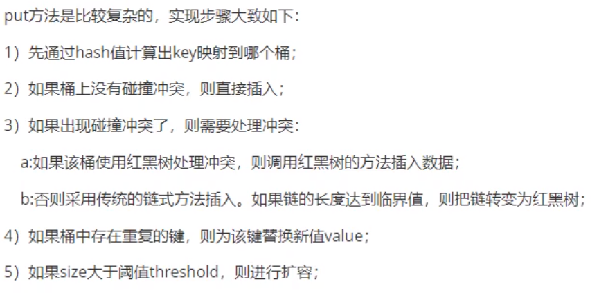

# HashMap

## 1.HashMap集合简介

​	HashMap基于哈希表的Map接口实现，是以key-value存储形式存在，即主要用来存放键值对。HashMap的实现是不同步的，这意味着它不是线程安全的。它的Key、Vlaue都可以为null。此外,HashMap中的映射不是有序的。

​	JDK1.8之前HashMap由**数组+链表**组成的，数组是HashMap的主题，链表则主要是为了解决哈希冲突（两个对象调用的hashCode方法计算的哈希码值一直导致计算的数组索引相同）而存在的（“拉链法”解决冲突。JDK1.8以后在解决哈希冲突时有了较大的变化，**当链表长度大于阈值（或者红黑树边界值，默认为8）并且当前数组的长度大于64时，此时此索引位置上的所有数据改为使用红黑树存储**

### 补充

​	将链表转换成红黑树前回判断，即使阈值大于8，但是数组长度小于64时，此时不会将链表变成红黑树。而是选择进行数组扩容。

​	这样做的目的时因为数组比较小，尽量避开红黑树结构，这种情况下红黑树结构，反而会降低效率，因为红黑树需要进行左旋，右旋，变色这些操作来保证平衡。同时数组长度小于

64时，搜索时间相对要快些。所以综上所述为了提高性能和减少搜索时间，底层在阈值大于8并且数组长度大于64时，链表才转换为红黑树。具体可以参考**treeifyBin**方法

​	当然虽然增加了红黑树作为底层数据结构，结构变得复杂了，但是阈值大于8并且数组长度大于64时，链表转换为红黑树时，效率也变得更高效

### 特点

1. 存取无序的
2. 键和值位置都可以是null，但是键值位置只能是一个null
3. 键位置是唯一的，底层的**数据结构控制键的**
4. JDK1.8前数据结构是：链表+数组  JDK1.8之后是：链表+数组+红黑树
5. 阈值（边界值）>8并且数组长度大于64，才将链表转换为红黑树，变为红黑树的目的是为了提高查询效率

## 2.HashMap集合底层的数据结构

### 数据结构的概念

​	数据结构是加算计存储、组织数据的方式。数据结构是指相互之间存在一种或多种特定关系的数据元素的集合。通常情况下，精心选择的数据结构可以带来更高的运行或者存储效率。数据结构往往高效的检索算法和索引技术有关

数据结构：就是存储数据的一种方式

在JDK1.8之前HashMap由**数组+链表**组成的

在JDK1.8之后HashMap由**数组+链表+红黑树**数据结构组成


### 面试题


### 图解


### HashMap存储过程


## 3.HashMap继承关系


## 4.HashMap集合类的成员

### 成员变量


**容量为何必须是2的N次幂**


**注意：当然如果不考虑效率可以直接求余即可（就不需要要求长度必须是2的n次方了）**


````java
public static void main(String[] args) {
        HashMap hashMap = new HashMap(10);
    }
---------------------------------------------
public HashMap(int initialCapacity, float loadFactor) {
        if (initialCapacity < 0)
            throw new IllegalArgumentException("Illegal initial capacity: " +
                                               initialCapacity);
        if (initialCapacity > MAXIMUM_CAPACITY)
            initialCapacity = MAXIMUM_CAPACITY;
        if (loadFactor <= 0 || Float.isNaN(loadFactor))
            throw new IllegalArgumentException("Illegal load factor: " +
                                               loadFactor);
        this.loadFactor = loadFactor;
        this.threshold = tableSizeFor(initialCapacity);
    }
---------------------------------------------
    static final int tableSizeFor(int cap) {
        int n = cap - 1;
        n |= n >>> 1;
        n |= n >>> 2;
        n |= n >>> 4;
        n |= n >>> 8;
        n |= n >>> 16;
        return (n < 0) ? 1 : (n >= MAXIMUM_CAPACITY) ? MAXIMUM_CAPACITY : n + 1;
    }
````

#### 运算解析


**注意**


````
Because TreeNodes are about twice the size of regular nodes, we
     * use them only when bins contain enough nodes to warrant use
     * (see TREEIFY_THRESHOLD). And when they become too small (due to
     * removal or resizing) they are converted back to plain bins.  In
     * usages with well-distributed user hashCodes, tree bins are
     * rarely used.  Ideally, under random hashCodes, the frequency of
     * nodes in bins follows a Poisson distribution
     * (http://en.wikipedia.org/wiki/Poisson_distribution) with a
     * parameter of about 0.5 on average for the default resizing
     * threshold of 0.75, although with a large variance because of
     * resizing granularity. Ignoring variance, the expected
     * occurrences of list size k are (exp(-0.5) * pow(0.5, k) /
     * factorial(k)). The first values are:
````


**补充**


**说明**


### 构造方法


3、构造一个具有指定初始容量和负载因子的HashMap

````java
public HashMap(int initialCapacity, float loadFactor) {
        if (initialCapacity < 0)
            throw new IllegalArgumentException("Illegal initial capacity: " +
                                               initialCapacity);
        if (initialCapacity > MAXIMUM_CAPACITY)
            initialCapacity = MAXIMUM_CAPACITY;
        if (loadFactor <= 0 || Float.isNaN(loadFactor))
            throw new IllegalArgumentException("Illegal load factor: " +
                                               loadFactor);
        this.loadFactor = loadFactor;
        this.threshold = tableSizeFor(initialCapacity);
    }


static final int tableSizeFor(int cap) {
        int n = cap - 1;
        n |= n >>> 1;
        n |= n >>> 2;
        n |= n >>> 4;
        n |= n >>> 8;
        n |= n >>> 16;
        return (n < 0) ? 1 : (n >= MAXIMUM_CAPACITY) ? MAXIMUM_CAPACITY : n + 1;
    }
````


````java
    final void putMapEntries(Map<? extends K, ? extends V> m, boolean evict) {
        int s = m.size();
        if (s > 0) {
            if (table == null) { // pre-size
                float ft = ((float)s / loadFactor) + 1.0F;
                int t = ((ft < (float)MAXIMUM_CAPACITY) ?
                         (int)ft : MAXIMUM_CAPACITY);
                if (t > threshold)
                    threshold = tableSizeFor(t);
            }
            else if (s > threshold)
                resize();
            for (Map.Entry<? extends K, ? extends V> e : m.entrySet()) {
                K key = e.getKey();
                V value = e.getValue();
                putVal(hash(key), key, value, false, evict);
            }
        }
    }
````


### 成员方法

#### 增加方法



具体方法如下

````java
public V put(K key, V value) {
    return putVal(hash(key), key, value, false, true);
} 
````

````java
static final int hash(Object key) {
  	int h;
  	return (key == null) ? 0 : (h = key.hashCode()) ^ (h >>> 16);
}
````


````java
final V putVal(int hash, K key, V value, boolean onlyIfAbsent,
                   boolean evict) {
        .........
        if ((p = tab[i = (n - 1) & hash]) == null)//这里的n表示数组长度为16
        .........
````


**实际为对hashCode * 数据长度取余计算索引**


**主要是为了减少hash碰撞次数**


````java
final V putVal(int hash, K key, V value, boolean onlyIfAbsent,
                   boolean evict) {
        Node<K,V>[] tab; Node<K,V> p; int n, i;
        if ((tab = table) == null || (n = tab.length) == 0)
            n = (tab = resize()).length;
        if ((p = tab[i = (n - 1) & hash]) == null)
            tab[i] = newNode(hash, key, value, null);
        else {
            Node<K,V> e; K k;
            if (p.hash == hash &&
                ((k = p.key) == key || (key != null && key.equals(k))))
                e = p;
            else if (p instanceof TreeNode)
                e = ((TreeNode<K,V>)p).putTreeVal(this, tab, hash, key, value);
            else {
                for (int binCount = 0; ; ++binCount) {
                    if ((e = p.next) == null) {
                        p.next = newNode(hash, key, value, null);
                        if (binCount >= TREEIFY_THRESHOLD - 1) // -1 for 1st
                            treeifyBin(tab, hash);
                        break;
                    }
                    if (e.hash == hash &&
                        ((k = e.key) == key || (key != null && key.equals(k))))
                        break;
                    p = e;
                }
            }
            if (e != null) { // existing mapping for key
                V oldValue = e.value;
                if (!onlyIfAbsent || oldValue == null)
                    e.value = value;
                afterNodeAccess(e);
                return oldValue;
            }
        }
        ++modCount;
        if (++size > threshold)
            resize();
        afterNodeInsertion(evict);
        return null;
    }
````

#### 讲链表转换红黑树

````java
final void treeifyBin(Node<K,V>[] tab, int hash) {
        int n, index; Node<K,V> e;
        if (tab == null || (n = tab.length) < MIN_TREEIFY_CAPACITY)
            resize();
        else if ((e = tab[index = (n - 1) & hash]) != null) {
            TreeNode<K,V> hd = null, tl = null;
            do {
                TreeNode<K,V> p = replacementTreeNode(e, null);
                if (tl == null)
                    hd = p;
                else {
                    p.prev = tl;
                    tl.next = p;
                }
                tl = p;
            } while ((e = e.next) != null);
            if ((tab[index] = hd) != null)
                hd.treeify(tab);
        }
    }
````


#### 扩容方法

**扩容机制**

