# JVM虚拟机

## 类加载器子系统

### 类加载的过程

加载->链接->初始化


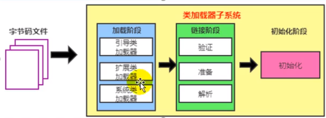

#### 加载

1. 通过一个类的全限定名获取该定义此类的二进制字节流

2. 将这个字节流所代表的静态存储结构转化为方法区的运行时数据结构

3. 在内存中生成一个代表这个类的java.lang.Class对象，作为方法区这个类的各种数据的方法问入口

#### 连接

1. 验证（Verify）
   * 目的在于确定class文件的字节流中包含信息符合当前虚拟机的要求，保证被加载的类的正确性，不会危害虚拟机自身安全。
   * 主要包括四种验证：文件格式验证，元数据验证，字节码验证，以及符号验证
2. 准备（Prepare）
   * 为类变量分配内存并设置该类变量的默认初始值，即零值。
   * 这里不包含用final修饰的static，因为final在编译的时候就会分配了，准备阶段会现式初始化；
   * 这里不会为实例变量分配初始化，类变量会分配在方法区中，而实例变量是会随着对象一起分配到java堆中
3. 解析（Resolve）
   * 将常量池内的符号引用转换为直接引用的过程。
   * 事实上，解析操作往往会伴随着jvm在执行完初始化之后再执行。
   * 符号引用就是一组符号来描述引用的目标。符号引用的字面量形式明确定义在《java虚拟机规范》的Class文件格式中。直接引用就是直接指向目标的指针、相对偏移量或者一个间接定位到目标的句柄
   * 解析动作主要针对类或接口、字段、类方法、接口方法、方法类型等。对应常量池中的CONSTANT_Class_info、CONSTANT_Fieldref_info、CONSTANT_Methodref_info等。

#### 初始化

* 注意
  * 初始化阶段就是执行类构造器方法\<clinit\>（）的过程
  * 此方法不许定义，是javac编译器自动收集类中的所有类变量的赋值动作和静态代码块中的语句合并而来。
  * 构造器方法中指令按语句在源文件中出现的顺序执行。
  * \<clinit\>（）不同于类的构造器。（关联：构造器是虚拟机视角下的\<init\>（））
  * 若该类具有父类，JVM会保证子类的\<clinit\>（）执行前，父类的\<clinit\>（）已经执行完毕。
  * 虚拟机必须保证一个类的\<clinit\>（）方法在多线程下被同步加锁

### 类加载器的分类

- JVM支持两种类型的类加载器，分别为**引导类加载器**和**自定义类加载器**

- 从概念上来讲，自定义类加载器一般指的是程序中由开发人员自定义的一类加载器，但是Java虚拟机规范却没有这么定义，而是**将所有派生于抽象类ClassLoader的类加载器都划分为自定义类加载器**

- 无论类加载器的类型如何划分，在程序中我门最常见的类加载器始终只有3个,如下所示

  - **Bootstrap Class Loader（引导类加载器）**

  - **Extension Class Loader（扩展类加载器）**

  - **System Class Loader（系统类加载器、应用程序加载器）**

  - User Defined Class Loader（用户自定义类加载器，默认使用系统类加载器加载）

    

    **这几者之间的关系是包含关系。不是上层下层，也不是子父类的集成关系**
    
    ````java
            //获取系统类加载器
            ClassLoader systemClassLoader = ClassLoader.getSystemClassLoader();
            System.out.println(systemClassLoader);
            //sun.misc.Launcher$AppClassLoader@18b4aac2
    
            //获取器上层：扩展类加载器
            ClassLoader extClassLoader = systemClassLoader.getParent();
            System.out.println(extClassLoader);
            //sun.misc.Launcher$ExtClassLoader@1b6d3586
    
            //获取器上层：获取不到引导类加载器
            ClassLoader bootstrapClassLoader = extClassLoader.getParent();
            System.out.println(bootstrapClassLoader);
            //null
    
            //对于用户自定义类来说：默认使用系统类加载器加载
            ClassLoader classLoader = ClassLoaderTest01.class.getClassLoader();
            System.out.println(classLoader);
            //sun.misc.Launcher$AppClassLoader@18b4aac2
    
            //Stirng类使用引导类加载器进行加载的 ----> Java的核心类库都是使用引导类加载器加载的
            ClassLoader classLoader1 = String.class.getClassLoader();
            System.out.println(classLoader1);
        //null
    ````
    
    

#### 启动类加载器（引导类加载器）

* Bootstrap ClassLoader为虚拟机自带的加载器

- 这个类加载使用C/C++语言实现的，嵌套在jvm内部

- 它用来加载Java的核心库（JAVA_HOME/jre/lib/tr/jar、resources.jar或sun.boot.class.path路径下的内容），用于提供JVM自身需要的类

- 并不继承自java.lang.ClassLoader，没有父加载器

- 加载扩展类和应用类加载器，并指定为他们的父类加载器

- 处于安全考虑，Bootstrap启动类加载器只加载报名为java、javax、sun等开头的包

  ````java
          //获取BootstrapClassLoader能够加载的api的路径
          URL[] urLs = Launcher.getBootstrapClassPath().getURLs();
          for (URL urL : urLs) {
              System.out.println(urL.toExternalForm());
          }
          //从上面的路径中随意挑选一个类，来看看它的类加载器是什么:引导类加载器
   		//file:/D:/Program%20Files/Java/jdk1.8.0_191/jre/lib/jsse.jar
          ClassLoader classLoader = Provider.class.getClassLoader();
          System.out.println(classLoader);
          //结果为null即为引导类加载器
  ````

  

  #### 扩展类加载器

* Java语言编写，由sun.misc.Launcher$ExtClassLoader实现。

* 派生于ClassLoader类

* 父加载器为启动类加载器

* 从java.ext.dirs系统属性所指定的目录中加载类库，或从JDK的安装目录的jre/lib/ext子目录（扩展目录）下加载类库。如果用户创建的JAR放在此目录下，也会自动由扩展类加载器加载。

  ```` java
          String property = System.getProperty("java.ext.dirs");
          System.out.println(property);
          for (String path:property.split(";")){
              System.out.println(path);
          }
          //从上面的路径中随意挑选一个类，来看看它的类加载器是什么:扩展类加载器
          ClassLoader classLoader1 = CurveDB.class.getClassLoader();
          System.out.println(classLoader1);
          //sun.misc.Launcher$ExtClassLoader@4b67cf4d
  ````

  

#### 应用程序类加载器（系统类加载器）

- java语言编写，由sum.misc.Launcher$AppClassLoader实现
- 派生于ClassLoader类
- 父类加载器为扩展类加载器
- 它负责加载环境变量classpath或者系统属性 java.class.path指定路径下的类库
- **该类加载是程序中默认的类加载器**，一般来说，Java应用的类都是由它来完成加载
- 通过ClassLoader#getSystemClassLoader()方法可以获取到该类加载器。

#### 用户自定义类加载器

1. 为什么要定义自定义类加载器？
   * 隔离加载类
   * 修改类加载的方式
   * 扩展加载源
   * 防止源码泄露

### 关于ClassLoader

ClassLoader类，它是一个抽象类，其后所有的类加载器都继承自ClassLoader（不包括启动类加载器）

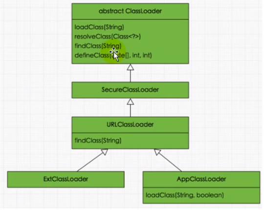

#### 获取ClassLoader的途径

````java
  			//1.获取当前类的ClassLoader
            ClassLoader classLoader = Class.forName("java.lang.String").getClassLoader();
            System.out.println(classLoader);
            //null

            //2.获取当前线程上下文的ClassLoader
            ClassLoader contextClassLoader = Thread.currentThread().getContextClassLoader();
            System.out.println(contextClassLoader);
            //sun.misc.Launcher$AppClassLoader@18b4aac2

            //3.获取系统的ClassLoader
            ClassLoader classLoader1 = ClassLoader.getSystemClassLoader();
            System.out.println(classLoader1);
            //sun.misc.Launcher$AppClassLoader@18b4aac2

            //4.获取扩展类加载器
            ClassLoader classLoader2 = classLoader1.getParent();
            System.out.println(classLoader2);
            //sun.misc.Launcher$ExtClassLoader@1b6d3586
````

### 双亲委派机制

​	Java虚拟机对class文件采用的是**按需加载**的方式，也就是说当需要使用该类时才会将它的class文件加载到内存中生成class对象。而且加载某个类的class文件时，Java虚拟机采用的是**双亲委派模式**，即把请求交由父类处理，它是一种任务委派模式。

#### 工作原理

1. 如果一个类加载器收到了类加载的请求，它并不会自己先去加载，而时把这个请求委托给父类加载器去执行；
2. 如果父类加载器还存在其父类加载器，则进一步向上委托，依次递归，请求最终将到达顶层的启动类加载器；
3. 如果父类加载器可以完成类加载任务，就成功返回，倘若父类加载器无法完成此加载任务，子类加载器才会尝试自己去加载，这就是双亲委派模型。

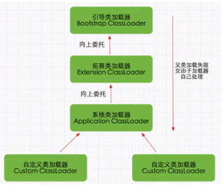

#### 优势

1. 避免类的重复加载
2. 保护程序安全，防止核心API被随意改动
   * 自定义类：java.lang.String
   * 自定义类：java.lang.ShkStart

#### 沙箱安全机制

​	自定义String类，但是在加载自定义String类的时候会率先使用引导类加载器加载，而引导类加载器在加载的过程中会先加载jdk自带的文件（rt.jar包中java\lang\String.class），报错信息说没有main方法，就是因为加载的是rt.jar包中的String类。这样可以保证对java核心源代码的保护，这就是沙箱安全机制。

### 补充内容

#### Class对象是否一致的判断条件

1. 类的完整类名必须一致，包括包名
2. 加载这个类的ClassLoader（指ClasLoader实例对象）必须相同

#### 对类加载器的引用

1. JVM必须知道一个类型是由启动类加载器加载的还是由用户类加载器加载的。如果一个类型是由用户类加载器加载的，那么JVM会**将这个类加载器的一个引用作为类型信息的一部分保存在方法区中**.当解析一个类型到另一个类型的引用的时候，JVM需要保证这两个类型的类加载器是相同的。

#### 类的主动使用和被动使用

- 主动使用，又分为七种情况：

  1. 创建类的实例

  2. 访问某个类或者接口的静态变量，或者对该静态变量赋值

  3. 调用类的静态方法

  4. 反射（比如：Class.forName("lang.String")）

  5. 初始化一个类的子类

  6. Java虚拟机启动时被表明为启动类的类

  7. JDK7开始提供的动态语言支持

     java.lang.invoke.MethodHandle实例的解析结果REF_getStatic、REF_putStatic、REF_invokeStatic句柄对应用的类没有初始化，则初始化

- 除了以上七种情况，其他使用Java类的方式都被看做是对**类的被动使用**，都**不会导致类的初始化**

## 运行时数据区

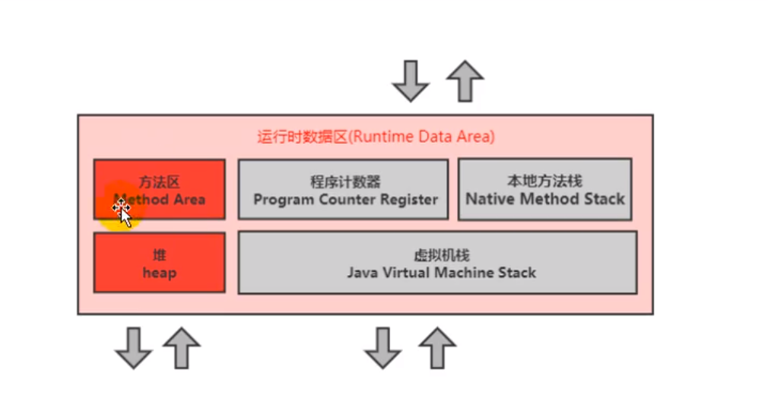

### 程序计数器（PC寄存器）

#### 简介

1. PC寄存器用来存储指向下一条指令的地址，即将要执行的执行代码。由执行引擎读取下一条指令，**JVM中的PC寄存器是对物理PC寄存器的一种抽象模拟**
2. 它是一块很小的内存空间，几乎可以忽略不记。也是运行速度最快的存储区域。
3. 在JVM规范中，每个线程都有它自己的程序计数器，是线程私有的，生命周期与线程的生命周期保持一致。
4. 任何时间一个线程都只有一个方法在执行，也就是所谓的**当前方法**。程序计数器会存储当前线程正在执行的Java方法的JVM指令地址；或者，如果是在执行native方法，则是未指定值（undefned）
5. 它是程序控制流的指示器，分支、循环、跳转、异常处理、线程恢复等基础功能都需要依赖这个计数器完成
6. 字节码解释器工作时就是通过改变这个计数器的值来选取下一条需要执行的字节码指令。
7. 它是唯一一个在Java虚拟机规范中没有规定任何OutOtMemoryError情况的区域  


#### 常见问题

1. 使用PC寄存器存储字节码指令地址有什么用？为什么使用PC寄存器来记录当前线程的执行地址呢？

   因为cpu需要不停的切换各个线程，这时候切换回来以后，就得知道接着从哪开始继续执行，JVM的字节码解释器就需要通过改变PC寄存器的值来明确下一条应该执行什么样的字节码指令。

2. PC寄存器为什么会被设定为线程私有？

   多线程在一个特定的时间段内只会执行其中某一个线程的方法，CPU会不停地做任务切换**为了能够准确地记录各个线程正在执行的当前字节码指令地址，最好的办法自然是为每一个线程都分配一个PC寄存器**，这样一来各个线程之间便可以进行独立的计算，从而不会出现互相干扰的情况。

#### CPU时间片

​		CPU时间片即CPU分配给各个程序的时间，每个线程被分配一个时间段，称作它的时间片。

- 宏观上：我们可以同时打开多个应用程序，每个程序并行不悖，同时运行。
- 微观上：由于只有一个cpu，一次只能处理程序要求的一部分，如何处理公平，一种办法就是引入时间片，每个程序轮流执行。

### 虚拟机栈（Java栈）

#### 栈和堆概念

- **栈是运行时的单位，而堆是存储的单位**（内存中）

- Java虚拟机栈，早期也叫java栈，每个线程在创建的时候都会创建一个虚拟机栈，其内部保存一个个的栈帧，对应着一次次的Java方法调用。
- java虚拟机栈式线程私有的

#### 生命周期

生命周期和线程是一致的

#### 作用

主管Java程序的运行，它保存方法的局部变量（8种基本数据类型、对象的引用）、部分结果、并参与方法的调用和返回

* 局部变量 vs 成员变量（或属性）
* 基本数据变量 vs 引用类型变量（类、数组、接口）

#### 特点

先进后出

#### 优点

- 栈是一种快速有效的分配存储方式，访问速度仅次于程序计数器
- JVM直接对Java栈的操作只有两个
  - 每个方法执行，伴随着进栈（入栈、压栈）
  - 执行结束后的出栈工作
- 对于栈来说不存在垃圾回收问题
  - GC（仅有入栈、出栈的简单操作 所以不需要GC）  ;  OOM（可能存在内存溢出） 

#### 栈中可能出现的异常

Java虚拟机规范允许**Java栈的大小是动态的或者是固定不变的**

- 如果采用固定大小的Java虚拟机栈，那每一个线程的Java虚拟机栈容量可以在线程创建的时候独立选定。如果线程请求分配的栈容量超过Java虚拟机栈允许的最大容量；Java虚拟机会抛出一个**StackOverflowError**异常 。

````java
public class StackErrorTest01 {
    public static void main(String[] args) {
        main(args);
    }
}

Exception in thread "main" java.lang.StackOverflowError
	at com.tomkate.java.StackErrorTest01.main(StackErrorTest01.java:10)
	at com.tomkate.java.StackErrorTest01.main(StackErrorTest01.java:10)
	at com.tomkate.java.StackErrorTest01.main(StackErrorTest01.java:10)
	at com.tomkate.java.StackErrorTest01.main(StackErrorTest01.java:10)
	at com.tomkate.java.StackErrorTest01.main(StackErrorTest01.java:10)
	at com.tomkate.java.StackErrorTest01.main(StackErrorTest01.java:10)
	at com.tomkate.java.StackErrorTest01.main(StackErrorTest01.java:10)
	at com.tomkate.java.StackErrorTest01.main(StackErrorTest01.java:10)
	at com.tomkate.java.StackErrorTest01.main(StackErrorTest01.java:10)
	at com.tomkate.java.StackErrorTest01.main(StackErrorTest01.java:10)
	at com.tomkate.java.StackErrorTest01.main(StackErrorTest01.java:10)
	at com.tomkate.java.StackErrorTest01.main(StackErrorTest01.java:10)

````


- 如果Java虚拟机栈可以动态扩展，并且在尝试扩展的时候无法申请到足够的内存，或者在创建新的线程时没有足够的内存区创建对应的虚拟机栈，那Java虚拟机将会抛出一个**OutOfMemoryError**异常。

#### 设置虚拟机栈大小

````java
 /**
     * 模拟设置栈大小
     *
     * 默认情况下：count：11414
     * 设置栈大小： -Xss256k：count：2477
     */
    private static int  a = 1;
    public static void main(String[] args) {
        System.out.println(a);
        a++;
        main(args);
    }
````

#### 栈的存储单位（栈帧）

* 每个线程都已自己的栈，栈中的数据都是以**栈帧（Stack Frame）的格式存在**
* 在这个线程上正在执行的每个方法都各自对应一个栈帧。
* 栈帧是一个内存区块，是一个数据集，维系着方法执行过程中的各种数据信息。

##### 栈的运行原理

* JVM直接对Java栈的操作只有两个，就是对栈帧的**压栈**和**出栈**,**遵循“先进后出” ——“后进先出”原则**
* 在一条活动线程中，一个时间点上，只会有一个活动的栈帧。即只有当前正在执行的方法的栈帧（栈顶栈帧）是有效的，这个栈帧被称为**当前栈帧（Current Frame）**，与当前栈帧相对应的方法就是**当前方法（Current Method）**,定义这个方法的类就是**当前类（Current Class）**
* 执行引擎运行的所有字节码指令只针对当前栈帧进行操作。
* 如果在该方法中调用了其他方法，对应的新的栈帧会被创建出来，放在栈的顶端，成为新的当前帧。
* **不同线程中锁包含的栈帧是不允许互相引用的，即不可能在一个栈帧之中引用另外一个线程的栈帧**。
* 如果当前方法调用了其他方法，方法返回之际，当前栈帧会传回此方法的执行结果给前一个栈帧，接着虚拟机会丢弃当前栈帧，使得前一个栈帧重新成为当前栈帧。
* Java方法有两种返回函数的方式，**一种是正常的函数返回，使用return指令；另外一种是抛出异常。不管使用哪种方式，都会导致栈帧被弹出**。


````java
	/**
     * 模拟方法进栈出栈，先进后出，后进先出
     *
     * @param args
     */
    public static void main(String[] args) {
        StackFrameTest stackFrameTest = new StackFrameTest();
        stackFrameTest.method01();
    }

    public void method01() {
        System.out.println("method1开始执行......");
        method02();
        System.out.println("method1执行结束......");
    }

    public int method02() {
        int a = 10;
        System.out.println("method2开始执行......");
        int c = (int) method03();
        System.out.println("method2执行结束......");
        return a + c;
    }

    public double method03() {
        double b = 20.0;
        System.out.println("method3开始执行......");
        System.out.println("method3执行结束......");
        return b;
    }

method1开始执行......
method2开始执行......
method3开始执行......
method3执行结束......
method2执行结束......
method1执行结束......
````

##### 栈帧的内部结构

每个栈帧中存储着：

* **局部变量表（Local  Variables）**
* **操作数栈（Operand  Stack）(或表达式栈)**
* 动态连接（或指向运行时常量池的方法以用）
* 方法返回地址（或方法正常退出或异常退出的定义）
* 一些附加信息


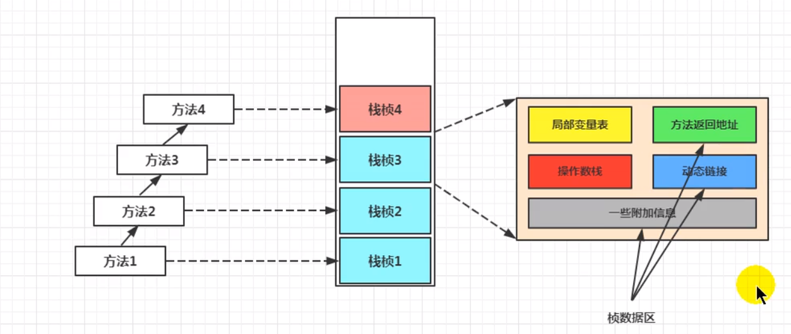

##### 局部变量表

* 局部变量表也被称之为局部变量数组或本地变量表
* **定义为一个数字数组，主要用于存储方法参数和定义在方法体内的局部变量**,这些数据类型包括基本数据类型、对象引用、以及returnAddress（返回地址）类型
* 由于局部变量表是建立在线程的栈上，是线程的私有数据，因此**不存在数据安全问题**
* **局部变量表所需的容量大小是在编译期间确定下来的**,并保存在方法的Code属性的maximum  local  variables数据项中。在方法的运行期间是不会改变局部变量表的大小的。
* **方法嵌套调用的次数由栈的大小决定**。一般来说，**栈越大，方法嵌套调用次数越多**。对于一个函数而言，它的参数和局部变量越多，是的局部变量表膨胀，它的栈帧就越大，以满足方法调用所传递的信息增大的需求。进而函数调用就会占用更多的栈空间，导致其嵌套调用次数会减少。
* **局部变量表中的变量只在当前方法调用中有效**。在方法执行时，虚拟机通过使用局部变量表完成参数值到参数变量列表的传递过程。**当方法调用结束后，随着方法栈帧的销毁，局部变量表也会随之销毁**。

###### 关于Slot的理解

*  参数值的存放总是在局部变量表的index0开始，到数组长度-1的索引结束。
* 局部变量表，**最基本的存储单元式Slot（变量槽）**
* 局部变量表中存放编译期可知的各种基本数据类型（8种），引用数据类型（reference），returnAddress类型的变量。
* 在局部变量表里，**32位以内的数据只占一个slot（包括returnAddress类型），64位类型（Long和double）占用两个Slot**。
  * byte、short、char在存储前被转换为int，boolean也被转换为int，0表示false，非0表示true
  * long和double 则占用两个Slot
* JVM会为局部变量表中搞得每一个Slot都分配一个访问索引，通过这个索引即可成功访问到局部变量表中指定的局部变量值。
* 当一个实例方法被调用的时候，它的方法参数和内部定义的局部变量会**按照顺序被复制**到局部变量表中的每一个slot上
* **如果需要访问局部变量表中的一个64bit的局部变量值时，只需要使用前一个索引即可**。（比如：访问long或double类型变量）
* 如果当前帧是由构造方法或者实例方法创建的，那么**该对象引用this将会存放inde为0的slot处**，其余的参数按照参数顺序排列。


###### Slot的重复利用

**栈帧中的局部变量表中的槽位是可以重复用的**，如果一个局部变量过了其作用域，那么在其作用域之后申明的新的局部变量就很有可能会复用过期局部变量的槽位，从而**达到节省资源的目的**。

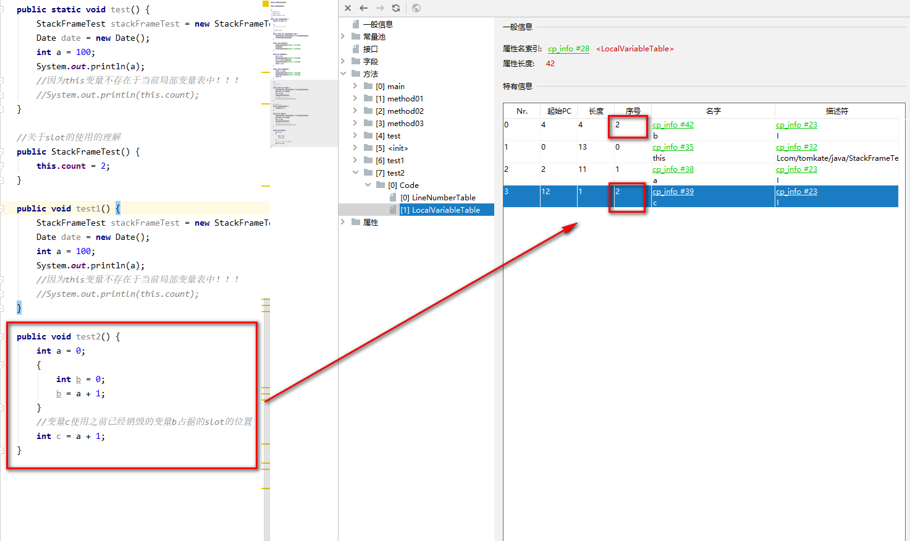

###### 静态变量与局部变量的对比

* 参数表分配完毕之后，再根据方法体内的变量的顺序和作用域分配。
* 我们知道类变量表由两次初始化的机会，第一次始在“**准备阶段**”，执行系统初始化，对类变量设置零值，另一次则是在“**初始化**”阶段，赋予程序员在代码中定义的初始值。
* 和类变量初始化不同的是，**局部变量表不存在系统初始化的过程**，这意味着一旦定义了局部变量则必须人为的初始化否则无法使用。

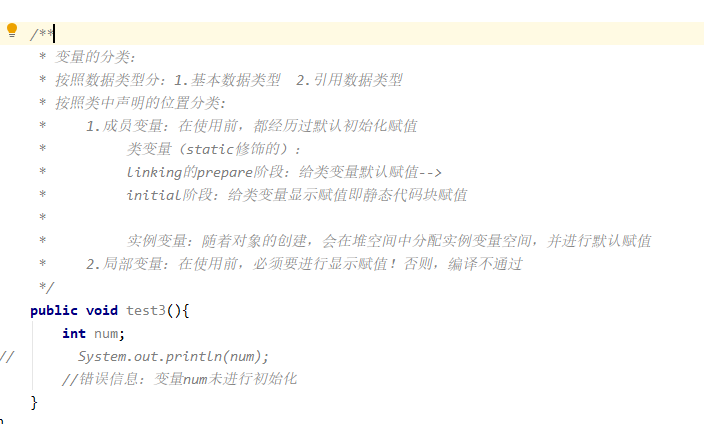

###### 补充说明

* 在栈帧中，与性能调优关系最为密切的部分就是前面提到的局部变量表。在方法执行时，虚拟机使用局部变量表完成方法的传递。
* **局部变量表中的变量也是重要的垃圾回收根节点，只要被局部变量表中直接或间接引用的对象都不会被回收**

##### 操作数栈

栈：可以使用数组或链表实现

* **操作数栈，在方法执行过程中，根据字节码指令，往栈中写数据或提取数据，即入栈（push）/出栈（pop）**。

* 操作数栈，**主要用于保存计算过程的中间结果，同时作为计算过程中变量临时的存储空间**

* 操作数栈就是JVM执行引擎的一个工作区，当一个方法刚开始执行的时候，一个新的栈帧也会随之被创建出来，**这个方法的操作数栈式空的**
* 每一个操作数栈都会拥有一个明确的栈深度用于存储数值，**其所需的最大深度在编译期就定义好了**，保存在方法的code属性中，为max_stack的值。
* 栈中的任何一个元素都是可以为任意的Java数据类型
  * 32bit的类型占用一个栈单位深度
  * 64bit的类型占用两个栈单位深度
* 操作数栈**并非采用访问索引的方式来进行数据访问的**，而是只能通过标准的入栈（push）和出栈（pop）操作来完成一次数据的访问
* **如果被调用的方法带有返回值的话，其返回值会被压入当前栈帧的操作数栈中**，并更新PC寄存器中下一条需要执行的字节码指令

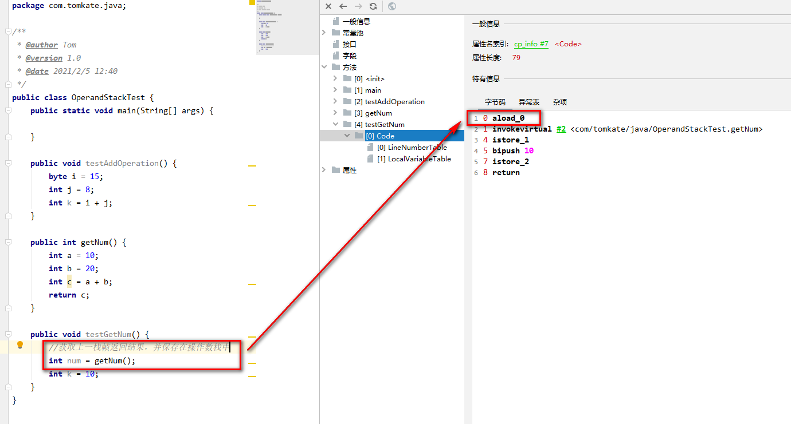

* 操作数栈中的元素的数据类型必须与字节码指令的序列严格匹配，这由编译器在编译期间进行验证，同时在类加载的过程中的类验证阶段的数据流分析阶段要再次验证。
* 另外，我们说Java虚拟机的**解释引擎是基于栈的执行引擎**，其中的栈指的就是操作数栈

###### 操作数栈代码追踪


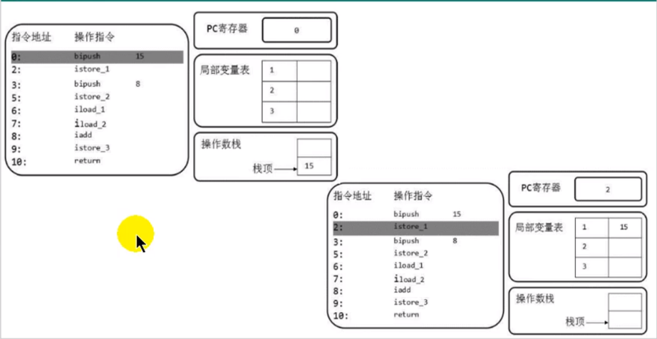

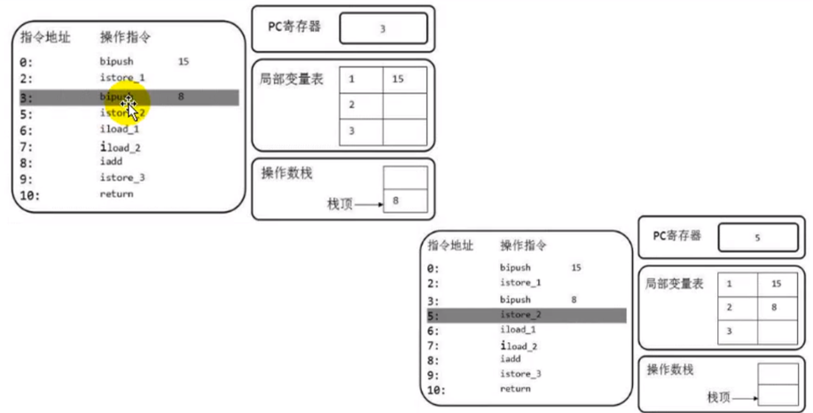

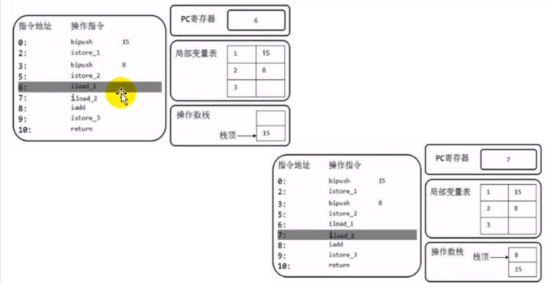


###### 栈顶缓存技术

前面提过，基于栈式架构的虚拟机所使用的零地址指令更加紧凑，单完成一项操作的时候必然需要使用更多的入栈和出栈指令，这同时也就意味着将需要更多的指令分派次数和内存读/写次数。

由于操作数是在存储在内存中的，因此频繁地执行内存读/写操作必然会影响执行速度，为了解决这个问题，HotSpot JVM的设计者们提出了栈顶缓存技术，**将栈顶元素全部缓存在物理CPU的寄存器中，以降低对内存的读/写次数，提升执行效率**

##### 动态链接（或指向运行时常量池的方法引用）

* 每一个栈帧内部都包含一个指向**运行时常量池中该栈帧所属方法的引用**。包含这个引用的目的就是为了支持当前方法的代码能够实现**动态链接（Dynamic Linking）。**比如invokedynamic指令
* 在Java源文件被编译到字节码文件中时，所有的变量和方法引用都作为符号引用保存在class文件的常量池里。比如：描述一个方法调用了另外的其他方法时，就是通过常量池中指向方法的符号引用来表示的，那么**动态连接的作用就是为了将这些符号引用转换为调用方法的直接引用**。

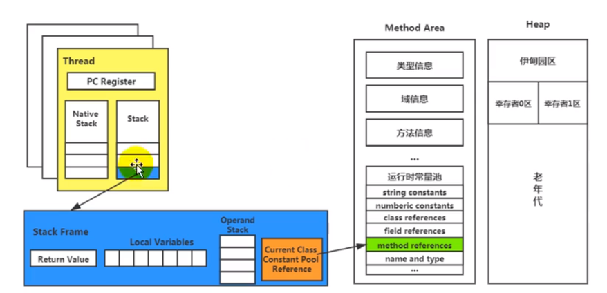

###### 为什么需要常量池？

常量池的作用，就是为了提供一些符号的常量，便于指令的识别。

##### 方法的调用

在JVM中，将符号引用转换为调用方法的直接引用与方法的绑定机制相关。

###### 链接

* 静态链接

当一个字节码文件被装载进JVM内部时，如果被调用的**目标方法在编译期可知**，且运行时保持不变时。这种情况下将调用方法的符号引用转换为直接引用的过程称之为静态链接。

* 动态连接

如果**被调用的方法在编译器无法被确定下来**，也就是说，只能够在程序运行期将调用方法的符号引用转换为直接引用，由于这种引用转换过程具备动态性，因此也被称之为动态连接。

###### 绑定机制

对应的方法的绑定机制为：早期绑定和晚期绑定。**绑定是一个字段、方法或者类在符号引用被替换为直接引用的过程，这仅仅发生一次**。

* 早期绑定

早期绑定就是指被调用的**目标方法如果在编译期可知，且运行期保持不变**时，即可将这个方法与所属类型进行绑定，这样一来，由于明确了被调用的目标方法究竟是哪一个，因此也就可以使用静态连接的方式将符号引用转换为直接引用。

* 晚期绑定

如果**被调用的方法在编译期无法被确定下来，只能够在程序运行期间根据实际的类型绑定的相关方法**，这种绑定方式也被称之为晚期绑定。

###### 早晚期绑定的发展历史

随着高级语言的横空出世，类似于Java一样的基于面向对象的编程语言如今越来越多，尽管这类编程语言在语法风格上存在一定的差别，但是它们彼此之间始终保持着一个共性，那就是都支持封装、继承和多态等面向对象特性，既然这一类的编程语言具备多态特性，那么自然也就具备早期绑定和晚期绑定两种绑定方式。

Java中任何一个普通的方法其实都具备虚函数的特征，它们相当于C++语言中的虚函数（C++中则需要使用关键字virtual来显式定义）。如果在Java程序中不希望某个方法拥有虚函数的特征时，则可以使用关键字final来标记这个方法。

###### 虚方法和非虚方法

* 非虚方法
  * 如果方法在编译期间就确定了具体的调用版本，这个版本在运行时时不可变的。这样的方法就称为**非虚方法**。
  * 静态方法、私有方法、final方法、实例构造器、父类方法都是非虚方法。
* 虚方法
  * 其他方法为**虚方法**。

虚拟机中提供了一下几条方法的调用指令：

* 普通调用指令
  1. **invokestatic：调用静态方法，解析阶段唯一确定方法版本**
  2. **invokespecial：调用\<init\>方法、私有及父类方法，解析阶段确定唯一方法版本**
  3. invokevirtual：调用所有虚方法
  4. invokeinterface：调用接口方法
* 动态调用指令
  5. invokekedynamic：动态解析出需要调用的方法，然后执行

前四条指令固化在虚拟机内部，方法的调用不可人为干预，而invokeKedynamic指令则支持由用户确定方法版本。其中**invokestatic指令和invokespecial指令调用的方法成为非虚方法，其余的（final修饰的除外）成为虚方法。**

###### 关于invokedynamic指令

* JVM字节码指令集一直比较稳定，一直到Java7中才增加了一个invokedynamic指令，这是Java为了实现动态类型语言】支持而做的一种改进。

* 但是在Java7中并没有提供直接生成invokedynamic指令的方法，需要借助ASM这种底层字节码工具来产生invokedynamic指令。直到Java8的Lambda表达式的出现，invokedynamic指令的生成，在Java中才有了直接的生成方式。

* Java7中增加的动态语言类型支持的本质是对Java虚拟机规范的修改，而不是对Java语言规则的修改，这一块相对来讲比较复杂，增加了虚拟机中的方法调用，最直接的受益者就是运行在Java平台的动态语言的编译器。

###### 动态语言和静态语言

动态类型语言和静态类型语言两者的区别就在于对类型的检查是在编译期还是在运行期，满足前者就是静态类型语言，反之是动态类型语言。

说的再直白一点就是，**静态类型语言是判断变量自身的类型信息；动态类型语言是判断变量值的类型信息，变量没有类型信息，变量值才有类型信息**，这是动态语言的一个重要特征。

> Java：String info = "tomkate";     (Java是静态类型语言的，会先编译就进行类型检查)
>
> JS：var name = "tomkate";    var name = 10;    （运行时才进行检查）

###### 方法重写的本质

- 找到操作数栈顶的第一个元素所执行的对象的实际类型，记作C。
- 如果在类型C中找到与常量中的描述符合简单名称都相符的方法，则进行访问权限校验，如果通过则返回这个方法的直接引用，查找过程结束；如果不通过，则返回java.1ang.I1legalAccessError 异常。
- 否则，按照继承关系从下往上依次对C的各个父类进行第2步的搜索和验证过程。
- 如果始终没有找到合适的方法，则抛出java.1ang.AbstractMethodsrror异常。

###### IllegalAccessError介绍

程序试图访问或修改一个属性或调用一个方法，这个属性或方法，你没有权限访问。一般的，这个会引起编译器异常。这个错误如果发生在运行时，就说明一个类发生了不兼容的改变。

###### 虚方法表

* 在面向对象的编程中，会很频繁的使用到动态分派，如果在每次动态分派的过程中都要重新在类的方法元数据中搜索合适的目标的话就可能影响到执行效率。因此，**为了提高性能，JVM采用在类的方法区建立一个虚方法表（virtual method table）（非虚方法不会出现在表中）来实现。使用索引表来代替查找**。
* 每个类中都有一个虚方法表，表中存放着各个方法的实际入口。
* 虚方法表什么时候被创建？

虚方法表会在类加载的连接阶段被创建并开始初始化，类的变量初始化值准备完成之后，JVM会把该类的方法表也初始化完成。

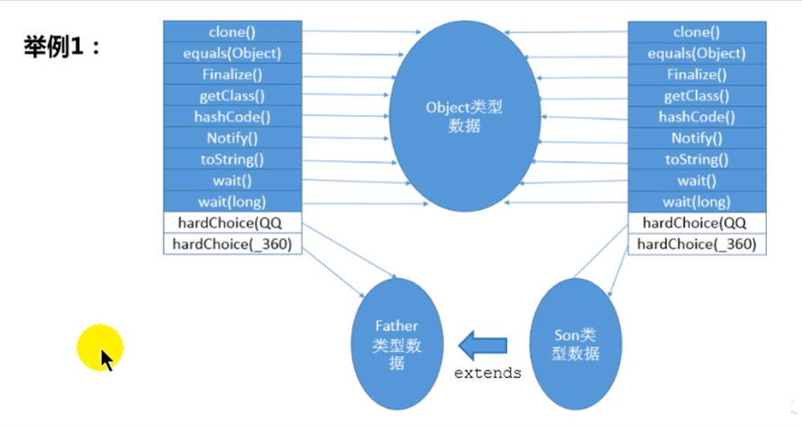

如上图所示：如果类中重写了方法，那么调用的时候，就会直接在虚方法表中查找，否则将会直接连接到Object的方法中。

##### 方法返回地址（return address）

* 存放调用该方法的pc寄存器的值。
* 一个方法的结束，有两种形式
  * 正常执行完成
  * 出现未处理的异常，非正常退出
* 无论通过那种方式的退出，在方法退出后都返回到该方法被调用的位置。方法无法正常退出时，**调用者的pc计数器的值作为返回地址，即调用该方法的指令的下一条指令的地址**。而通过异常退出的，返回地址时要通过异常表来确定，栈帧中一般不会保存这部分信息。

当一个方法开始执行后，只有两种方式可以退出这个方法：

1. 执行引擎遇到任意一个方法返回的字节码指令（return），会有返回值传递给上层的方法调用者，简称**正常完成出口**

   * 一个方法在正常嗲用完成之后究竟需要使用哪一个返回指令还需要根据方法返回值的实际数据类型而定。
   * 在字节码指令中，返回指令包含ireturn（当返回值时boolean、byte、char、short和int类型时使用）、lreturn、freturn、dtrturn以及areturn，另外还有一个return指令供声明为void的方法、实例初始化方法、类和接口的初始化方法使用。

   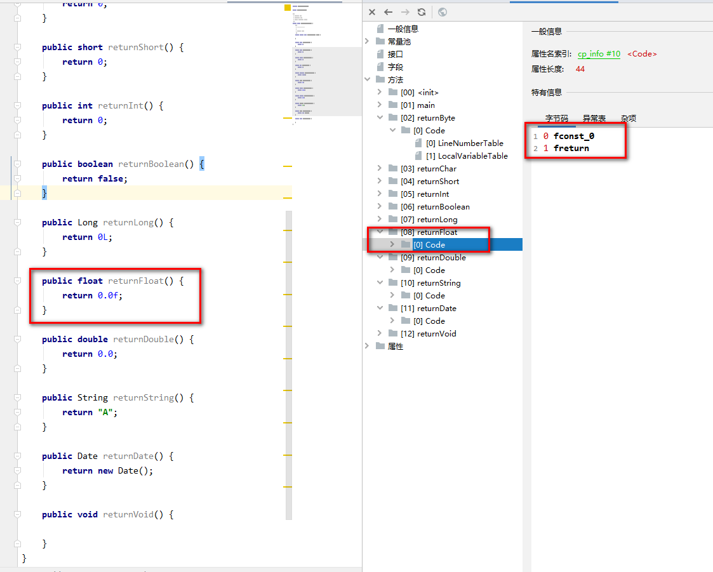

2. 在方法执行的过程中遇到了异常（Exception）,并且这个异常没有在方法内进行处理，也就是只要在本方法的异常表中没有搜索到匹配的异常处理器，就会导致方法退出。简称**异常完成出口**

方法执行过程中抛出异常时的异常处理，存储在一个异常处理表，方便再发生异常的时候找到处理异常的代码。


* **本质上，方法的退出就是当前栈帧出栈的过程。此时，需要恢复上层方法的局部变量表、操作数栈、将返回值压入调用者栈帧的操作数栈、设置PC寄存器值等，让调用者方法继续执行下去**。
* **正常完成出口和异常完成出口的区别在于：通过异常完成出口退出的不会给它的上层调用者产生任的返回值。**

##### 栈帧中的一些附加信息

栈帧中还允许携带与Java虚拟机实现相关的一些附加信息。例如，对程序条视提供支持的信息。

#### 栈的相关面试题

* 举例出栈溢出的情况？（StackOverflowError）
  * 通过-Xss设置栈的大小；
  * 整个内存空间不足OOM
* 调整栈大小，就能保证不出现溢出吗？
  * 不能，递归调用main方法总是会溢出的
* 分配的栈内存越大越好吗？
  * 不是，一定时间内降低了OOM概率，但是会挤占其它的线程空间，因为整个空间是有限的。
* 垃圾回收是否会涉及到虚拟机栈？
  * 不会
* 方法中定义的局部变量是否线程安全？
  * 具体问题具体分析

````java
package com.tomkate.java;

/**
 * 面试题
 * 方法中定义局部变量是否线程安全？具体情况具体分析
 * 何为线程安全？
 * 如果只有一个线程才可以操作此数据，则必是线程安全的
 * 如果有多个线程操作，则此数据是共享数据，如果不考虑同步机制，则为线程不安全
 *
 * @author Tom
 * @version 1.0
 * @date 2021/2/5 17:05
 */
public class StringBuilderTest {

    // s1的声明方式是线程安全的
    public static void method01() {
        // 线程内部创建的，属于局部变量
        //内部消亡
        StringBuilder s1 = new StringBuilder();
        s1.append("a");
        s1.append("b");
    }
    
    // stringBuilder 是线程不安全的，操作的是共享数据
    public static void method02(StringBuilder stringBuilder) {
        stringBuilder.append("a");
        stringBuilder.append("b");
    }
    
    /**
     * 同时并发的执行，会出现线程不安全的问题
     */
    public static void method03() {
        StringBuilder stringBuilder = new StringBuilder();
        
        new Thread(() -> {
            stringBuilder.append("a");
            stringBuilder.append("b");
        }, "t1").start();

        method02(stringBuilder);
    	//new的线程可能与method02同时执行产生并发
    }

    // 这个也是线程不安全的，因为有返回值，有可能被其它的程序所调用
    public static StringBuilder method04() {
        StringBuilder stringBuilder = new StringBuilder();
        stringBuilder.append("a");
        stringBuilder.append("b");
        return stringBuilder;
    }

    // StringBuilder是线程安全的，但是String也可能线程不安全的
    // StringBuilder内部消亡，return的Strin是线程不安全的
    public static String method05() {
        StringBuilder stringBuilder = new StringBuilder();
        stringBuilder.append("a");
        stringBuilder.append("b");
        return stringBuilder.toString();
    }
}
````

总结：**如果对象始在内部产生，并在内部消亡，没有返回值到外部，那么它就是线程安全的，反之则是线程不安全的。**

**运行时数据区，是否存在Error和GC？**

| 运行时数据区 | 是否存在Error | 是否存在GC |
| ------------ | ------------- | ---------- |
| 程序计数器   | 否            | 否         |
| 虚拟机栈     | 是            | 否         |
| 本地方法栈   | 是            | 否         |
| 方法区       | 是（OOM）     | 是         |
| 堆           | 是            | 是         |

### 本地方法接口

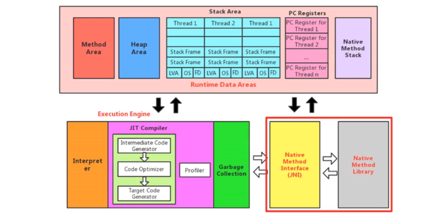

#### 什么是本地方法？

简单地讲，一个Native Methodt是一个Java调用非Java代码的接囗。一个Native Method是这样一个Java方法：该方法的实现由非Java语言实现，比如C。这个特征并非Java所特有，很多其它的编程语言都有这一机制，比如在C++中，你可以用extern "c" 告知c++编译器去调用一个c的函数。

"A native method is a Java method whose implementation is provided by non-java code."（本地方法是一个非Java的方法，它的具体实现是非Java代码的实现）

在定义一个native method时，并不提供实现体（有些像定义一个Java interface），因为其实现体是由非java语言在外面实现的。

本地接口的作用是融合不同的编程语言为Java所用，它的初衷是融合C/C++程序。

````java
/**
 * 本地方法
 *
 * @author Tom
 * @version 1.0
 * @date 2021/2/5 18:39
 */
public class IhaveNatives {
    public native void Native1(int x);

    native static public long Native2();

    private native synchronized  float Native3(Object o);

    native void Natives(int[] ary) throws Exception;
}
````

> **标识符native可以与所有其他的java标识符连用，但是abstract除外。**

#### 为什么要使用Native Method

Java使用起来非常方便，然而有些层次的任务用Java实现起来不容易，或者我们堆程序的效率很在意时，问题就来了。

* **与Java环境外交互**

**有时Java应用需要与Java外面的环境交互，这是本地方法存在的主要原因。**你可以想想Java需要与一些底层系统，如操作系统或某些硬件交换信息时的情况。本地方法正是这样一种交流机制：它为我们提供了一个非常简洁的接口，而且我们无需去了解Java应用之外的繁琐的细节。

* **与操作系统交互**

JVM支持着Java语言本身和运行时库，它是Java程序赖以生存的平台，它由一个解释器（解释字节码）和一些连接到本地代码的库组成。然而不管怎样，它毕竟不是一个完整的系统，它经常依赖于一底层系统的支持。这些底层系统常常是强大的操作系统。**通过使用本地方法，我们得以用Java实现了jre的与底层系统的交互，甚至JVM的一些部分就是用c写的。**还有，如果我们要使用一些Java语言本身没有提供封装的操作系统的特性时，我们也需要使用本地方法。

* **sun's  Java**

**Sun的解释器是用C实现的，这使得它能像一些普通的C一样与外部交互。**jre大部分是用Java实现的，它也通过一些本地方法与外界交互。例如：类java.lang.Thread的setpriority（）方法是用Java实现的，但是它实现调用的是该类里的本地方法setpriorityo（）。这个本地方法是用C实现的，并被植入JVM内部，在Windows 95的平台上，这个本地方法最终将调用Win32 setpriority（）ApI。这是一个本地方法的具体实现由JVM直接提供，更多的情况是本地方法由外部的动态链接库（external dynamic link library）提供，然后被JVM调用。

#### 现状

**目前该方法使用的越来越少了，除非是与硬件有关的应用**，比如通过Java程序驱动打印机或者Java系统管理生产设备，在企业级应用中已经比较少见。因为现在的异构领域间的通信很发达，比如可以使用Socket通信，也可以使用Web Service等等，不多做介绍。

### 本地方法栈

* **Java虚拟机栈用于管理Java方法的调用，而本地方法栈用于管理本地方法的调用。**
* 本地方法栈，也是线程私有的。
* 允许被实现成固定或者时可动态扩展的内存大小。（在内存溢出方面是相同的）
  * 如果线程请求分配的栈容量超过本地方法栈允许的最大容量，Java虚拟机将会抛出一个stackOverflowError异常。
  * 如果本地方法栈可以动态扩展，并且在尝试扩展的时候无法申请到足够的内存，或者在创建新的线程时没有足够的内存去创建对应的本地方法栈，那么Java虚拟机将会抛出一个OutOfMemoryError异常。
* 本地方法是使用C语言实现的。
* 它的具体做法是Native Method Stack中登记native方法，在Execution Engine执行时加载本地方法库。

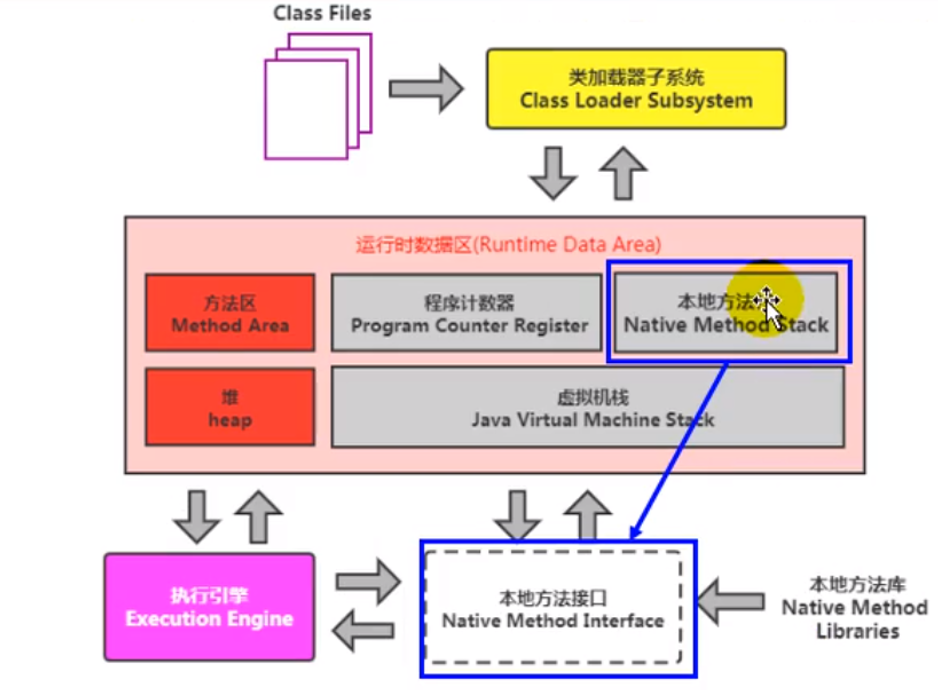

* **当某个线程调用一个本地方法时，它就进入了一个全新的并且不再受虚拟机限制的世界。它和虚拟机拥有同样的权限。**
  * 本地方法可以通过本地方法接口来**访问虚拟机内部的运行时数据区。**
  * 它甚至可以直接使用本地处理器中的寄存器。
  * 直接从本地内存的堆中分配任意数量的内存。
* **并不是所有的JVM都支持本地方法。因为Java虚拟机规范并没有明确要求本地方法栈使用的语言、具体实现方式、数据结构等。**如果JVM产品不打算支持native方法，也可以无需实现本地方法栈。
* 在Hotspot JVM中，直接将本地方法栈和虚拟机栈合二为一。

### 堆

 #### 堆的核心概述

* 一个JVM实例只存在一个堆内存，堆也是Java内存管理的核心区域。
* Java堆在JVM启动的时候即被创建，其空间大小也就确定了。是JVM管理的最大的一块内存空间。
  * 堆内存的大小是可以调节的。

> -Xms10m：最小堆内存
>
> -Xms10m：最大堆内存

下图为使用Visual VM查看堆空间的内容，需要安装Visual GC插件

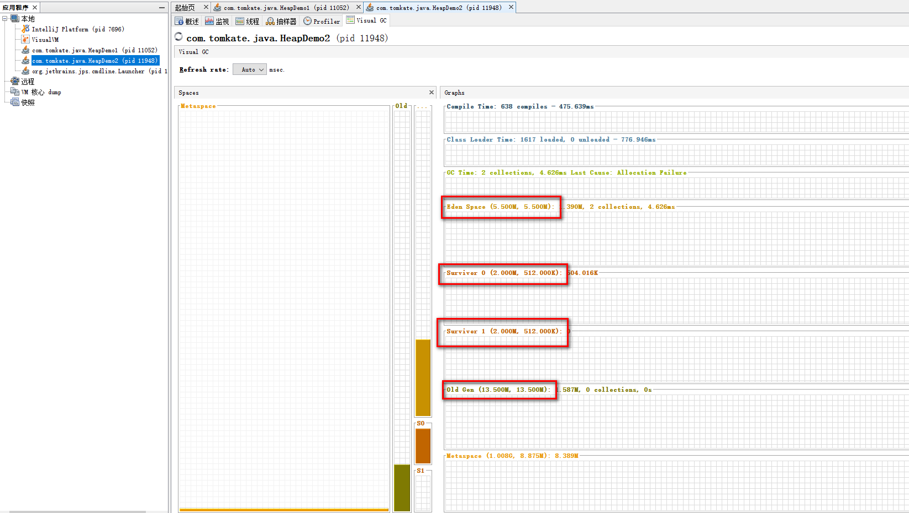

* 《Java虚拟机规范》规定，堆可以处于**物理上不连续**的内存空间中，但在**逻辑上**它应该被视为**连续的**
* 所有的线程共享Java堆空间，在这里还可以划分线程私有的缓冲区（Thread Local Allocation Buffer，TLAB）
* 《Java虚拟机规范》中对Java堆的描述是：所有的对象实例以及数组都应当在运行时分配在堆上。（The heap is the run-time data area from which memory for all class instances and arrays is allocated）
  * 我要说的是：“几乎”所有的对象实例都在这里分配内存。-从实际实用角度看的。
  * 因为还有一些对象是在栈上分配的
* 数组和对象可能永远不会存在栈上，因为栈帧中保存引用，这个引用指向对象或者数组在堆中的位置

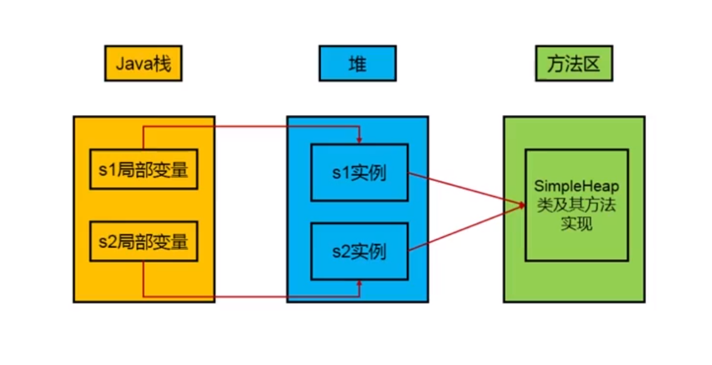

* 在方法结束后，堆中的对象不会马上被移除，仅仅在垃圾收集的时候才会被移除
  * 也就是出发了GC的时候，才会进行回收
  * 如果堆中对象马上被回收（频繁GC），那么用户线程就会受到影响
* 堆，是GC（Garbage  Collection，垃圾收集器）执行垃圾回收的重点区域

#### 堆内存的细分

现代垃圾收集器大部分都基于分代收集理论设计，堆空间细分为：

* Java7及之前堆内存逻辑上分为三部分：新生区+养老区+**永久区**
  * Young Generation Space	新生区		Young/New  又被分为Eden区+Survivor区
  * Tenure Generation Space   养老区        Old/Tenure
  * Permanent  永久区   Perm
* Java8及之后堆内存逻辑上分为三部分：新生区+养老区+**元空间**
  * Young Generation Space	新生区		Young/New  又被分为Eden区+Survivor区
  * Tenure Generation Space   养老区        Old/Tenure
  * Meta Spae   元空间    Meta

约定：新生区<-->新生代<-->年轻代    养老区<-->老年区<-->老年代    永久区<-->永久代

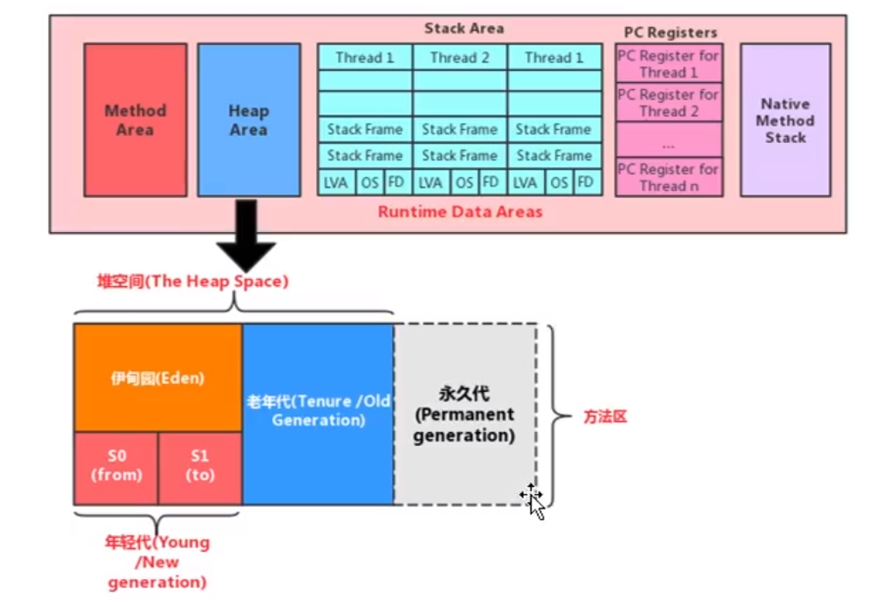

堆空间内部结构，JDK1.8之前从**永久代** 替换为  **元空间**

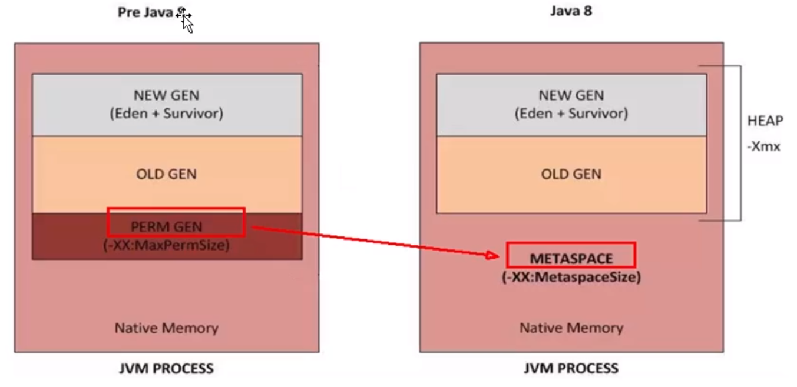

#### 设置堆内存大小与OOM

* Java堆区用于存储Java对象实例，那么堆的大小在JVM启动时就已经设定好了，大家可以通过选项"-Xmx"和"-Xms"来进行设置。
  * “-Xms"用于表示堆区的起始内存，等价于-xx:InitialHeapSize
  * “-Xmx"则用于表示堆区的最大内存，等价于-XX:MaxHeapSize

* 一旦堆区中的内存大小超过“-xmx"所指定的最大内存时，将会抛出outofMemoryError异常。

* 通常会将-Xms和-Xmx两个参数配置相同的值，其目的是**为了能够在ava垃圾回收机制清理完堆区后不需要重新分隔计算堆区的大小，从而提高性能**。

* 默认情况下
  * 初始内存大小：物理电脑内存大小/64

  * 最大内存大小：物理电脑内存大小/4

````java
/**
 * 1.设置堆空间大小的参数
 * -Xms 用来设置堆空间（年轻代+老年代）的初始内存大小
 *      -X 是jvm的运行参数
 *      ms 是memory start
 *-Xmx 用来设置堆空间（年轻代+老年代）的最大内存大小
 *
 * 2.默认堆空间的大小
 *      初始内存大小：物理电脑内存大小/64
 *      最大内存大小：物理电脑内存大小/4
 *
 * 3.自定义设置堆内存：-Xms600m -Xmx600m
 *      开发中建议将初始内存和最大的堆内存设置为相同值
 *
 * 4.如何查看设置参数
 *      方式一：jps / jstat -gc 进程id
 *      方式二：-XX:+PrintGCDetails
 *
 * @author Tom
 * @version 1.0
 * @date 2021/2/6 14:04
 */
public class HeapSpaceInitial {
    public static void main(String[] args) {
        //返回java虚拟机中的堆内存总量
        long initialMemory = Runtime.getRuntime().totalMemory() / 1024 / 1024;
        //返回java虚拟机试图使用的最大堆内存
        long maxMemory = Runtime.getRuntime().maxMemory() / 1024 / 1024;

        System.out.println("-Xms : " + initialMemory + "M");
        System.out.println("-Xmx : " + maxMemory + "M");
    }
}
````

输出结果为

````java
-Xms : 184M
-Xmx : 2715M
````

如何查看堆内存的内存分配情况

````java
jps  ->  jstat -gc 进程id
````

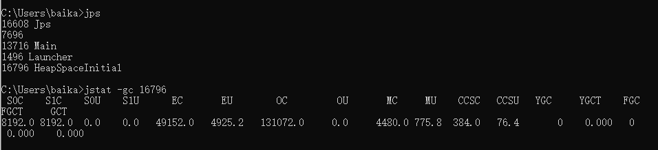

启动参数增加

````
-XX:+PrintGCDetails
````

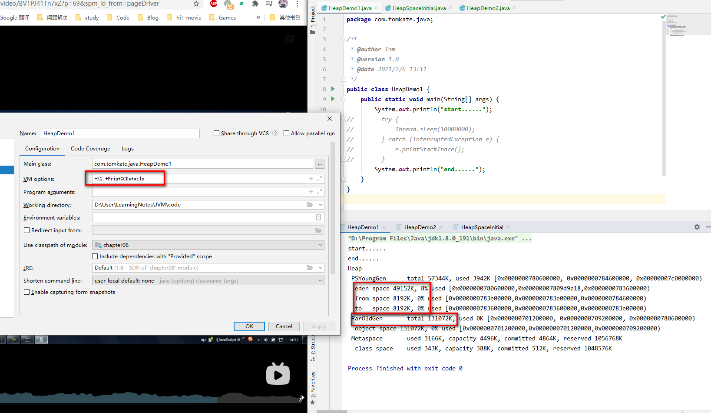

##### OutOfMemory举例

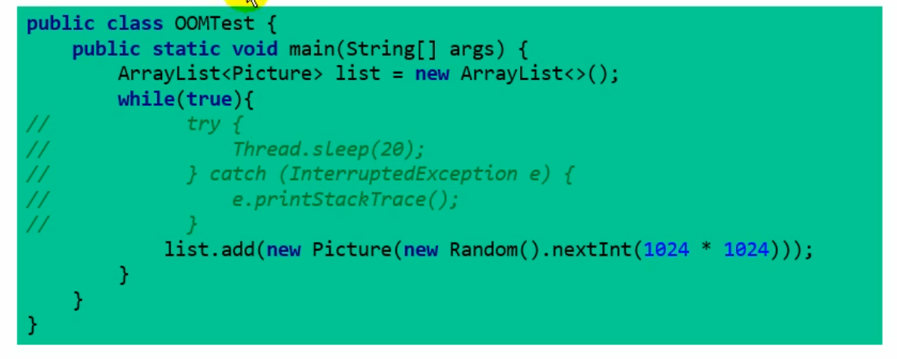

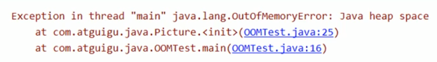

````java
/**
 * 模拟OOM
 *
 * @author Tom
 * @version 1.0
 * @date 2021/2/6 14:50
 */
public class OOMTest {
    public static void main(String[] args) {
//        ArrayList<Integer> list = new ArrayList<>();
//        while (true) {
//            try {
//                Thread.sleep(1);
//            } catch (InterruptedException e) {
//                e.printStackTrace();
//            }
//            list.add(999999999);
//        }

        ArrayList<Picture> list = new ArrayList<>();
        while (true) {
            try {
                Thread.sleep(20);
            } catch (InterruptedException e) {
                e.printStackTrace();
            }
            list.add(new Picture(new Random().nextInt(1024 * 1024)));
        }
    }

    static class Picture {
        private byte[] pixels;

        public Picture(int length) {
            this.pixels = new byte[length];
        }
    }
}

````

设置JVM启动参数

````
-Xms10m -Xmx10m
````

运行后,可通过Visual GC观察到 伊甸园区内存不断增加填入幸存者区最终汇入老年代，最终老年代填满爆出OOM

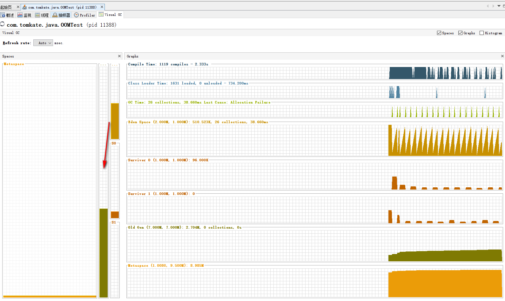

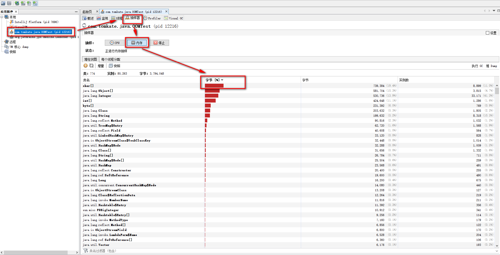

#### 年轻代与老年代

* 存储在JVM中的Java对象可以被划分为两类
  * 一类是生命周期较短的瞬时对象，这类对象的创建和消亡都非常迅速
  * 另外一类对象的生命周期却非常长，在某些极端的情况下还能够与JVM的生命周期保持一致
* Java堆区进一步细分的话，可以划分为年轻代（YoungGen）和老年代（OldGen）
* 其中年轻代又可以划分为Eden空间、Survivor0空间和Survivor1空间（有时也叫做from区、to区）

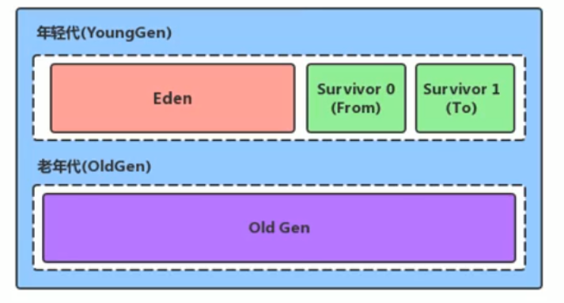

**下面这参数开发中一般不会调**

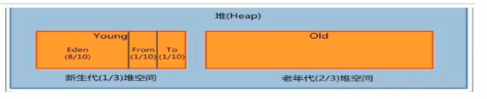

* Eden：From：To ->    8:1:1
* 新生代：老年代     ->    1:2

配置新生代与老年代在堆结构的占比

* 默认-XX:NewRatio=2，表示新生代占1，老年代占2，新生代占整个堆的1/3
* 可以修改-XX:NewRatio=4，表示新生代占1，老年代占4，新生代占整个堆的1/5

> 当发现在整个项目中，生命周期长的对象偏多，那么就可以通过调整老年代大小，来进行优化

在HotSpot中，Eden空间和另外两个survivor空间缺省所占的比例是8：1：1当然开发人员可以通过选项“-xx:SurvivorRatio”调整这个空间比例。比如-xx:SurvivorRatio=8

新生代比例分配

* -XX:SurvivorRatio：设置新生代中Eden区与Survivor区的比例

* -XX:-UserAdaptiveSizePolicy:8：新生代关闭自适应的内存分配策略（暂时用不到）（+代表使用 - 代表不使用）

**几乎所有的**Java对象都是在Eden区被new出来的，绝大部分的Java对象的销毁都在新生代进行了

> IBM公司的专门研究表明，新生代中80%的对象都是“朝生夕死”的
>
> 可以使用选项“-Xmn”设置新生代内存大小
>
> 这个参数一般使用默认就可以

````
-XX:NewRatio：设置新生代与老年代的比例。默认值是2
-XX:SurvivorRatio：设置新生代中Eden区与Survivor区的比例 默认值是8
-XX:-UserAdaptiveSizePolicy:8 ：新生代关闭自适应的内存分配策略（暂时用不到）
-Xmn：设置新生代的空间的大小（优先级比-XX:NewRatio高，一般不设置）
````


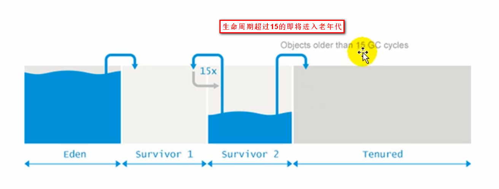

#### 图解对象分配过程

##### 概念

为新对象分配内存是一件非常严谨和复杂的任务，JVM的设计者们不仅需要考虑内存如何分配、在哪里分配等问题，并且由于内存分配算法与内存回收算法密切关联，所以还需要考虑GC执行完内存回收后是否会在内存空间中产生内存碎片。

1. new的对象先放在伊甸园区。此处没有大小限制

2. 当伊甸园的空间填满时，程序又需要创建对象，JVM的垃圾回收器将对伊甸园区进行垃圾回收（Minor GC），将伊甸园区中的不再被其它对象所引用的对象进行销毁。再加载新的对象放到伊甸园区

3. 然后将伊甸园区中的剩余对象移动到幸存者0区

4. 如果再次触发垃圾回收，此时上次幸存下来的放到幸存者0区的，如果没有被回收，就会放到幸存者1区

5. 如果再次经历垃圾回收，此时会重新放回到幸存者0区，接着再去幸存者1区

6. 啥时候能去养老区呢？可以设置次数。默认是15次

   **可以设置参数：-XX:MaxTenuringThreshold=\<N\>进行设置**

7. 在养老区，相对悠闲。当养老区内存不足时，再次触发GC：Major GC，进行养老区的内存清理

8. 若养老区执行了Major GC之后发现依然无法进行对象的保存，就会产生OMM异常


##### 图解过程

我们创建的对象，一般都是存放在Eden区的，当我们Eden区满了后，就会触发GC操作，一般被称为 YGC / Minor GC操作

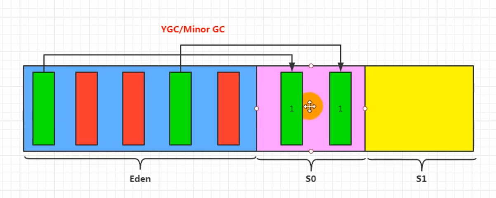

当我们进行一次垃圾收集后，红色的将会被回收，而绿色的还被会占用，存放在S0（Survivor From）区。同时我们给每个对象设置了一个年龄计数器，一次回收后就是1

同时Eden区继续存放对象，当Eden区再次存满的时候，又会触发一个MinorGC操作，此时GC将会把 Eden和Survivor From中的对象 进行一次收集，把存活的对象放到 Survivor To区，同时让年龄 + 1

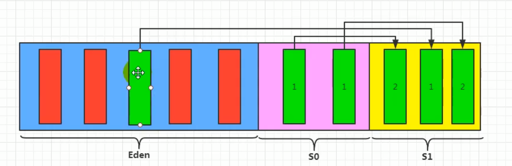

我们继续不断的进行对象生成 和 垃圾回收，当Survivor中的对象的年龄达到15的时候，将会触发一次 Promotion晋升的操作，也就是将年轻代中的对象  晋升到 老年代中

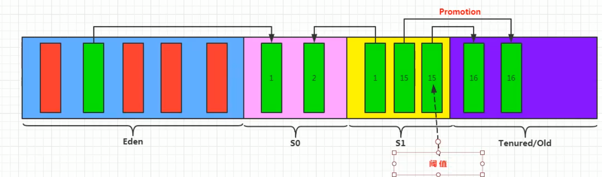

##### 思考：幸存区区满了后？

特别注意，在Eden区满了的时候，才会触发MinorGC，而幸存者区满了后，不会触发MinorGC操作

如果Survivor区满了后，将会触发一些特殊的规则，也就是可能直接晋升老年代

> 举例：以当兵为例，正常人的晋升可能是 ：  新兵 -> 班长 -> 排长 -> 连长
>
> 但是也有可能有些人因为做了非常大的贡献，直接从  新兵 -> 排长

##### 对象分配的特殊情况

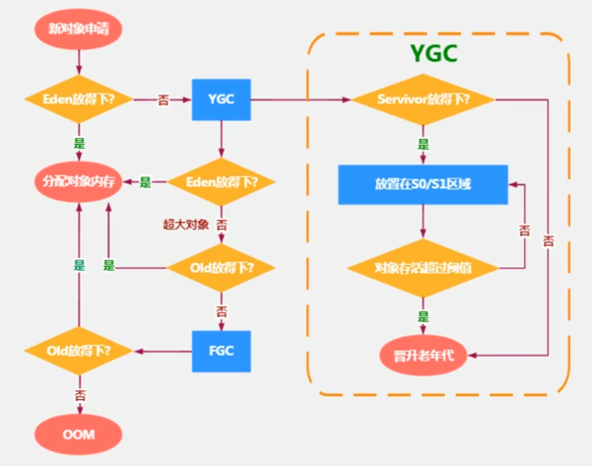

##### 代码演示对象分配过程

````java
/**
 * @author Tom
 * @version 1.0
 * @date 2021/2/6 17:21
 */
public class HeapInstanceTest {
    byte [] buffer = new byte[new Random().nextInt(1024 * 200)];
    public static void main(String[] args) throws InterruptedException {
        ArrayList<HeapInstanceTest> list = new ArrayList<>();
        while (true) {
            list.add(new HeapInstanceTest());
            Thread.sleep(10);
        }
    }
}

````

然后设置JVM参数

````
-Xms600m -Xmx600m
````

然后cmd输入下面命令，打开VisualVM图形化界面

```
jvisualvm
```

然后通过执行上面代码，通过VisualGC进行动态化查看


最终，在老年代和新生代都满了，就出现OOM

````java
Exception in thread "main" java.lang.OutOfMemoryError: Java heap space
	at com.tomkate.java.HeapInstanceTest.<init>(HeapInstanceTest.java:12)
	at com.tomkate.java.HeapInstanceTest.main(HeapInstanceTest.java:16)
````

##### 总结

- 针对幸存者s0，s1区的总结：复制之后有交换，谁空谁是to
- 关于垃圾回收：频繁在新生区收集，很少在老年代收集，几乎不再永久代和元空间进行收集
- 新生代采用复制算法的目的：是为了减少内碎片

##### 常用的调优工具

- JDK命令行
- Eclipse：Memory Analyzer Tool
- Jconsole
- Visual VM（实时监控  推荐）
- Jprofiler（推荐）
- Java Flight Recorder（实时监控）
- GCViewer
- GCEasy

#### MinorGC、MajorGC、FullGC

- Minor GC：新生代的GC
- Major GC：老年代的GC
- Full GC：整堆收集，收集整个Java堆和方法区的垃圾收集

>  我们都知道，JVM的调优的一个环节，也就是垃圾收集，我们需要尽量的避免垃圾回收，因为在垃圾回收的过程中，容易出现STW的问题而 Major GC 和 Full GC出现STW的时间，是Minor GC的10倍以上

JVM在进行GC时，并非每次都对上面三个内存区域一起回收的，大部分时候回收的都是指新生代。

针对Hotspot VM的实现，它里面的GC按照回收区域又分为两大种类型：一种是部分收集（Partial GC），一种是整堆收集（FullGC）

* 部分收集：不是完整收集整个Java堆的垃圾收集。其中又分为：
  * 新生代收集（MinorGC/Young GC）：只是新生代（Eden、S0,S1）的垃圾收集
  * 老年代收集（MajorGC/Old GC）：只是老年代的圾收集
    * 目前，只有CMSGC会有单独收集老年代的行为
    * 注意，很多时候Major GC会和FullGC混淆使用，需要具体分辨是老年代回收还是整堆回收
  * 混合收集（MixedGC）：收集整个新生代以及部分老年代的垃圾收集
    * 目前，只有G1 GC会有这种行为
* 整堆收集（FullGC）：收集整个java堆和方法区的垃圾收集。

##### 年轻代（Minor GC）触发机制

* 当年轻代空间不足时，就会触发MinorGC，这里的年轻代满指的是Eden代满，Survivor满不会引发GC。（每次Minor GC会清理年轻代的内存）
* 因为Java对象**大多都具备朝生夕灭** 的特性，所以Minor GC非常频繁，一般回收速度也比较快。这一定义既清晰又易于理解
* Minor GC会引发STW，暂停其它用户的线程，等垃圾回收结束，用户线程才恢复运行

> STW：stop the word


##### 老年代GC（Major GC/Full GC）触发机制

* 指发生在老年代的GC，对象从老年代消失时，我们说 “Major Gc” 或 “Full GC” 发生了
* 出现了MajorGc，经常会伴随至少一次的Minor GC（但非绝对的，在Paralle1 Scavenge收集器的收集策略里就有直接进行MajorGC的策略选择过程）
  * 也就是在老年代空间不足时，会先尝试触发MinorGC。如果之后空间还不足，则触发Major GC
* Major GC的速度一般会比MinorGc慢10倍以上，STW的时间更长，如果Major GC后，内存还不足，就报OOM了

##### Full GC触发机制

触发FullGC执行的情况有如下五种

* 调用System.gc（）时，系统建议执行Full GC，但是不必然执行
* 老年代空间不足
* 方法区空间不足
* 通过Minor GC后进入老年代的平均大小大于老年代的可用内存
* 由Eden区、survivor space0（From Space）区向survivor space1（To Space）区复制时，对象大小大于To Space可用内存，则把该对象转存到老年代，且老年代的可用内存小于该对象大小

说明：**Full GC 是开发或调优中尽量要避免的。这样暂时时间会短一些**

##### GC代码实例

模拟OOM异常。不断创建字符串，存放在堆区

````java
/**
 * 测试 Minor GC、Major GC、Full GC
 *
 * @author Tom
 * @version 1.0
 * @date 2021/2/11 12:21
 */
public class GCTest {
    public static void main(String[] args) {
        int i = 0;
        ArrayList<String> list = new ArrayList<>();
        String str = "com.tomkate";
        try {
            while (true) {
                list.add(str);
                str = str + str;
                ++i;
            }
        } catch (Exception e) {
            e.printStackTrace();
            System.out.println("执行次数为：" + i);
        }

    }
}

````

设置JVM启动参数

````
-Xms10m -Xmx10m -XX:+PrintGCDetails
````

打印log

````
[GC (Allocation Failure) [PSYoungGen: 2029K->482K(2560K)] 2029K->818K(9728K), 0.0019803 secs] [Times: user=0.00 sys=0.02, real=0.00 secs] 
[GC (Allocation Failure) [PSYoungGen: 2320K->488K(2560K)] 2656K->2058K(9728K), 0.0010732 secs] [Times: user=0.00 sys=0.00, real=0.00 secs] 
[GC (Allocation Failure) [PSYoungGen: 1934K->504K(2560K)] 3505K->2778K(9728K), 0.0008983 secs] [Times: user=0.00 sys=0.00, real=0.00 secs] 
[Full GC (Ergonomics) [PSYoungGen: 1246K->0K(2560K)] [ParOldGen: 6498K->4849K(7168K)] 7745K->4849K(9728K), [Metaspace: 3209K->3209K(1056768K)], 0.0096134 secs] [Times: user=0.00 sys=0.00, real=0.00 secs] 
[GC (Allocation Failure) [PSYoungGen: 0K->0K(2560K)] 4849K->4849K(9728K), 0.0004468 secs] [Times: user=0.00 sys=0.00, real=0.00 secs] 
[Full GC (Allocation Failure) [PSYoungGen: 0K->0K(2560K)] [ParOldGen: 4849K->4831K(7168K)] 4849K->4831K(9728K), [Metaspace: 3209K->3209K(1056768K)], 0.0076483 secs] [Times: user=0.03 sys=0.00, real=0.02 secs] 
Heap
 PSYoungGen      total 2560K, used 80K [0x00000000ffd00000, 0x0000000100000000, 0x0000000100000000)
  eden space 2048K, 3% used [0x00000000ffd00000,0x00000000ffd140e8,0x00000000fff00000)
  from space 512K, 0% used [0x00000000fff80000,0x00000000fff80000,0x0000000100000000)
  to   space 512K, 0% used [0x00000000fff00000,0x00000000fff00000,0x00000000fff80000)
 ParOldGen       total 7168K, used 4831K [0x00000000ff600000, 0x00000000ffd00000, 0x00000000ffd00000)
  object space 7168K, 67% used [0x00000000ff600000,0x00000000ffab7d50,0x00000000ffd00000)
 Metaspace       used 3241K, capacity 4496K, committed 4864K, reserved 1056768K
  class space    used 352K, capacity 388K, committed 512K, reserved 1048576K
Exception in thread "main" java.lang.OutOfMemoryError: Java heap space
	at java.util.Arrays.copyOf(Arrays.java:3332)
	at java.lang.AbstractStringBuilder.ensureCapacityInternal(AbstractStringBuilder.java:124)
	at java.lang.AbstractStringBuilder.append(AbstractStringBuilder.java:448)
	at java.lang.StringBuilder.append(StringBuilder.java:136)
	at com.tomkate.java.GCTest.main(GCTest.java:20)

Process finished with exit code 1

````

触发OOM的时候，一定是进行了一次Full GC，因为只有在老年代空间不足时候，才会爆出OOM异常

#### 堆空间分代思想

##### 为什么需要把Java堆分代不分代就不能正常工作了吗？

* 经研究，不同对象的生命周期不同。70%-99%的对象是临时对象。
  * 新生代：有Eden、两块大小相同的Survivor（又称from/to，s0/s1）构成，to总为空。
  * 老年代：存放新生代中经历过多次GC仍然存活的对象。


* 其实不分代完全可以，分代的唯一理由就是优化GC性能。如果没有分代，那所有的对象都在一块，就如同把一个学校的人都关在一个教室。GC的时候要找到哪些对象没用，这样就会对堆的所有区域进行扫描。而很多对象都是朝生夕死的，如果分代的话，把新创建的对象放到某一地方，当GC的时候先把这块存储“朝生夕死”对象的区域进行回收，这样就会腾出很大的空间出来。

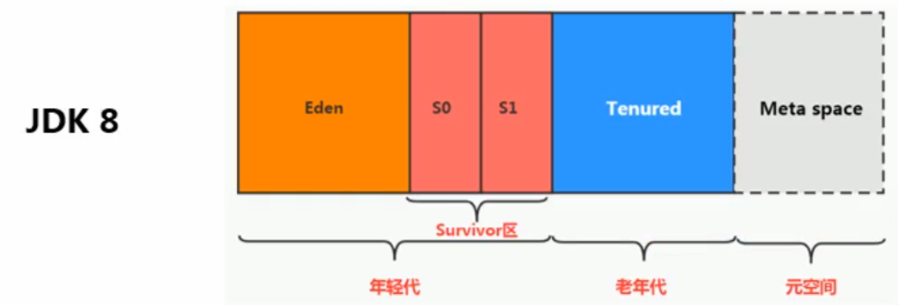

#### 内存分配策略（或对象提升（Promotion）规则）

如果对象在Eden出生并经过第一次Minor GC后仍然存活，并且能被Survivor容纳的话，将被移动到survivor空间中，并将对象年龄设为1。对象在survivor区中每熬过一次MinorGC，年龄就增加1岁，当它的年龄增加到一定程度（默认为15岁，其实每个JVM、每个GC都有所不同）时，就会被晋升到老年代

针对不同年龄段的对象分配原则如下所示：

* 优先分配到Eden
  * 开发中比较长的字符串或者数组，会直接存在老年代，但是因为新创建的对象 都是 朝生夕死的，所以这个大对象可能也很快被回收，但是因为老年代触发Major GC的次数比 Minor GC要更少，因此可能回收起来就会比较慢
* 大对象直接分配到老年代
  * 尽量避免程序中出现过多的大对象
* 长期存活的对象分配到老年代
* 动态对象年龄判断
  * 如果survivor区中相同年龄的所有对象大小的总和大于Survivor空间的一半，年龄大于或等于该年龄的对象可以直接进入老年代，无须等到MaxTenuringThreshold 中要求的年龄。

* 空间分配担保： -XX:HandlePromotionFailure
  * 也就是经过Minor GC后，所有的对象都存活，因为Survivor比较小，所以就需要将Survivor无法容纳的对象，存放到老年代中。

##### 测试：大对象直接进入老年代

````java
/**
 * 测试大对象直接进入老年代
 * <p>
 * -Xms60m -Xmx60m -XX:NewRatio=2 -XX:SurvivorRatio=8 -XX:+PrintGCDetails
 *
 * @author Tom
 * @version 1.0
 * @date 2021/2/11 14:49
 */
public class YongOldAreaTest {
    public static void main(String[] args) {
        byte[] bytes = new byte[1024 * 1024 * 20];
    }
}
````

设置参数

````
-Xms60m -Xmx60m -XX:NewRatio=2 -XX:SurvivorRatio=8 -XX:+PrintGCDetails
````

打印日志如下：直接进入老年代 没有GC日志产生

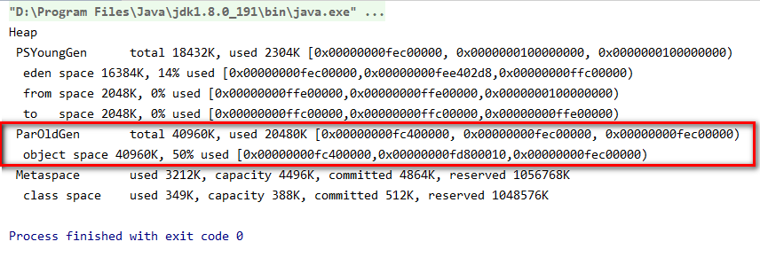

#### 为对象分配内存：TLAB

##### 堆空间都是共享的么？

不一定，因为还有TLAB这个概念，在堆中划分出一块区域，为每个线程所独占

##### 为什么有TLAB（Thread Local Allocation Buffer）？

* TLAB：Thread Local Allocation Buffer，也就是为每个线程单独分配了一个缓冲区

* 堆区是线程共享区域，任何线程都可以访问到堆区中的共享数据

* 由于对象实例的创建在JVM中非常频繁，因此在并发环境下从堆区中划分内存空间是线程不安全的

* 为避免多个线程操作同一地址，需要使用加锁等机制，进而影响分配速度。

##### 什么是TLAB?

* 从内存模型而不是垃圾收集的角度，对Eden区域继续进行划分，JVM为**每个线程分配了一个私有缓存区域**，它包含在Eden空间内。

* 多线程同时分配内存时，使用TLAB可以避免一系列的非线程安全问题，同时还能够提升内存分配的吞吐量，因此我们可以将这种内存分配方式称之为**快速分配策略**。

* 据我所知所有OpenJDK衍生出来的JVM都提供了TLAB的设计。

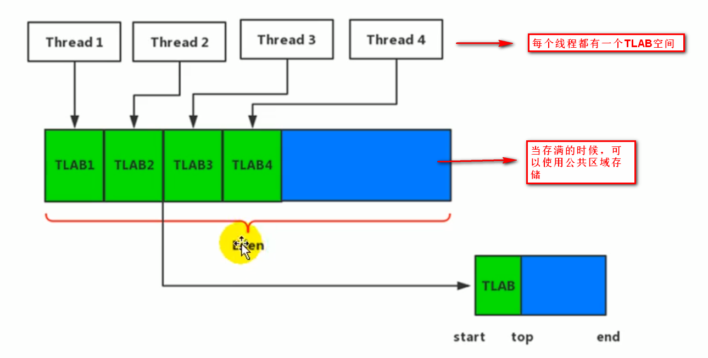

* 尽管不是所有的对象实例都能够在TLAB中成功分配内存，但**JVM确实是将TLAB作为内存分配的首选**。

* 在程序中，开发人员可以通过选项“-Xx:UseTLAB”设置是否开启TLAB空间。

* 默认情况下，TLAB空间的内存非常小，**仅占有整个Eden空间的1%**，当然我们可以通过选项“-Xx:TLABWasteTargetPercent”设置TLAB空间所占用Eden空间的百分比大小。

* 一旦对象在TLAB空间分配内存失败时，JVM就会尝试着通过**使用加锁机制**确保数据操作的原子性，从而直接在Eden空间中分配内存。

##### TLAB对象分配过程

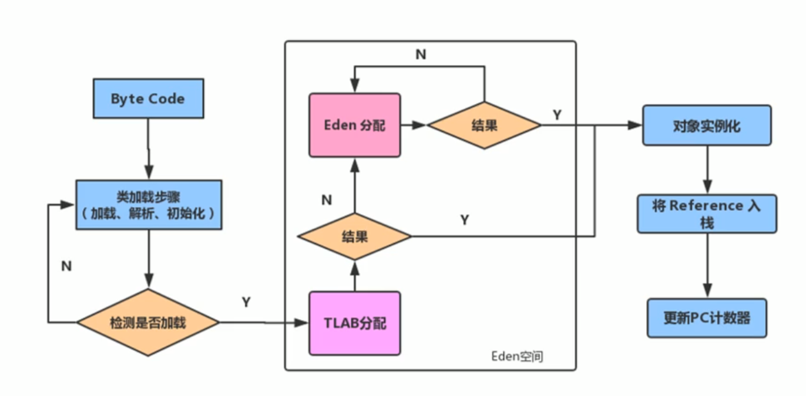

#### 小结：堆空间的参数设置

- -XX：+PrintFlagsInitial：查看所有的参数的默认初始值
- -XX：+PrintFlagsFinal：查看所有的参数的最终值（可能会存在修改，不再是初始值）
- -Xms：初始堆空间内存（默认为物理内存的1/64）
- -Xmx：最大堆空间内存（默认为物理内存的1/4）
- -Xmn：设置新生代的大小。（初始值及最大值）
- -XX:NewRatio：配置新生代与老年代在堆结构的占比
- -XX:SurvivorRatio：设置新生代中Eden和S0/S1空间的比例
- -XX:MaxTenuringThreshold：设置新生代垃圾的最大年龄
- -XX：+PrintGCDetails：输出详细的GC处理日志
  - 打印gc简要信息：①-Xx：+PrintGC  ② - verbose:gc
- -XX:HandlePromotionFalilure：是否设置空间分配担保

##### 空间分配担保

在发生Minor GC之前，虚拟机会**检查老年代最大可用的连续空间是否大于新生代所有对象的总空间**。

- 如果大于，则此次Minor GC是安全的
- 如果小于，则虚拟机会查看-xx:HandlePromotionFailure设置值是否允担保失败。
  - 如果HandlePromotionFailure=true，那么会继续**检查老年代最大可用连续空间是否大于历次晋升到老年代的对象的平均大小**。
    - 如果大于，则尝试进行一次Minor GC，但这次Minor GC依然是有风险的；
    - 如果小于，则改为进行一次Full GC。
  - 如果HandlePromotionFailure=false，则改为进行一次Full GC。

在JDK6 Update24之后，HandlePromotionFailure参数不会再影响到虚拟机的空间分配担保策略，观察openJDK中的源码变化，虽然源码中还定义了HandlePromotionFailure参数，但是在代码中已经不会再使用它。JDK6 Update 24之后的规则变为**只要老年代的连续空间大于新生代对象总大小**或者**历次晋升的平均大小就会进行Minor GC**，否则将进行FullGC。

#### 堆是分配对象存储的唯一选择吗？

##### 逃逸分析

在《深入理解Java虚拟机》中关于Java堆内存有这样一段描述：

随着JIT编译器的发展与**逃逸分析技术**逐渐成熟，**栈上分配**、**标量替换优化技术**将会导致一些微妙的变化，所有的对象都分配到堆上也渐渐变得不那么“绝对”了。

在Java虚拟机中，对象是在Java堆中分配内存的，这是一个普遍的常识。但是，有一种特殊情况，那就是**如果经过逃逸分析（Escape Analysis）后发现，一个对象并没有逃逸出方法的话，那么就可能被优化成栈上分配**。这样就无需在堆上分配内存，也无须进行垃圾回收了。这也是最常见的堆外存储技术。

此外，前面提到的基于openJDk深度定制的TaoBaovm，其中创新的GCIH（GC invisible heap）技术实现off-heap，将生命周期较长的Java对象从heap中移至heap外，并且GC不能管理GCIH内部的Java对象，以此达到降低GC的回收频率和提升GC的回收效率的目的。

**如何将堆上的对象分配到栈，需要使用逃逸分析手段。**

* 这是一种可以有效减少Java程序中同步负载和内存堆分配压力的跨函数全局数据流分析算法。通过逃逸分析，Java Hotspot编译器能够分析出一个新的对象的引用的使用范围从而决定是否要将这个对象分配到堆上。逃逸分析的基本行为就是分析对象动态作用域：
  * 当一个对象在方法中被定义后，对象只在方法内部使用，则认为没有发生逃逸。
  * 当一个对象在方法中被定义后，它被外部方法所引用，则认为发生逃逸。例如作为调用参数传递到其他地方中。

##### 逃逸分析举例

没有发生逃逸的对象，则可以分配到栈上，随着方法执行的结束，栈空间就被移除，每个栈里面包含了很多栈帧，也就是发生逃逸分析

````java
public void my_method() {
    V v = new V();
    // use v
    // ....
    v = null;
}
````

针对下面的代码

````java
public static StringBuffer createStringBuffer(String s1, String s2) {
    StringBuffer sb = new StringBuffer();
    sb.append(s1);
    sb.append(s2);
    return sb;
}
````

如果想要StringBuffer sb不发生逃逸，可以这样写

````java
public static String createStringBuffer(String s1, String s2) {
    StringBuffer sb = new StringBuffer();
    sb.append(s1);
    sb.append(s2);
    return sb.toString();
}
````

完整逃逸分析代码举例

````java
/**
 * 逃逸分析
 * 如何快速的判断是否发生了逃逸分析，大家就看new的对象是否在方法外被调用。
 *
 * @author Tom
 * @version 1.0
 * @date 2021/2/15 15:17
 */
public class EscapeAnalysis {
    public EscapeAnalysis obj;

    /**
     * 方法返回EscapeAnalysis对象，发生逃逸
     *
     * @return
     */
    public EscapeAnalysis getInstance() {
        return obj == null ? new EscapeAnalysis() : obj;
    }

    /**
     * 为成员属性赋值，发生逃逸
     */
    public void setObj() {
        this.obj = new EscapeAnalysis();
    }

    /**
     * 对象的作用于仅在当前方法中有效，没有发生逃逸
     */
    public void useEscapeAnalysis() {
        EscapeAnalysis e = new EscapeAnalysis();
    }

    /**
     * 引用成员变量的值，发生逃逸
     */
    public void useEscapeAnalysis2() {
        EscapeAnalysis e = getInstance();
        // getInstance().XXX  发生逃逸
    }
}
````

##### 参数设置

在JDK 1.7 版本之后，HotSpot中默认就已经开启了逃逸分析

如果使用的是较早的版本，开发人员则可以通过：

- 选项“-xx：+DoEscapeAnalysis"显式开启逃逸分析
- 通过选项“-xx：+PrintEscapeAnalysis"查看逃逸分析的筛选结果

##### 结论

**开发中能使用局部变量的，就不要使用在方法外定义。**

使用逃逸分析，编译器可以对代码做如下优化：

- **栈上分配**：将堆分配转化为栈分配。如果一个对象在子程序中被分配，要使指向该对象的指针永远不会发生逃逸，对象可能是栈上分配的候选，而不是堆上分配
- **同步省略**：如果一个对象被发现只有一个线程被访问到，那么对于这个对象的操作可以不考虑同步。
- **分离对象或标量替换**：有的对象可能不需要作为一个连续的内存结构存在也可以被访问到，那么对象的部分（或全部）可以不存储在内存，而是存储在CPU寄存器中。

##### 栈上分配

JIT编译器在编译期间根据逃逸分析的结果，发现如果一个对象并没有逃逸出方法的话，就可能被优化成栈上分配。分配完成后，继续在调用栈内执行，最后线程结束，栈空间被回收，局部变量对象也被回收。这样就无须进行垃圾回收了。

常见的栈上分配的场景

> 在逃逸分析中，已经说明了。分别是给成员变量赋值、方法返回值、实例引用传递。

###### 举例

我们通过举例来说明 开启逃逸分析 和 未开启逃逸分析时候的情况

````java
/**
 * 栈上分配
 * -Xmx1G -Xms1G -XX:-DoEscapeAnalysis -XX:+PrintGCDetails
 *
 * @author Tom
 * @version 1.0
 * @date 2021/2/15 15:26
 */
class User {
    private String name;
    private String age;
    private String gender;
    private String phone;
}

public class StackAllocation {
    public static void main(String[] args) throws InterruptedException {
        long start = System.currentTimeMillis();
        for (int i = 0; i < 100000000; i++) {
            alloc();
        }
        long end = System.currentTimeMillis();
        System.out.println("花费的时间为：" + (end - start) + " ms");

        // 为了方便查看堆内存中对象个数，线程sleep
        Thread.sleep(10000000);
    }

    private static void alloc() {
        // 未发生逃逸
        User user = new User();
    }
}
````

设置JVM参数，表示未开启逃逸分析

````
-Xmx1G -Xms1G -XX:-DoEscapeAnalysis -XX:+PrintGCDetails
````

运行结果，同时还触发了GC操作

````
[GC (Allocation Failure) [PSYoungGen: 262144K->712K(305664K)] 262144K->720K(1005056K), 0.0011135 secs] [Times: user=0.00 sys=0.00, real=0.00 secs] 
[GC (Allocation Failure) [PSYoungGen: 262856K->712K(305664K)] 262864K->720K(1005056K), 0.0010531 secs] [Times: user=0.00 sys=0.00, real=0.00 secs] 
[GC (Allocation Failure) [PSYoungGen: 262856K->680K(305664K)] 262864K->688K(1005056K), 0.0007803 secs] [Times: user=0.00 sys=0.00, real=0.00 secs] 
[GC (Allocation Failure) [PSYoungGen: 262824K->680K(305664K)] 262832K->688K(1005056K), 0.0010725 secs] [Times: user=0.00 sys=0.00, real=0.00 secs] 
[GC (Allocation Failure) [PSYoungGen: 262824K->696K(305664K)] 262832K->704K(1005056K), 0.0011659 secs] [Times: user=0.00 sys=0.00, real=0.00 secs] 
[GC (Allocation Failure) [PSYoungGen: 262840K->680K(348160K)] 262848K->688K(1047552K), 0.0009799 secs] [Times: user=0.00 sys=0.00, real=0.00 secs] 
[GC (Allocation Failure) [PSYoungGen: 347816K->0K(348160K)] 347824K->644K(1047552K), 0.0016947 secs] [Times: user=0.00 sys=0.00, real=0.00 secs] 
[GC (Allocation Failure) [PSYoungGen: 347136K->0K(348160K)] 347780K->644K(1047552K), 0.0003808 secs] [Times: user=0.00 sys=0.00, real=0.00 secs] 
[GC (Allocation Failure) [PSYoungGen: 347136K->0K(348160K)] 347780K->644K(1047552K), 0.0004810 secs] [Times: user=0.00 sys=0.00, real=0.00 secs] 
[GC (Allocation Failure) [PSYoungGen: 347136K->128K(348160K)] 347780K->772K(1047552K), 0.0004254 secs] [Times: user=0.00 sys=0.00, real=0.00 secs] 
花费的时间为：726 ms
````

然后查看内存的情况，发现有大量的User存储在堆中

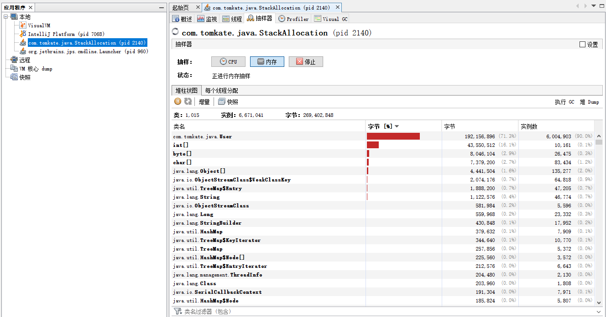

我们在开启逃逸分析

````
-Xmx1G -Xms1G -XX:+DoEscapeAnalysis -XX:+PrintGCDetails
````

然后查看运行时间，我们能够发现花费的时间快速减少，同时不会发生GC操作

````
花费的时间为：10 ms
````

在看内存情况，我们发现只有很少的User对象，说明User未发生逃逸，因为它存储在栈中，随着栈的销毁而消失

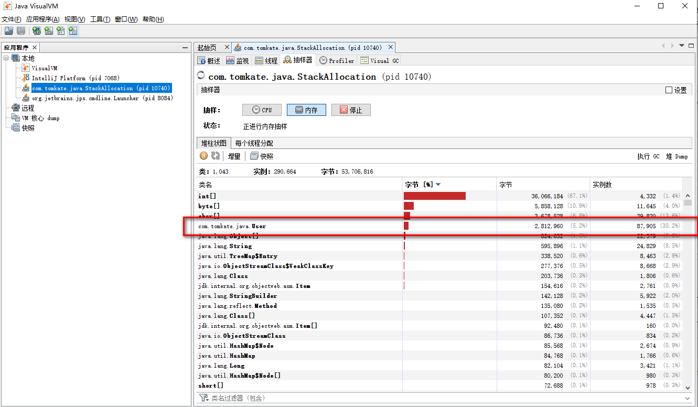

##### 同步省略（锁消除）

* 线程同步的代价是相当高的，同步的后果是降低并发性和性能。

* 在动态编译同步块的时候，JIT编译器可以借助逃逸分析来**判断同步块所使用的锁对象是否只能够被一个线程访问而没有被发布到其他线程。**如果没有，那么JIT编译器在编译这个同步块的时候就会取消对这部分代码的同步。这样就能大大提高并发性和性能。这个取消同步的过程就叫同步省略，也叫**锁消除**。

例如下面的代码

````java
public void f() {
    Object hellis = new Object();
    synchronized(hellis) {
        System.out.println(hellis);
    }
}
````

代码中对hellis这个对象加锁，但是hellis对象的生命周期只在f()方法中，并不会被其他线程所访问到，所以在JIT编译阶段就会被优化掉，优化成:

````java
public void f() {
    Object hellis = new Object();
	System.out.println(hellis);
}
````

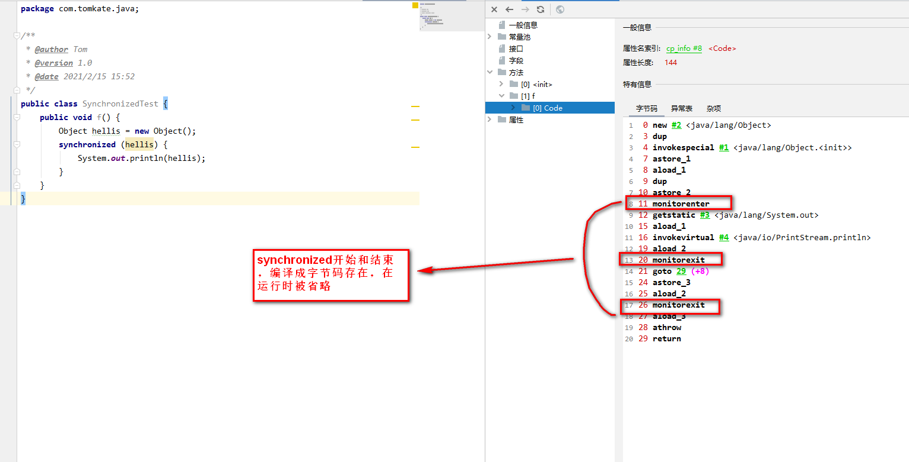

##### 分离对象和标量替换

**标量（scalar）**是指一个无法再分解成更小的数据的数据。Java中的原始数据类型就是标量。

相对的，那些还可以分解的数据叫做**聚合量（Aggregate）**，Java中的对象就是聚合量，因为他可以分解成其他聚合量和标量。

在JIT阶段，如果经过逃逸分析，发现一个对象不会被外界访问的话，那么经过JIT优化，就会把这个对象拆解成若干个其中包含的若干个成员变量来代替。这个过程就是**标量替换**。

````java
public static void main(String args[]) {
    alloc();
}
class Point {
    private int x;
    private int y;
}
private static void alloc() {
    Point point = new Point(1,2);
    System.out.println("point.x" + point.x + ";point.y" + point.y);
}
````

以上代码，经过标量替换后，就会变成

````java
private static void alloc() {
    int x = 1;
    int y = 2;
    System.out.println("point.x = " + x + "; point.y=" + y);
}
````

可以看到，Point这个聚合量经过逃逸分析后，发现他并没有逃逸，就被替换成两个标量了。那么标量替换有什么好处呢？就是可以大大减少堆内存的占用。因为一旦不需要创建对象了，那么就不再需要分配堆内存，在栈上分配。**标量替换为栈上分配提供了很好的基础。**

###### 标量替换参数设置

````
参数-XX:+EliminateAllocations:开启了标量替换（默认打开），允许将对象打散分配在栈上
````

###### 举例

````java
/**
 * 标量替换测试
 * -Xmx100m -Xms100m -XX:+DoEscapeAnalysis -XX:+PrintGC -XX:-EliminateAllocations
 * @author Tom
 * @version 1.0
 * @date 2021/2/15 16:05
 */
public class ScalarReplace {
    public static class User {
        public int id;
        public String name;
    }

    public static void alloc() {
        //未发生逃逸
        User user = new User();
        user.id = 5;
        user.name = "tomkate";
    }

    public static void main(String[] args) throws InterruptedException {
        long start = System.currentTimeMillis();
        for (int i = 0; i < 100000000; i++) {
            alloc();
        }
        long end = System.currentTimeMillis();
        System.out.println("花费的时间为：" + (end - start) + " ms");

        // 为了方便查看堆内存中对象个数，线程sleep
        Thread.sleep(10000000);
    }
}
````

设置参数如（开启逃逸分析，不开启标量替换）

````
-Xmx100m -Xms100m -XX:+DoEscapeAnalysis -XX:+PrintGC -XX:-EliminateAllocations
````

结果如下

````
[GC (Allocation Failure)  25600K->736K(98304K), 0.0021742 secs]
[GC (Allocation Failure)  26336K->760K(98304K), 0.0014713 secs]
[GC (Allocation Failure)  26360K->664K(98304K), 0.0012067 secs]
[GC (Allocation Failure)  26264K->728K(98304K), 0.0010282 secs]
[GC (Allocation Failure)  26328K->696K(98304K), 0.0011772 secs]
[GC (Allocation Failure)  26296K->696K(101376K), 0.0012251 secs]
[GC (Allocation Failure)  32440K->648K(101376K), 0.0016216 secs]
[GC (Allocation Failure)  32392K->648K(101376K), 0.0004420 secs]
花费的时间为：69 ms
````

开启标量替换

````
-XX:+EliminateAllocations
````

未发生Minor GC分配至栈 局部变量表 结果如下

````
花费的时间为：8 ms
````

上述代码在主函数中进行了1亿次alloc。调用进行对象创建，由于User对象实例需要占据约16字节的空间，因此累计分配空间达到将近1.5GB。如果堆空间小于这个值，就必然会发生GC。使用如下参数运行上述代码：

````bash
-server -Xmx100m -Xms100m -XX:+DoEscapeAnalysis -XX:+PrintGC -XX:+EliminateAllocations
````

这里设置参数如下：

- 参数-server：启动Server模式，因为在server模式下，才可以启用逃逸分析。
- 参数-XX:+DoEscapeAnalysis：启用逃逸分析
- 参数-Xmx10m：指定了堆空间最大为10MB
- 参数-XX:+PrintGC：将打印Gc日志
- 参数-XX:+EliminateAllocations：开启了标量替换（默认打开），允许将对象打散分配在栈上，比如对象拥有id和name两个字段，那么这两个字段将会被视为两个独立的局部变量进行分配

JDK1.8版本可忽略-server参数，因为jdk1.8 64位下默认为server模式

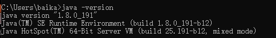

##### 逃逸分析小结：逃逸分析并不成熟

* 关于逃逸分析的论文在1999年就已经发表了，但直到JDK1.6才有实现，而且这项技术到如今也并不是十分成熟。

* 其根本原因就是**无法保证逃逸分析的性能消耗一定能高于他的消耗。虽然经过逃逸分析可以做标量替换、栈上分配、和锁消除。但是逃逸分析自身也是需要进行一系列复杂的分析的，这其实也是一个相对耗时的过程。**
* 一个极端的例子，就是经过逃逸分析之后，发现没有一个对象是不逃逸的。那这个逃逸分析的过程就白白浪费掉了。

* 虽然这项技术并不十分成熟，但是它也**是即时编译器优化技术中一个十分重要的手段。**
* 注意到有一些观点，认为通过逃逸分析，JVM会在栈上分配那些不会逃逸的对象，这在理论上是可行的，但是取决于JVM设计者的选择。据我所知，oracle Hotspot JVM中并未这么做，这一点在逃逸分析相关的文档里已经说明，所以可以明确所有的对象实例都是创建在堆上。

* 目前很多书籍还是基于JDK7以前的版本，JDK已经发生了很大变化，intern字符串的缓存和静态变量曾经都被分配在永久代上，而永久代已经被元数据区取代。但是，intern字符串缓存和静态变量并不是被转移到元数据区，而是直接在堆上分配，所以这一点同样符合前面一点的结论：**对象实例都是分配在堆上**。

#### 堆空间小结

* 年轻代是对象的诞生、成长、消亡的区域，一个对象在这里产生、应用，最后被垃圾回收器收集、结束生命。

* 老年代放置长生命周期的对象，通常都是从survivor区域筛选拷贝过来的Java对象。当然，也有特殊情况，我们知道普通的对象会被分配在TLAB上；如果对象较大，JVM会试图直接分配在Eden其他位置上；如果对象太大，完全无法在新生代找到足够长的连续空闲空间，JVM就会直接分配到老年代。当GC只发生在年轻代中，回收年轻代对象的行为被称为MinorGc。

* 当GC发生在老年代时则被称为MajorGc或者FullGC。一般的，MinorGc的发生频率要比MajorGC高很多，即老年代中垃圾回收发生的频率将大大低于年轻代。

### 方法区

#### 前言

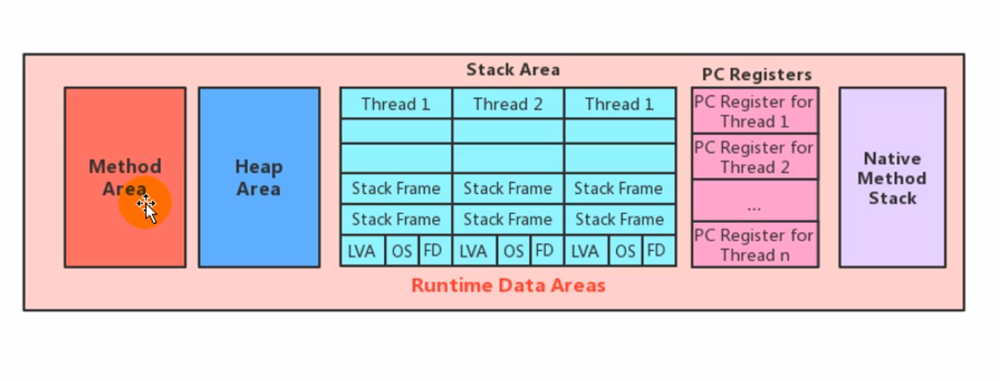

从线程共享与否的角度来看

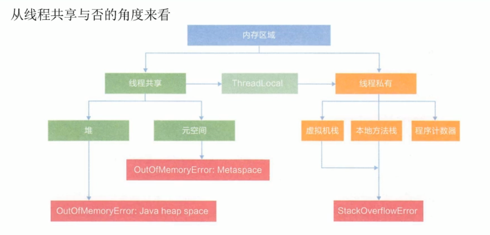

ThreadLocal：如何保证多个线程在并发环境下的安全性？典型应用就是数据库连接管理，以及会话管理

#### 栈、堆、方法区的交互关系

下面就涉及了对象的访问定位

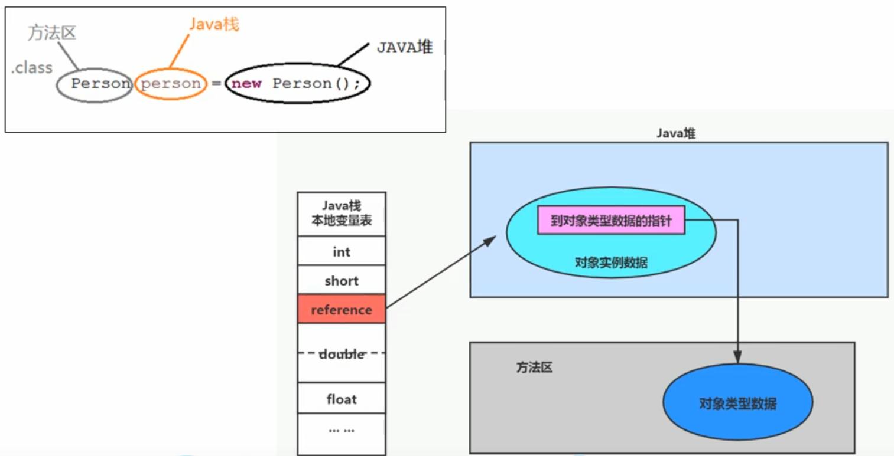

- Person：存放在元空间，也可以说方法区
- person：存放在Java栈的局部变量表中
- new Person()：存放在Java堆中

#### 方法区的理解

《Java虚拟机规范》中明确说明：“尽管所有的方法区在逻辑上是属于堆的一部分，但一些简单的实现可能不会选择去进行垃圾收集或者进行压缩。”但对于HotSpotJVM而言，方法区还有一个别名叫做Non-Heap（非堆），目的就是要和堆分开。

所以，**方法区看作是一块独立于Java堆的内存空间**。

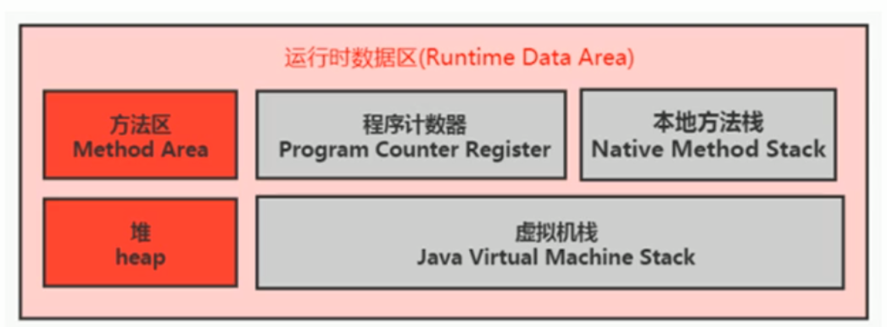

方法区主要存放的是 Class，而堆中主要存放的是 实例化的对象

- 方法区（Method Area）与Java堆一样，是各个线程共享的内存区域。
- 方法区在JVM启动的时候被创建，并且它的实际的物理内存空间中和Java堆区一样都可以是不连续的。
- 方法区的大小，跟堆空间一样，可以选择固定大小或者可扩展。
- 方法区的大小决定了系统可以保存多少个类，如果系统定义了太多的类，导致方法区溢出，虚拟机同样会抛出内存溢出错误：ava.lang.OutofMemoryError：**PermGen space** 或者java.lang.OutOfMemoryError:**Metaspace**
  - 加载大量的第三方的jar包
  - Tomcat部署的工程过多（30~50个）
  - 大量动态的生成反射类
- 关闭JVM就会释放这个区域的内存。

#### HotSpot中方法区的演进

* 在jdk7及以前，习惯上把方法区，称为永久代。jdk8开始，使用元空间取代了永久代。
  * **JDK 1.8后，元空间存放在堆外内存中**

* 本质上，方法区和永久代并不等价。仅是对hotspot而言的。《Java虚拟机规范》对如何实现方法区，不做统一要求。例如：BEAJRockit / IBM J9 中不存在永久代的概念。          

> 现在来看，当年使用永久代，不是好的idea。导致Java程序更容易oom（超过-XX:MaxPermsize上限）

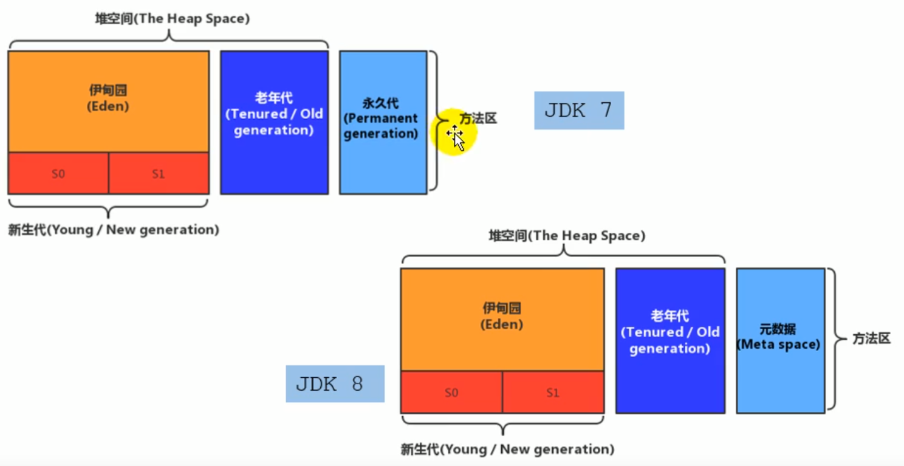

* 而到了JDK8，终于完全废弃了永久代的概念，改用与JRockit、J9一样在本地内存中实现的元空间（Metaspace）**来代替**

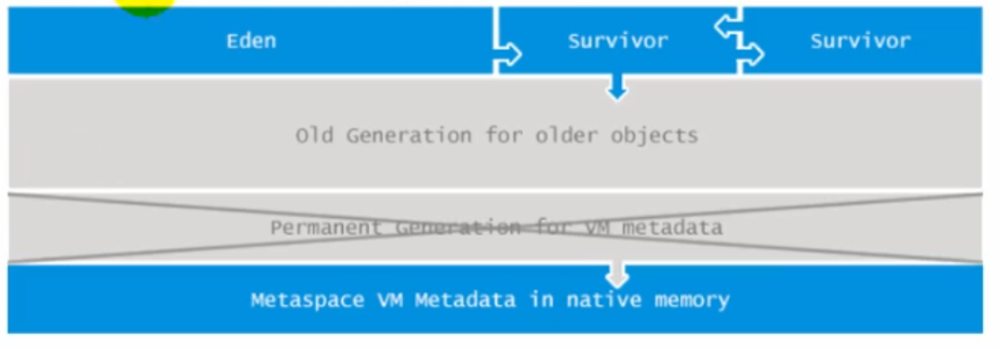

* 元空间的本质和永久代类似，都是对JVM规范中方法区的实现。不过元空间与永久代最大的区别在于：**元空间不在虚拟机设置的内存中，而是使用本地内存**

* 永久代、元空间二者并不只是名字变了，内部结构也调整了

* 根据《Java虚拟机规范》的规定，如果方法区无法满足新的内存分配需求时，将抛出OOM异常

#### 设置方法区大小与OOM

##### JDK7及以前

- **通过-xx:Permsize来设置永久代初始分配空间。默认值是20.75M**
- **-XX:MaxPermsize来设定永久代最大可分配空间。32位机器默认是64M，64位机器模式是82M**

> -xx:Permsize=100m   -XX:MaxPermsize=100m

- 当JVM加载的类信息容量超过了这个值，会报异常OutofMemoryError:PermGen space。

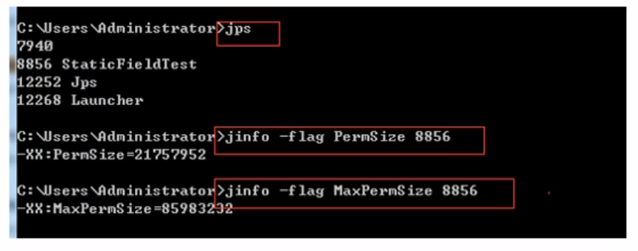

##### JDK8及以后

* 元数据区大小可以使用参数 -XX:MetaspaceSize 和 -XX:MaxMetaspaceSize指定

* 默认值依赖于平台。**windows下，-XX:MetaspaceSize是21M，-XX:MaxMetaspaceSize的值是-1，即没有限制。**

> -XX:MetaspaceSize=100m  -XX:MaxMetaspaceSize=100m

* 与永久代不同，如果不指定大小，默认情况下，虚拟机会耗尽所有的可用系统内存。如果元数据区发生溢出，虚拟机一样会抛出异常OutOfMemoryError:Metaspace

* -XX:MetaspaceSize：设置初始的元空间大小。对于一个64位的服务器端JVM来说，其默认的-xx:MetaspaceSize值为21MB。这就是初始的高水位线，一旦触及这个水位线，Full GC将会被触发并卸载没用的类（即这些类对应的类加载器不再存活）然后这个高水位线将会重置。新的高水位线的值取决于GC后释放了多少元空间。如果释放的空间不足，那么在不超过MaxMetaspaceSize时，适当提高该值。如果释放空间过多，则适当降低该值。

* 如果初始化的高水位线设置过低，上述高水位线调整情况会发生很多次。通过垃圾回收器的日志可以观察到Full GC多次调用。为了避免频繁地GC，建议将-XX:MetaspaceSize设置为一个相对较高的值。

##### 模拟方法区OOM

````java
/**
 * 模拟方法区（元空间溢出）
 * <p>
 * jdk8及以后：
 * -XX:MetaspaceSize=10m  -XX:MaxMetaspaceSize=10m
 * jdk7及以前：
 * -xx:Permsize=10m   -XX:MaxPermsize=10m
 *
 * @author Tom
 * @version 1.0
 * @date 2021/2/15 17:57
 */
public class OOMTest extends ClassLoader {
    public static void main(String[] args) {
        int j = 0;
        try {
            OOMTest test = new OOMTest();
            for (int i = 0; i < 10000; i++) {
                // 创建classWriter对象，用于生成类的二进制字节码
                ClassWriter classWriter = new ClassWriter(0);
                // 创建对应的基本信息（版本号 1.8，修饰符，类名，）
                classWriter.visit(Opcodes.V1_8, Opcodes.ACC_PUBLIC, "Class" + i, null, "java/lang/Object", null);
                // 返回byte[]
                byte[] code = classWriter.toByteArray();
                // 类的加载
                test.defineClass("Class" + i, code, 0, code.length);//class对象
                j++;
            }
        } catch (Exception e) {
            e.printStackTrace();
        } finally {
            System.out.println(j);
        }
    }
}
````

默认情况下方法区默认Size自动扩容

````
10000
````

设置方法区大小

````
-XX:MetaspaceSize=10m  -XX:MaxMetaspaceSize=10m
````

方法区大小被限定报错

````
3331
Exception in thread "main" java.lang.OutOfMemoryError: Compressed class space
	at java.lang.ClassLoader.defineClass1(Native Method)
	at java.lang.ClassLoader.defineClass(ClassLoader.java:763)
	at java.lang.ClassLoader.defineClass(ClassLoader.java:642)
	at com.tomkate.java.OOMTest.main(OOMTest.java:31)

Process finished with exit code 1
````

##### 如何解决这些OOM

- 要解决OOM异常或heap space的异常，一般的手段是首先通过内存映像分析工具（如Eclipse Memory Analyzer）对dump出来的堆转储快照进行分析，重点是确认内存中的对象是否是必要的，也就是要先分清楚到底是出现了内存泄漏（Memory Leak）还是内存溢出（Memory Overflow）
  - 内存泄漏就是 有大量的引用指向某些对象，但是这些对象以后不会使用了，但是因为它们还和GC ROOT有关联，所以导致以后这些对象也不会被回收，这就是内存泄漏的问题

- 如果是内存泄漏，可进一步通过工具查看泄漏对象到GC Roots的引用链。于是就能找到泄漏对象是通过怎样的路径与GCRoots相关联并导致垃圾收集器无法自动回收它们的。掌握了泄漏对象的类型信息，以及GCRoots引用链的信息，就可以比较准确地定位出泄漏代码的位置。

- 如果不存在内存泄漏，换句话说就是内存中的对象确实都还必须存活着，那就应当检查虚拟机的堆参数（-Xmx与-Xms），与机器物理内存对比看是否还可以调大，从代码上检查是否存在某些对象生命周期过长、持有状态时间过长的情况，尝试减少程序运行期的内存消耗。

#### 方法区的内部结构

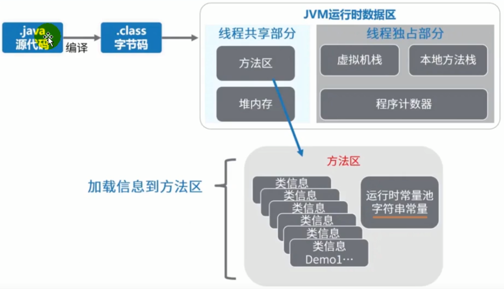

《深入理解Java虚拟机》书中对方法区（Method Area）存储内容描述如下：它用于存储已被虚拟机加载的类型信息、常量、静态变量、即时编译器编译后的代码缓存等。


##### 类型信息

对每个加载的类型（类class、接口interface、枚举enum、注解annotation），JVM必须在方法区中存储以下类型信息：

- 这个类型的完整有效名称（全名=包名.类名）
- 这个类型直接父类的完整有效名（对于interface或是java.lang.object，都没有父类）
- 这个类型的修饰符（public，abstract，final的某个子集）
- 这个类型直接接口的一个有序列表

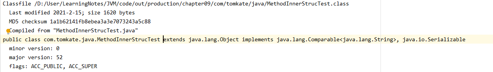

#####  域（Field）信息

* JVM必须在方法区中保存类型的所有域的相关信息以及域的声明顺序。

* 域的相关信息包括：域名称、域类型、域修饰符（public，private，protected，static，final，volatile，transient的某个子集）

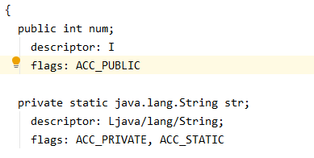

##### 方法（Method）信息

JVM必须保存所有方法的以下信息，同域信息一样包括声明顺序：

- 方法名称
- 方法的返回类型（或void）
- 方法参数的数量和类型（按顺序）
- 方法的修饰符（public，private，protected，static，final，synchronized，native，abstract的一个子集）
- 方法的字节码（bytecodes）、操作数栈、局部变量表及大小（abstract和native方法除外）
- 异常表（abstract和native方法除外）

  - 每个异常处理的开始位置、结束位置、代码处理在程序计数器中的偏移地址、被捕获的异常类的常量池索引

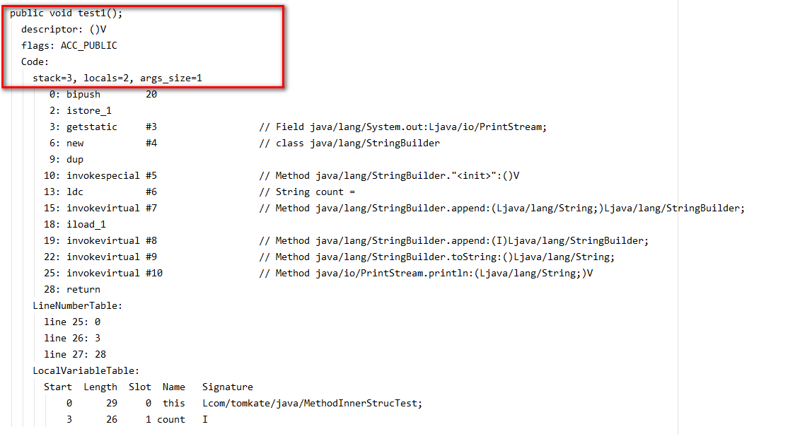

````java
/**
 * 测试方法区内部结构
 * @author Tom
 * @version 1.0
 * @date 2021/2/15 18:26
 */
public class MethodInnerStrucTest extends Object implements Comparable<String>, Serializable {

    @Override
    public int compareTo(String o) {
        return 0;
    }

    //属性
    public int num = 10;
    private static String str = "方法区内部结构";

    //构造器

    //方法
    public void test1() {
        int count = 20;
        System.out.println("count = " + count);
    }

    public static int test2(int cal) {
        int result = 0;
        try {
            int value = 30;
            result = value / cal;
        } catch (Exception e) {
            e.printStackTrace();
        }
        return result;
    }
}
````

编译后class文件内容

````
Classfile /D:/User/LearningNotes/JVM/code/out/production/chapter09/com/tomkate/java/MethodInnerStrucTest.class
  Last modified 2021-2-15; size 1620 bytes
  MD5 checksum 1a1b62141fb8ebea3a3e7073243a5c88
  Compiled from "MethodInnerStrucTest.java"
  //类型信息!!!!!
public class com.tomkate.java.MethodInnerStrucTest extends java.lang.Object implements java.lang.Comparable<java.lang.String>, java.io.Serializable
  minor version: 0
  major version: 52
  flags: ACC_PUBLIC, ACC_SUPER
Constant pool:
   #1 = Methodref          #18.#52        // java/lang/Object."<init>":()V
   #2 = Fieldref           #17.#53        // com/tomkate/java/MethodInnerStrucTest.num:I
   #3 = Fieldref           #54.#55        // java/lang/System.out:Ljava/io/PrintStream;
   #4 = Class              #56            // java/lang/StringBuilder
   #5 = Methodref          #4.#52         // java/lang/StringBuilder."<init>":()V
   #6 = String             #57            // count =
   #7 = Methodref          #4.#58         // java/lang/StringBuilder.append:(Ljava/lang/String;)Ljava/lang/StringBuilder;
   #8 = Methodref          #4.#59         // java/lang/StringBuilder.append:(I)Ljava/lang/StringBuilder;
   #9 = Methodref          #4.#60         // java/lang/StringBuilder.toString:()Ljava/lang/String;
  #10 = Methodref          #61.#62        // java/io/PrintStream.println:(Ljava/lang/String;)V
  #11 = Class              #63            // java/lang/Exception
  #12 = Methodref          #11.#64        // java/lang/Exception.printStackTrace:()V
  #13 = Class              #65            // java/lang/String
  #14 = Methodref          #17.#66        // com/tomkate/java/MethodInnerStrucTest.compareTo:(Ljava/lang/String;)I
  #15 = String             #67            // �������ڲ��ṹ
  #16 = Fieldref           #17.#68        // com/tomkate/java/MethodInnerStrucTest.str:Ljava/lang/String;
  #17 = Class              #69            // com/tomkate/java/MethodInnerStrucTest
  #18 = Class              #70            // java/lang/Object
  #19 = Class              #71            // java/lang/Comparable
  #20 = Class              #72            // java/io/Serializable
  #21 = Utf8               num
  #22 = Utf8               I
  #23 = Utf8               str
  #24 = Utf8               Ljava/lang/String;
  #25 = Utf8               <init>
  #26 = Utf8               ()V
  #27 = Utf8               Code
  #28 = Utf8               LineNumberTable
  #29 = Utf8               LocalVariableTable
  #30 = Utf8               this
  #31 = Utf8               Lcom/tomkate/java/MethodInnerStrucTest;
  #32 = Utf8               compareTo
  #33 = Utf8               (Ljava/lang/String;)I
  #34 = Utf8               o
  #35 = Utf8               test1
  #36 = Utf8               count
  #37 = Utf8               test2
  #38 = Utf8               (I)I
  #39 = Utf8               value
  #40 = Utf8               e
  #41 = Utf8               Ljava/lang/Exception;
  #42 = Utf8               cal
  #43 = Utf8               result
  #44 = Utf8               StackMapTable
  #45 = Class              #63            // java/lang/Exception
  #46 = Utf8               (Ljava/lang/Object;)I
  #47 = Utf8               <clinit>
  #48 = Utf8               Signature
  #49 = Utf8               Ljava/lang/Object;Ljava/lang/Comparable<Ljava/lang/String;>;Ljava/io/Serializable;
  #50 = Utf8               SourceFile
  #51 = Utf8               MethodInnerStrucTest.java
  #52 = NameAndType        #25:#26        // "<init>":()V
  #53 = NameAndType        #21:#22        // num:I
  #54 = Class              #73            // java/lang/System
  #55 = NameAndType        #74:#75        // out:Ljava/io/PrintStream;
  #56 = Utf8               java/lang/StringBuilder
  #57 = Utf8               count =
  #58 = NameAndType        #76:#77        // append:(Ljava/lang/String;)Ljava/lang/StringBuilder;
  #59 = NameAndType        #76:#78        // append:(I)Ljava/lang/StringBuilder;
  #60 = NameAndType        #79:#80        // toString:()Ljava/lang/String;
  #61 = Class              #81            // java/io/PrintStream
  #62 = NameAndType        #82:#83        // println:(Ljava/lang/String;)V
  #63 = Utf8               java/lang/Exception
  #64 = NameAndType        #84:#26        // printStackTrace:()V
  #65 = Utf8               java/lang/String
  #66 = NameAndType        #32:#33        // compareTo:(Ljava/lang/String;)I
  #67 = Utf8               �������ڲ��ṹ
  #68 = NameAndType        #23:#24        // str:Ljava/lang/String;
  #69 = Utf8               com/tomkate/java/MethodInnerStrucTest
  #70 = Utf8               java/lang/Object
  #71 = Utf8               java/lang/Comparable
  #72 = Utf8               java/io/Serializable
  #73 = Utf8               java/lang/System
  #74 = Utf8               out
  #75 = Utf8               Ljava/io/PrintStream;
  #76 = Utf8               append
  #77 = Utf8               (Ljava/lang/String;)Ljava/lang/StringBuilder;
  #78 = Utf8               (I)Ljava/lang/StringBuilder;
  #79 = Utf8               toString
  #80 = Utf8               ()Ljava/lang/String;
  #81 = Utf8               java/io/PrintStream
  #82 = Utf8               println
  #83 = Utf8               (Ljava/lang/String;)V
  #84 = Utf8               printStackTrace
{
//域信息!!!!!
  public int num;
    descriptor: I
    flags: ACC_PUBLIC

  private static java.lang.String str;
    descriptor: Ljava/lang/String;
    flags: ACC_PRIVATE, ACC_STATIC
//构造器!!!!!
  public com.tomkate.java.MethodInnerStrucTest();
    descriptor: ()V
    flags: ACC_PUBLIC
    Code:
      stack=2, locals=1, args_size=1
         0: aload_0
         1: invokespecial #1                  // Method java/lang/Object."<init>":()V
         4: aload_0
         5: bipush        10
         7: putfield      #2                  // Field num:I
        10: return
      LineNumberTable:
        line 10: 0
        line 18: 4
      LocalVariableTable:
        Start  Length  Slot  Name   Signature
            0      11     0  this   Lcom/tomkate/java/MethodInnerStrucTest;

  public int compareTo(java.lang.String);
    descriptor: (Ljava/lang/String;)I
    flags: ACC_PUBLIC
    Code:
      stack=1, locals=2, args_size=2
         0: iconst_0
         1: ireturn
      LineNumberTable:
        line 14: 0
      LocalVariableTable:
        Start  Length  Slot  Name   Signature
            0       2     0  this   Lcom/tomkate/java/MethodInnerStrucTest;
            0       2     1     o   Ljava/lang/String;
//方法信息!!!
  public void test1();
    descriptor: ()V
    flags: ACC_PUBLIC
    //操作数栈、局部变量表信息等
    Code:
      stack=3, locals=2, args_size=1
         0: bipush        20
         2: istore_1
         3: getstatic     #3                  // Field java/lang/System.out:Ljava/io/PrintStream;
         6: new           #4                  // class java/lang/StringBuilder
         9: dup
        10: invokespecial #5                  // Method java/lang/StringBuilder."<init>":()V
        13: ldc           #6                  // String count =
        15: invokevirtual #7                  // Method java/lang/StringBuilder.append:(Ljava/lang/String;)Ljava/lang/StringBuilder;
        18: iload_1
        19: invokevirtual #8                  // Method java/lang/StringBuilder.append:(I)Ljava/lang/StringBuilder;
        22: invokevirtual #9                  // Method java/lang/StringBuilder.toString:()Ljava/lang/String;
        25: invokevirtual #10                 // Method java/io/PrintStream.println:(Ljava/lang/String;)V
        28: return
      LineNumberTable:
        line 25: 0
        line 26: 3
        line 27: 28
      LocalVariableTable:
        Start  Length  Slot  Name   Signature
            0      29     0  this   Lcom/tomkate/java/MethodInnerStrucTest;
            3      26     1 count   I

  public static int test2(int);
    descriptor: (I)I
    flags: ACC_PUBLIC, ACC_STATIC
    Code:
      stack=2, locals=3, args_size=1
         0: iconst_0
         1: istore_1
         2: bipush        30
         4: istore_2
         5: iload_2
         6: iload_0
         7: idiv
         8: istore_1
         9: goto          17
        12: astore_2
        13: aload_2
        14: invokevirtual #12                 // Method java/lang/Exception.printStackTrace:()V
        17: iload_1
        18: ireturn
        //异常信息表
      Exception table:
         from    to  target type
             2     9    12   Class java/lang/Exception
      LineNumberTable:
        line 30: 0
        line 32: 2
        line 33: 5
        line 36: 9
        line 34: 12
        line 35: 13
        line 37: 17
      LocalVariableTable:
        Start  Length  Slot  Name   Signature
            5       4     2 value   I
           13       4     2     e   Ljava/lang/Exception;
            0      19     0   cal   I
            2      17     1 result   I
      StackMapTable: number_of_entries = 2
        frame_type = 255 /* full_frame */
          offset_delta = 12
          locals = [ int, int ]
          stack = [ class java/lang/Exception ]
        frame_type = 4 /* same */

  public int compareTo(java.lang.Object);
    descriptor: (Ljava/lang/Object;)I
    flags: ACC_PUBLIC, ACC_BRIDGE, ACC_SYNTHETIC
    Code:
      stack=2, locals=2, args_size=2
         0: aload_0
         1: aload_1
         2: checkcast     #13                 // class java/lang/String
         5: invokevirtual #14                 // Method compareTo:(Ljava/lang/String;)I
         8: ireturn
      LineNumberTable:
        line 10: 0
      LocalVariableTable:
        Start  Length  Slot  Name   Signature
            0       9     0  this   Lcom/tomkate/java/MethodInnerStrucTest;

  static {};
    descriptor: ()V
    flags: ACC_STATIC
    Code:
      stack=1, locals=0, args_size=0
         0: ldc           #15                 // String �������ڲ��ṹ
         2: putstatic     #16                 // Field str:Ljava/lang/String;
         5: return
      LineNumberTable:
        line 19: 0
}
Signature: #49                          // Ljava/lang/Object;Ljava/lang/Comparable<Ljava/lang/String;>;Ljava/io/Serializable;
SourceFile: "MethodInnerStrucTest.java"

````

##### non-final的类变量

* 静态变量和类关联在一起，随着类的加载而加载，他们成为类数据在逻辑上的一部分

* 类变量被类的所有实例共享，即使没有类实例时，你也可以访问它

````java
/**
 * non-final的类变量
 * @author Tom
 * @version 1.0
 * @date 2021/2/15 18:46
 */
public class MethodAreaTest {
    public static void main(String[] args) {
        Order order = new Order();
        order.hello();
        System.out.println(order.count);
    }
}

class Order {
    public static int count = 1;
    public static final int number = 2;

    public static void hello() {
        System.out.println("hello!");
    }
}
````

如上代码所示，即使我们把order设置为null，也不会出现空指针异常

##### 补充说明：全局常量：static final

**被声明为final的类变量的处理方式则不同，每个全局变量在编译的时候就会被分配了**

##### 运行时常量池 VS 常量池

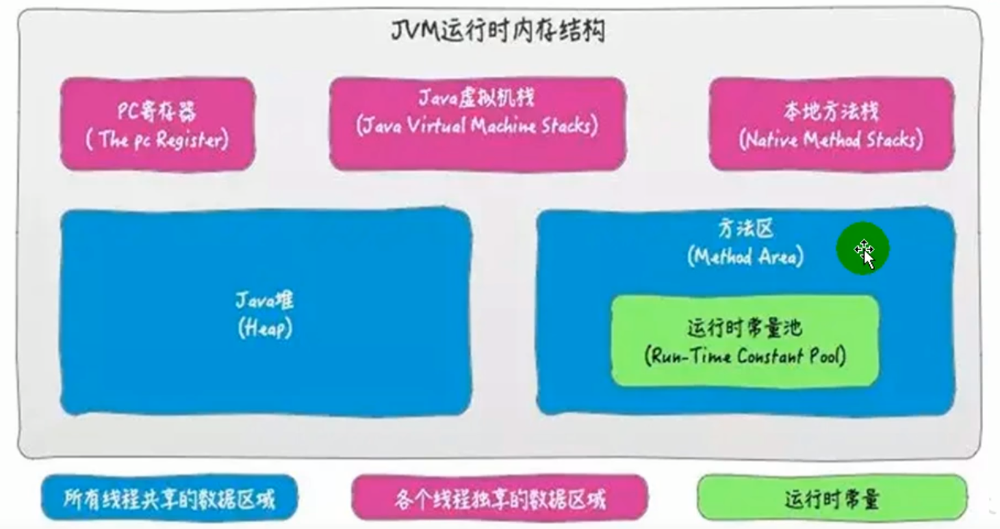

- 方法区，内部包含了运行时常量池
- 字节码文件，内部包含了常量池
- 要弄清楚方法区，需要理解清楚ClassFile，因为加载类的信息都在方法区
- 要弄清楚方法区的运行时常量池，需要理解清楚ClassFile中的常量池

##### 常量池

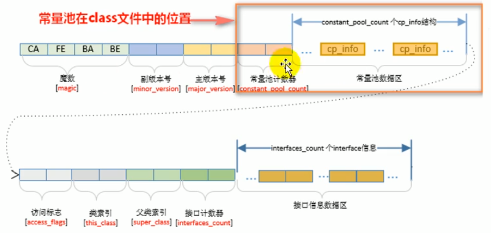

一个有效的字节码文件中除了包含类的版本信息、字段、方法以及接口等描述符信息外，还包含一项信息就是常量池表（Constant Pool Table），包括各种字面量和对类型、域和方法的符号引用

###### 为什么需要常量池

一个java源文件中的类、接口，编译后产生一个字节码文件。而Java中的字节码需要数据支持，通常这种数据会很大以至于不能直接存到字节码里，换另一种方式，可以存到常量池，这个字节码包含了指向常量池的引用。在动态链接的时候会用到运行时常量池，之前有介绍。

比如：如下的代码：

````java
public class SimpleClass {
    public void sayHello() {
        System.out.println("hello");
    }
}
````

虽然上述代码只有194字节，但是里面却使用了String、System、PrintStream及Object等结构。这里的代码量其实很少了，如果代码多的话，引用的结构将会更多，这里就需要用到常量池了。

###### 常量池中有什么

- 数量值
- 字符串值
- 类引用
- 字段引用
- 方法引用

例如下面这段代码

````java
public class MethodAreaTest2 {
    public static void main(String args[]) {
        Object obj = new Object();
    }
}
````

将会被翻译成如下字节码

````bash
new #2  
dup
invokespecial
````

###### 小结

常量池、可以看做是一张表，虚拟机指令根据这张常量表找到要执行的类名、方法名、参数类型、字面量等类型

##### 运行时常量池

* 运行时常量池（Runtime Constant Pool）是方法区的一部分

* 常量池表（Constant Pool Table）是Class文件的一部分，**用于存放编译期生成的各种字面量与符号引用，这部分内容将在类加载后存放到方法区的运行时常量池中**。 

* 运行时常量池，在加载类和接口到虚拟机后，就会创建对应的运行时常量池。

* JVM为每个已加载的类型（类或接口）都维护一个常量池。池中的数据项像数组项一样，是通过**索引访问**的。 

* 运行时常量池中包含多种不同的常量，包括编译期就已经明确的数值字面量，也包括到运行期解析后才能够获得的方法或者字段引用。此时不再是常量池中的符号地址了，这里换为真实地址。 

* 运行时常量池，相对于Class文件常量池的另一重要特征是：具备动态性。
  * String.intern()

* 运行时常量池类似于传统编程语言中的符号表（symboltable），但是它所包含的数据却比符号表要更加丰富一些。

* 当创建类或接口的运行时常量池时，如果构造运行时常量池所需的内存空间超过了方法区所能提供的最大值，则JVM会抛OutOfMemoryError异常。

#### 方法区使用举例

代码如下

````java
public class MethodAreaDemo {
    public static void main(String args[]) {
        int x = 500;
        int y = 100;
        int a = x / y;
        int b  = 50;
        System.out.println(a+b);
    }
}
````

反编译得到

````
Classfile /D:/User/LearningNotes/JVM/code/out/production/chapter09/com/tomkate/java/MethodAreaDemo.class
  Last modified 2021-2-15; size 638 bytes
  MD5 checksum 07d9f11e21f54813372f83a95e755e9a
  Compiled from "MethodAreaDemo.java"
public class com.tomkate.java.MethodAreaDemo
  minor version: 0
  major version: 52
  flags: ACC_PUBLIC, ACC_SUPER
Constant pool:
   #1 = Methodref          #5.#24         // java/lang/Object."<init>":()V
   #2 = Fieldref           #25.#26        // java/lang/System.out:Ljava/io/PrintStream;
   #3 = Methodref          #27.#28        // java/io/PrintStream.println:(I)V
   #4 = Class              #29            // com/tomkate/java/MethodAreaDemo
   #5 = Class              #30            // java/lang/Object
   #6 = Utf8               <init>
   #7 = Utf8               ()V
   #8 = Utf8               Code
   #9 = Utf8               LineNumberTable
  #10 = Utf8               LocalVariableTable
  #11 = Utf8               this
  #12 = Utf8               Lcom/tomkate/java/MethodAreaDemo;
  #13 = Utf8               main
  #14 = Utf8               ([Ljava/lang/String;)V
  #15 = Utf8               args
  #16 = Utf8               [Ljava/lang/String;
  #17 = Utf8               x
  #18 = Utf8               I
  #19 = Utf8               y
  #20 = Utf8               a
  #21 = Utf8               b
  #22 = Utf8               SourceFile
  #23 = Utf8               MethodAreaDemo.java
  #24 = NameAndType        #6:#7          // "<init>":()V
  #25 = Class              #31            // java/lang/System
  #26 = NameAndType        #32:#33        // out:Ljava/io/PrintStream;
  #27 = Class              #34            // java/io/PrintStream
  #28 = NameAndType        #35:#36        // println:(I)V
  #29 = Utf8               com/tomkate/java/MethodAreaDemo
  #30 = Utf8               java/lang/Object
  #31 = Utf8               java/lang/System
  #32 = Utf8               out
  #33 = Utf8               Ljava/io/PrintStream;
  #34 = Utf8               java/io/PrintStream
  #35 = Utf8               println
  #36 = Utf8               (I)V
{
  public com.tomkate.java.MethodAreaDemo();
    descriptor: ()V
    flags: ACC_PUBLIC
    Code:
      stack=1, locals=1, args_size=1
         0: aload_0
         1: invokespecial #1                  // Method java/lang/Object."<init>":()V
         4: return
      LineNumberTable:
        line 10: 0
      LocalVariableTable:
        Start  Length  Slot  Name   Signature
            0       5     0  this   Lcom/tomkate/java/MethodAreaDemo;

  public static void main(java.lang.String[]);
    descriptor: ([Ljava/lang/String;)V
    flags: ACC_PUBLIC, ACC_STATIC
    Code:
      stack=3, locals=5, args_size=1
         0: sipush        500
         3: istore_1
         4: bipush        100
         6: istore_2
         7: iload_1
         8: iload_2
         9: idiv
        10: istore_3
        11: bipush        50
        13: istore        4
        15: getstatic     #2                  // Field java/lang/System.out:Ljava/io/PrintStream;
        18: iload_3
        19: iload         4
        21: iadd
        22: invokevirtual #3                  // Method java/io/PrintStream.println:(I)V
        25: return
      LineNumberTable:
        line 12: 0
        line 13: 4
        line 14: 7
        line 15: 11
        line 16: 15
        line 17: 25
      LocalVariableTable:
        Start  Length  Slot  Name   Signature
            0      26     0  args   [Ljava/lang/String;
            4      22     1     x   I
            7      19     2     y   I
           11      15     3     a   I
           15      11     4     b   I
}
SourceFile: "MethodAreaDemo.java"

````


字节码执行过程展示

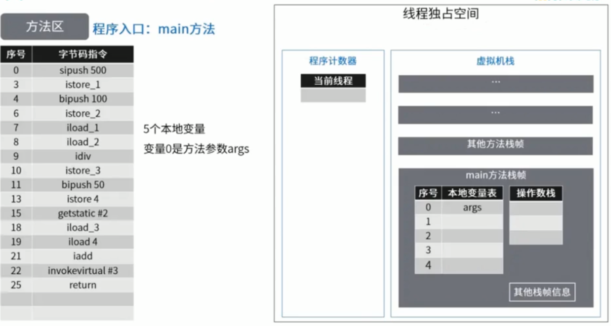

首先现将操作数500放入到操作数栈中

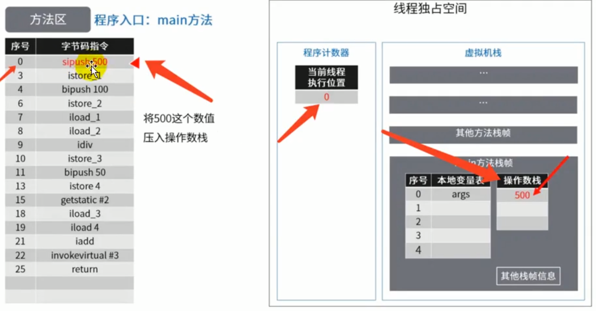

然后存储到局部变量表1中

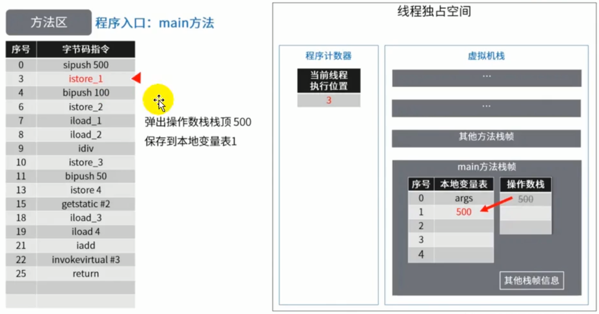

然后重复一次，把100放入局部变量表2中


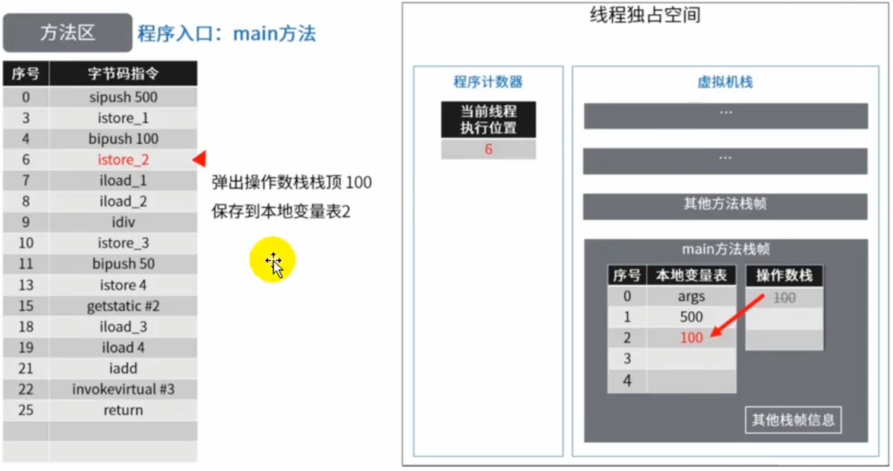

再将变量表中的500 和 100 取出 压入操作数栈

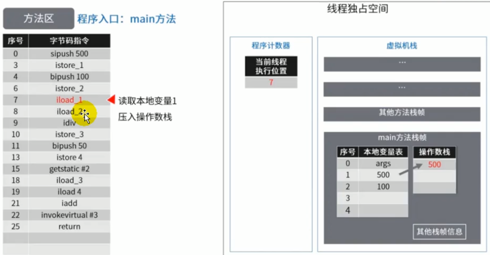

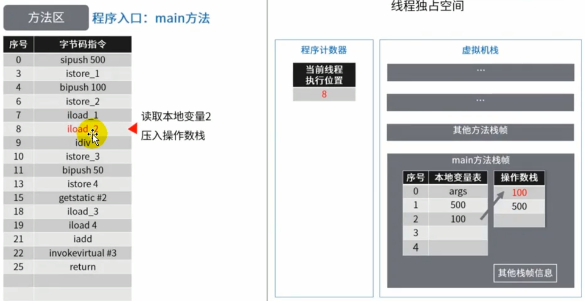

将500 和 100 进行一个除法运算，在把结果入栈

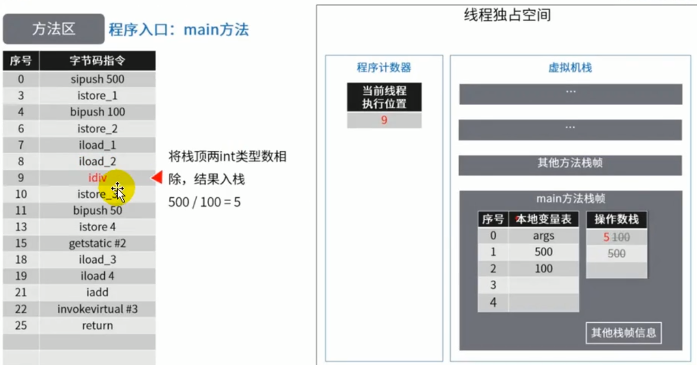

取50压入操作数栈

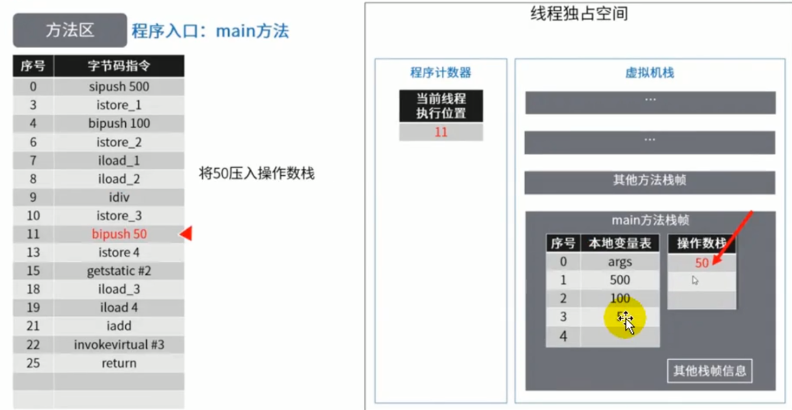

将50存入本地变量表4中

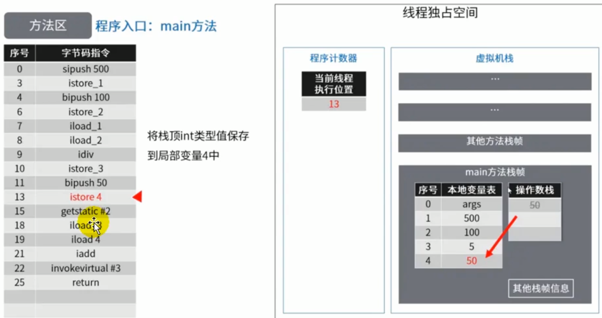

在最后就是输出流，需要调用运行时常量池的常量

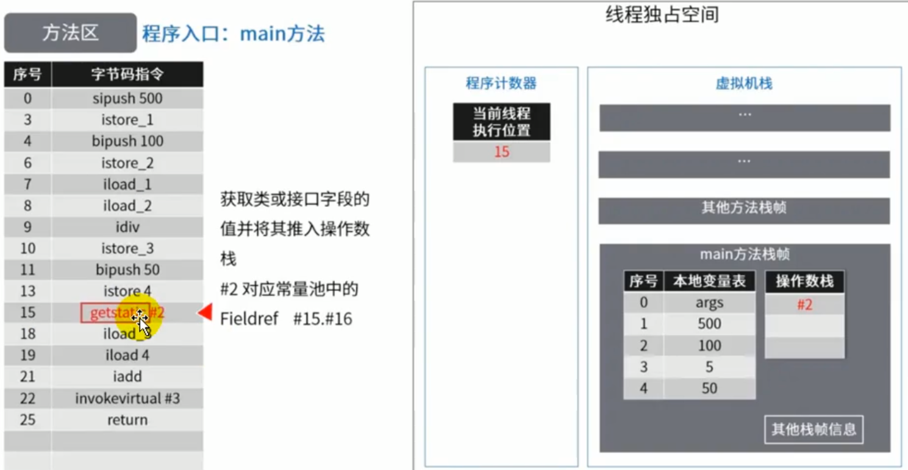

将本地变量表中的3，4取出压入操作数栈中

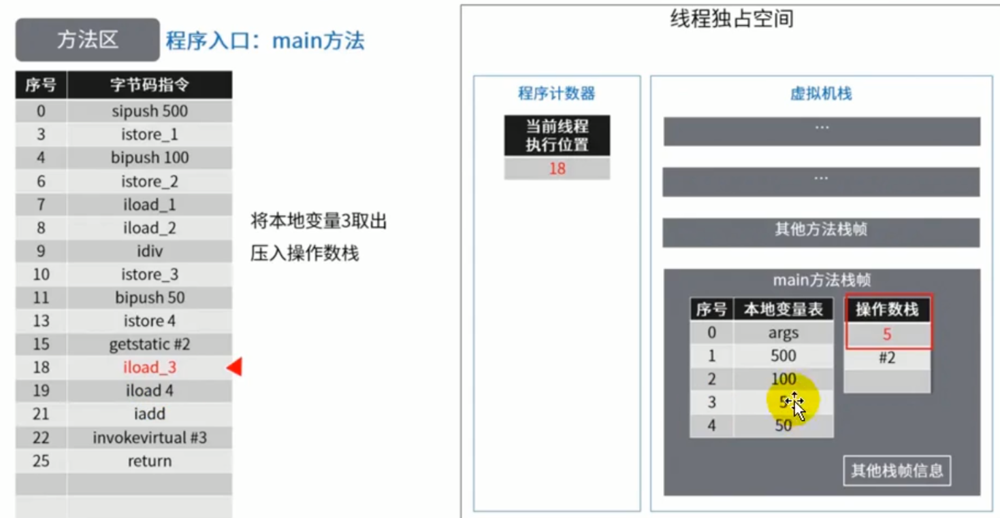

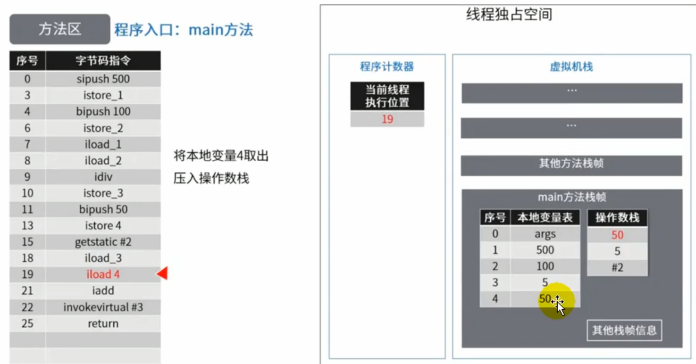

两数相加，入栈（操作数栈）

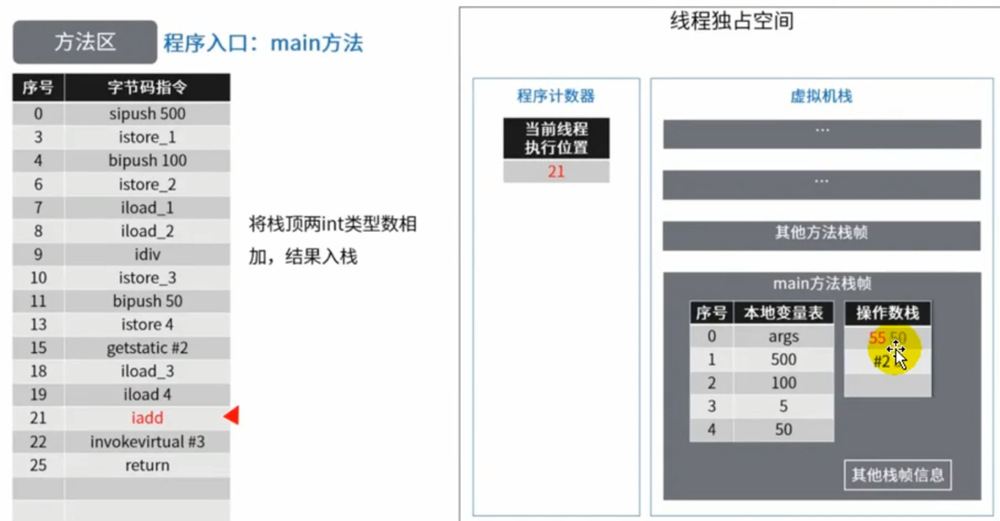

最后调用invokevirtual（虚方法调用），然后返回

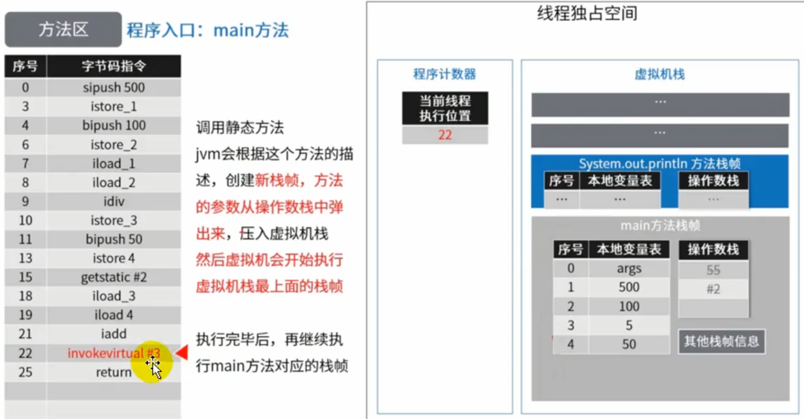

返回

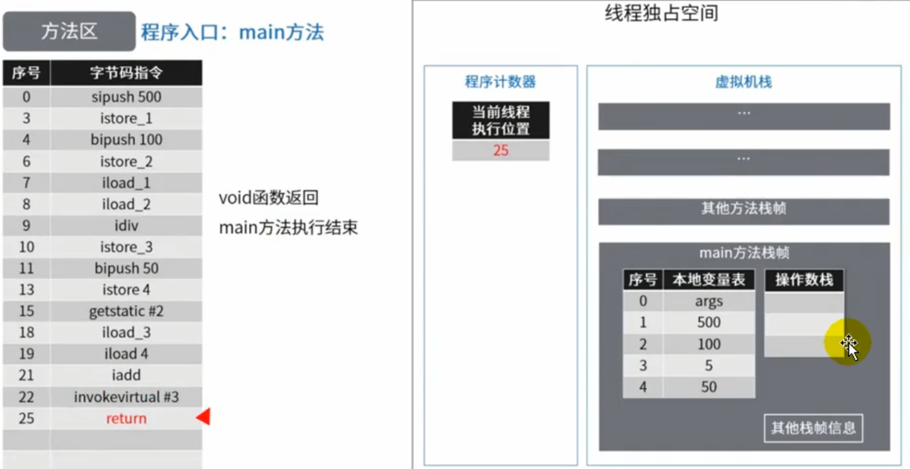

#### 方法区的演进细节

1. 首先明确：只有Hotspot才有永久代。BEA JRockit、IBMJ9等来说，是不存在永久代的概念的。原则上如何实现方法区属于虚拟机实现细节，不受《Java虚拟机规范》管束，并不要求统一

2. Hotspot中方法区的变化：

| JDK1.6及之前 | 有永久代，静态变量存储在永久代上                             |
| ------------ | ------------------------------------------------------------ |
| JDK1.7       | 有永久代，但已经逐步 “去永久代”，字符串常量池，静态变量移除，保存在堆中 |
| JDK1.8       | 无永久代，类型信息，字段，方法，常量保存在本地内存的元空间，但字符串常量池、静态变量仍然在堆中。 |

##### JDK1.6

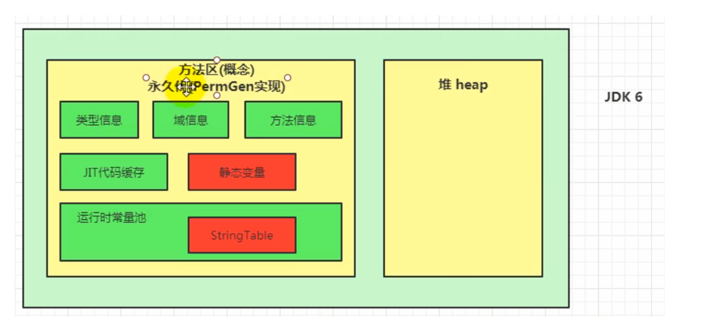

##### JDK1.7

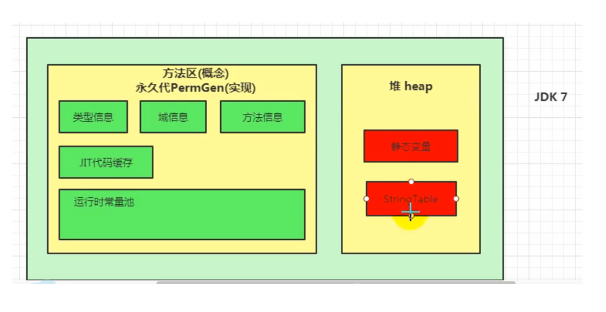

##### JDK1.8

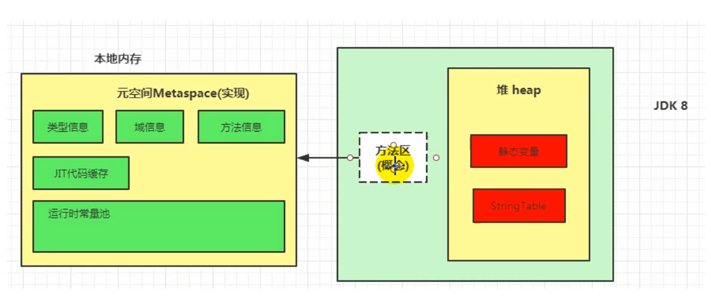

#### 永久代为什么要被元空间替代

JRockit是和HotSpot融合后的结果，因为JRockit没有永久代，所以他们不需要配置永久代

* 随着Java8的到来，HotSpot VM中再也见不到永久代了。但是这并不意味着类的元数据信息也消失了。这些数据被移到了一个与堆不相连的本地内存区域，这个区域叫做元空间（Metaspace）。

* 由于类的元数据分配在本地内存中，元空间的最大可分配空间就是系统可用内存空间，这项改动是很有必要的，原因有：
  * 为永久代设置空间大小是很难确定的。

  在某些场景下，如果动态加载类过多，容易产生Perm区的oom。比如某个实际Web工
  程中，因为功能点比较多，在运行过程中，要不断动态加载很多类，经常出现致命错误。

  > Exception in thread‘dubbo client x.x connector'java.lang.OutOfMemoryError:PermGen space

  而元空间和永久代之间最大的区别在于：元空间并不在虚拟机中，而是使用本地内存。
  因此，默认情况下，元空间的大小仅受本地内存限制。

  * 对永久代进行调优是很困难的（主要是为了降低Full GC）
    * 有些人认为方法区（如HotSpot虚拟机中的元空间或者永久代）是没有垃圾收集行为的，其实不然。《Java虚拟机规范》对方法区的约束是非常宽松的，提到过可以不要求虚拟机在方法区中实现垃圾收集。事实上也确实有未实现或未能完整实现方法区类型卸载的收集器存在（如JDK11时期的ZGC收集器就不支持类卸载）
    * 一般来说**这个区域的回收效果比较难令人满意，尤其是类型的卸载，条件相当苛刻**。但是这部分区域的回收**有时又确实是必要的**。以前sun公司的Bug列表中，曾出现过的若干个严重的Bug就是由于低版本的HotSpot虚拟机对此区域未完全回收而导致内存泄漏

**方法区的垃圾收集主要回收两部分内容：常量池中废弃的常量和不在使用的类型**

#### StringTable为什么要调整位置

* jdk7中将StringTable放到了堆空间中。因为永久代的回收效率很低，在full gc的时候才会触发。而full gc是老年代的空间不足、永久代不足时才会触发。
* 这就导致stringTable回收效率不高。而我们开发中会有大量的字符串被创建，回收效率低，导致永久代内存不足。放到堆里，能及时回收内存。

#### 静态变量存放在哪里？

**静态引用对应的对象实体始终都存在堆空间**

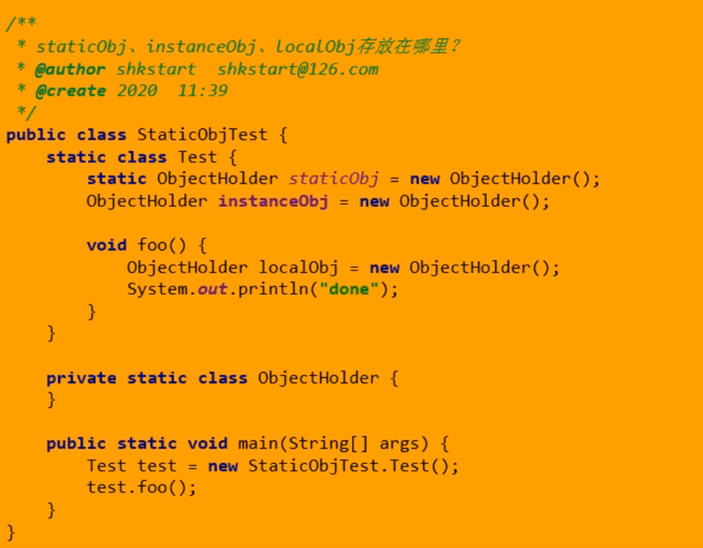

可以使用 jhsdb.ext，需要在jdk9的时候才引入的

* staticobj随着Test的类型信息存放在方法区，instanceobj随着Test的对象实例存放在Java堆，localobject则是存放在foo（）方法栈帧的局部变量表中。

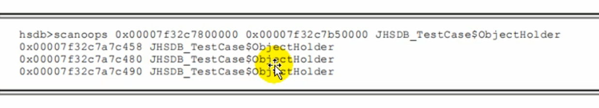

* 测试发现：三个对象的数据在内存中的地址都落在Eden区范围内，所以结论：只要是对象实例必然会在Java堆中分配。

* 接着，找到了一个引用该staticobj对象的地方，是在一个java.1ang.Class的实例里，并且给出了这个实例的地址，通过Inspector查看该对象实例，可以清楚看到这确实是一个java.lang.Class类型的对象实例，里面有一个名为staticobj的实例字段：


* 从《Java虚拟机规范》所定义的概念模型来看，所有Class相关的信息都应该存放在方法区之中，但方法区该如何实现，《Java虚拟机规范》并未做出规定，这就成了一件允许不同虚拟机自己灵活把握的事情。JDK7及其以后版本的HotSpot虚拟机选择把静态变量与类型在Java语言一端的映射class对象存放在一起，存储于Java堆之中，从我们的实验中也明确验证了这一点

#### 方法区的垃圾回收

* 有些人认为方法区（如HotSpot虚拟机中的元空间或者永久代）是没有垃圾收集行为的，其实不然。《Java虚拟机规范》对方法区的约束是非常宽松的，提到过可以不要求虚拟机在方法区中实现垃圾收集。事实上也确实有未实现或未能完整实现方法区类型卸载的收集器存在（如JDK11时期的ZGC收集器就不支持类卸载）
* 一般来说**这个区域的回收效果比较难令人满意，尤其是类型的卸载，条件相当苛刻**。但是这部分区域的回收**有时又确实是必要的**。以前sun公司的Bug列表中，曾出现过的若干个严重的Bug就是由于低版本的HotSpot虚拟机对此区域未完全回收而导致内存泄漏

**方法区的垃圾收集主要回收两部分内容：常量池中废弃的常量和不再使用的类型**

* 先来说说方法区内常量池之中主要存放的两大类常量：字面量和符号引用。字面量比较接近Java语言层次的常量概念，如文本字符串、被声明为final的常量值等。而符号引用则属于编译原理方面的概念，包括下面三类常量：
  * 类和接口的全限定名
  * 字段的名称和描述符
  * 方法的名称和描述符

* HotSpot虚拟机对常量池的回收策略是很明确的，**只要常量池中的常量没有被任何地方引用，就可以被回收**。

* 回收废弃常量与回收Java堆中的对象非常类似。（关于常量的回收比较简单，重点是类的回收）

##### 类回收判定

* 判定一个常量是否“废弃”还是相对简单，而要判定一个类型是否属于“不再被使用的类”的条件就比较苛刻了。需要同时满足下面三个条件
  * 该类所有的实例都已经被回收，也就是Java堆中不存在该类及其任何派生子类的实例。
  * 加载该类的类加载器已经被回收，这个条件除非是经过精心设计的可替换类加载器的场景，如osGi、JSP的重加载等，否则通常是很难达成的。
  * 该类对应的java.lang.Class对象没有在任何地方被引用，无法在任何地方通过反射访问该类的方法。
*  Java虚拟机被允许对满足上述三个条件的无用类进行回收，这里说的仅仅是“被允许”，而并不是和对象一样，没有引用了就必然会回收。关于是否要对类型进行回收，HotSpot虚拟机提供了-Xnoclassgc参数进行控制，还可以使用-verbose:class 以及 -XX：+TraceClass-Loading、-XX：+TraceClassUnLoading查看类加载和卸载信息
* 在大量使用反射、动态代理、CGLib等字节码框架，动态生成JSP以及oSGi这类频繁自定义类加载器的场景中，**通常都需要Java虚拟机具备类型卸载的能力，以保证不会对方法区造成过大的内存压力**。

### 运行时数据区总结

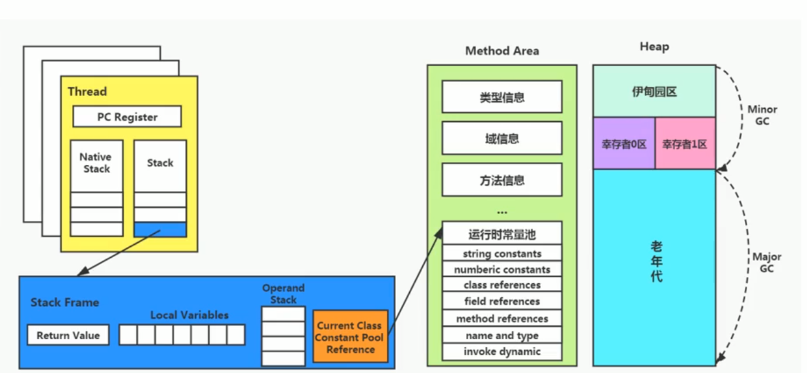

### 运行时数据区常见面试题

* 百度
  三面：说一下JVM内存模型吧，有哪些区？分别干什么的？

* 蚂蚁金服
  Java8的内存分代改进
  JVM内存分哪几个区，每个区的作用是什么？
  一面：JVM内存分布/内存结构？栈和堆的区别？堆的结构？为什么两个survivor区？
  二面：Eden和survior的比例分配

* 小米
  jvm内存分区，为什么要有新生代和老年代

* 字节跳动：
  二面：Java的内存分区
  二面：讲讲vm运行时数据库区
  什么时候对象会进入老年代？

* 京东
  JVM的内存结构，Eden和Survivor比例。
  JVM内存为什么要分成新生代，老年代，持久代。新生代中为什么要分为Eden和survivor。

* 天猫
  一面：Jvm内存模型以及分区，需要详细到每个区放什么。
  一面：JVM的内存模型，Java8做了什么改

* 拼多多
  JVM内存分哪几个区，每个区的作用是什么？

* 美团
  java内存分配
  jvm的永久代中会发生垃圾回收吗？
  一面：jvm内存分区，为什么要有新生代和老年代？

## 对象的实例化、内存布局与访问定位

### 对象的实例化

#### 面试题

- 对象在JVM中是怎么存储的？
- 对象头信息里面有哪些东西？
- Java对象头有什么？

从对象创建的方式 和 步骤开始说

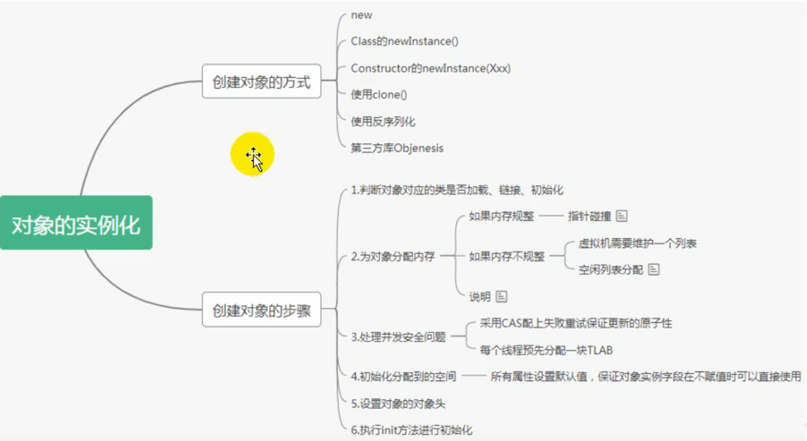

#### 对象的创建方式

- new：最常见的方式、单例类中调用getInstance的静态类方法，XXXFactory的静态方法
- Class的newInstance方法：在JDK9里面被标记为过时的方法，因为只能调用空参构造器
- Constructor的newInstance(XXX)：反射的方式，可以调用空参的，或者带参的构造器
- 使用clone()：不调用任何的构造器，要求当前的类需要实现Cloneable接口中的clone接口
- 使用序列化：序列化一般用于Socket的网络传输
- 第三方库 Objenesis

#### 创建对象的步骤（六步）

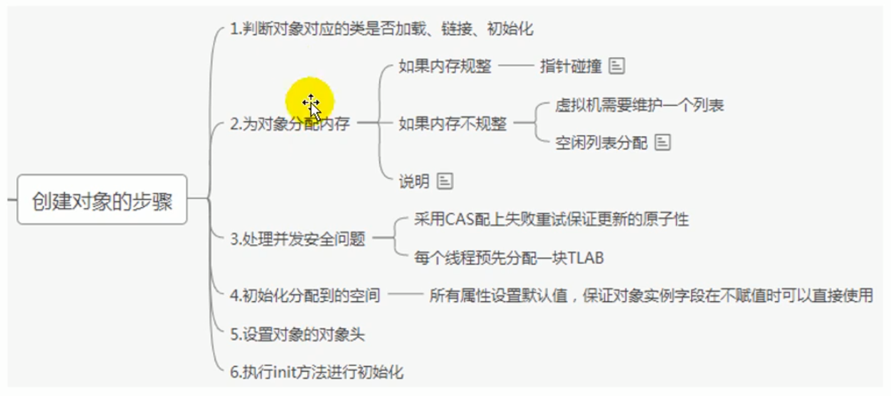

##### 1. 判断对象对应的类是否加载、链接、初始化

​	虚拟机遇到一条new指令，首先去检查这个指令的参数能否在Metaspace的常量池中定位到一个类的符号引用，并且检查这个符号引用代表的类是否已经被加载，解析和初始化。（即判断类元信息是否存在）。如果没有，那么在双亲委派模式下，使用当前类加载器以ClassLoader + 包名 + 类名为key进行查找对应的 .class文件，如果没有找到文件，则抛出ClassNotFoundException异常，如果找到，则进行类加载，并生成对应的Class对象。

##### 2.为对象分配内存

首先计算对象占用空间的大小，接着在堆中划分一块内存给新对象。如果实例成员变量是引用变量，仅分配引用变量空间即可，即4个字节大小

- 如果内存规整：指针碰撞

- 如果内存不规整
  - 虚拟表需要维护一个列表
  - 空闲列表分配

**如果内存是规整的**，那么虚拟机将采用的是指针碰撞法（Bump The Point）来为对象分配内存。

​	意思是所有用过的内存在一边，空闲的内存放另外一边，中间放着一个指针作为分界点的指示器，分配内存就仅仅是把指针指向空闲那边挪动一段与对象大小相等的距离罢了。如果垃圾收集器选择的是Serial ，ParNew这种基于压缩算法的，虚拟机采用这种分配方式。一般使用带Compact（整理）过程的收集器时，使用指针碰撞。

**如果内存不是规整的**，已使用的内存和未使用的内存相互交错，那么虚拟机将采用的是空闲列表来为对象分配内存。意思是虚拟机维护了一个列表，记录上那些内存块是可用的，再分配的时候从列表中找到一块足够大的空间划分给对象实例，并更新列表上的内容。这种分配方式成为了 “空闲列表（Free List）”

​	**选择哪种分配方式由Java堆是否规整所决定，而Java堆是否规整又由所采用的垃圾收集器是否带有压缩整理功能决定。**

##### 3.处理并发安全问题

- 采用CAS配上失败重试保证更新的原子性
- 每个线程预先分配TLAB - 通过设置 -XX:+UseTLAB参数来设置（区域加锁机制）
  - 在Eden区给每个线程分配一块区域

##### 4.初始化分配到的空间

- 所有属性设置默认值，保证对象实例字段在不赋值可以直接使用

##### 5.设置对象的对象头

将对象的所属类（即类的元数据信息）、对象的HashCode和对象的GC信息、锁信息等数据存储在对象的对象头中。这个过程的具体设置方式取决于JVM实现。

##### 6.执行init方法进行初始化

​	在Java程序的视角看来，初始化才正式开始。初始化成员变量，执行实例化代码块，调用类的构造方法，并把堆内对象的首地址赋值给引用变量

因此一般来说（由字节码中跟随invokespecial指令所决定），new指令之后会接着就是执行方法，把对象按照程序员的意愿进行初始化，这样一个真正可用的对象才算完成创建出来。

#### 对象实例化的过程

- 加载类元信息
- 为对象分配内存
- 处理并发问题
- 属性的默认初始化（零值初始化）
- 设置对象头信息
- 属性的显示初始化、代码块中初始化、构造器中初始化

### 对象的内存布局

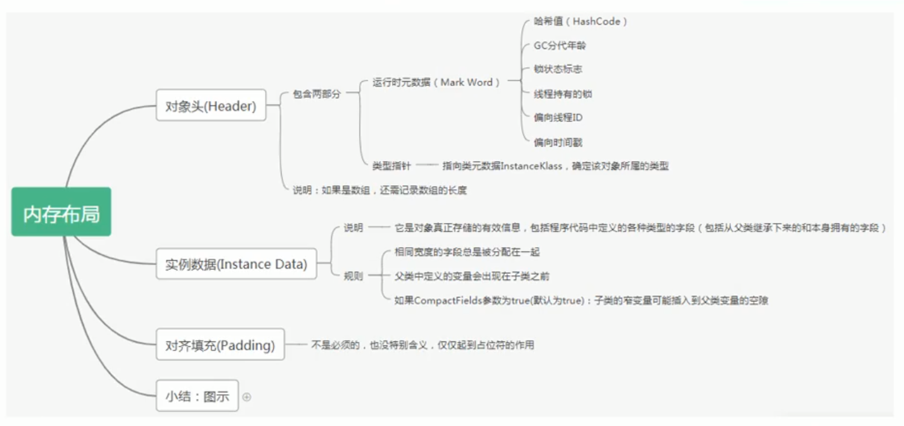

#### 1.对象头

对象头包含了两部分，分别是 运行时元数据（Mark Word）和 类型指针

> 如果是数组，还需要记录数组的长度

##### 运行时元数据

- 哈希值（HashCode）
- GC分代年龄
- 锁状态标志
- 线程持有的锁
- 偏向线程ID
- 翩向时间戳

##### 类型指针

指向类元数据InstanceKlass，确定该对象所属的类型。指向的其实是方法区中存放的类元信息

#### 2.实例数据

它是对象真正存储的有效信息，包括程序代码定义的各种类型的字段（包括从父类继承下来的和本身拥有的字段）

##### 规则

* 相同宽度的字段会被分配在一起
* 父类中定义的变量会出现在子类之前
* 如果CompactFields参数为true（默认为true）：子类的窄变量可能插入到父类变量的间隙（节省空间）

#### 3.对其填充

不是必须的，也没有特别的含义，仅仅起到占位符的作用

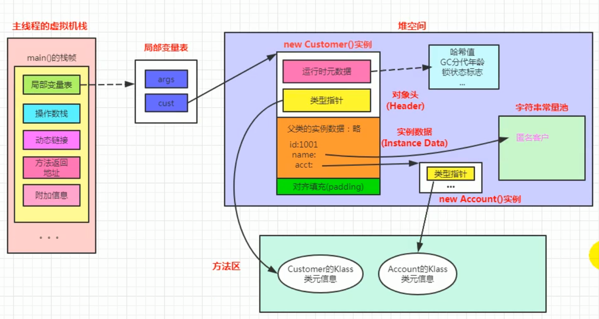

### 对象的访问定位


JVM是如何通过栈帧中的对象引用访问到其内部的对象实例呢？

图示

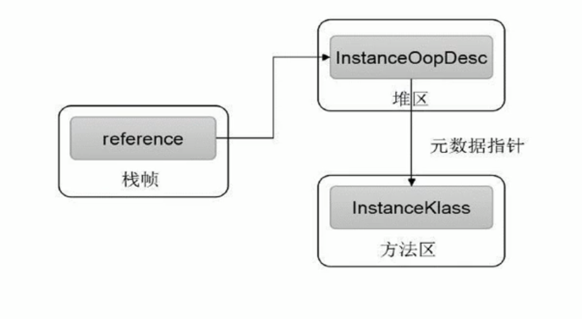

#### 对象的两种访问方式

##### 1.句柄访问

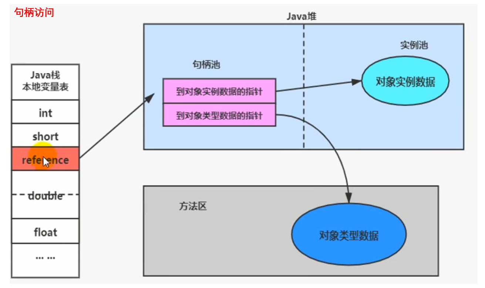

句柄访问就是说栈的局部变量表中，记录的对象的引用，然后在堆空间中开辟了一块空间，也就是句柄池

**优点**

reference中存储稳定句柄地址，对象被移动（垃圾收集时移动对象很普遍）时只会改变句柄中实例数据指针即可，reference本身不需要被修改

##### 2.直接指针（HotSpot采用）

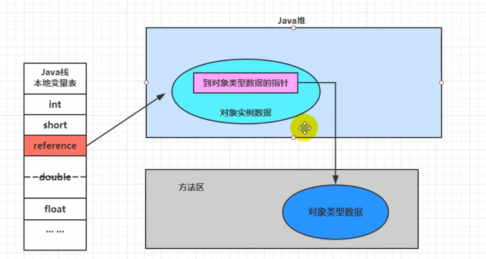

直接指针是局部变量表中的引用，直接指向堆中的实例，在对象实例中有类型指针，指向的是方法区中的对象类型数据

## 直接内存（Direct Memory）

### 概述

* 不是虚拟机运行时数据区的一部分，也不是《Java虚拟机规范》中定义的内存区域。

* 直接内存是在Java堆外的、直接向系统申请的内存区间。

* 来源于NIO，通过存在堆中的DirectByteBuffer操作Native内存

* 通常，访问直接内存的速度会优于Java堆。即读写性能高。
  * 因此出于性能考虑，读写频繁的场合可能会考虑使用直接内存。
  * Java的NIO库允许Java程序使用直接内存，用于数据缓冲区

````java
/**
 *
 * IO               NIO(New IO/ Non-Blocking IO)
 * byte[]/char[]    Buffer
 * stream           channel
 *
 * 查看直接内存的占用与释放
 *
 * @author Tom
 * @version 1.0
 * @date 2021/2/16 15:07
 */
public class BufferTest {
    //1GB
    private static final int BUFFER = 1024 * 1024 * 1024;

    public static void main(String[] args) {
        //直接分配本地内存空间
        ByteBuffer byteBuffer = ByteBuffer.allocateDirect(BUFFER);
        System.out.println("直接内存分配完毕，请求指示！");

        Scanner scanner = new Scanner(System.in);
        scanner.next();

        System.out.println("直接内存开始释放!");
        byteBuffer = null;
        System.gc();
        scanner.next();
    }
}
````

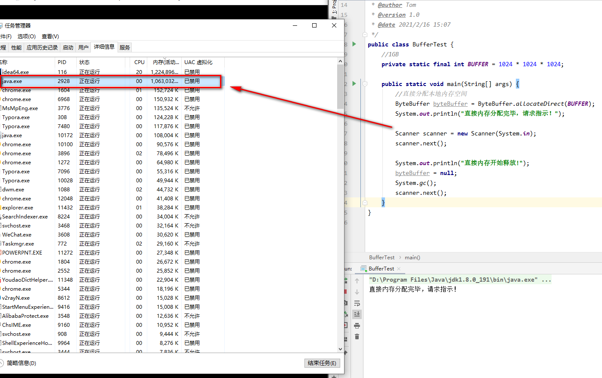

### 非直接缓存区和缓存区

#### 1.非直接缓存

原来采用BIO的架构，我们需要从用户态切换成内核态

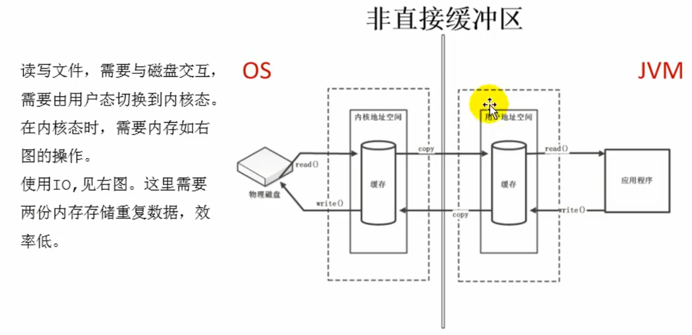

#### 2.直接缓存

NIO的方式使用了缓存区的概念

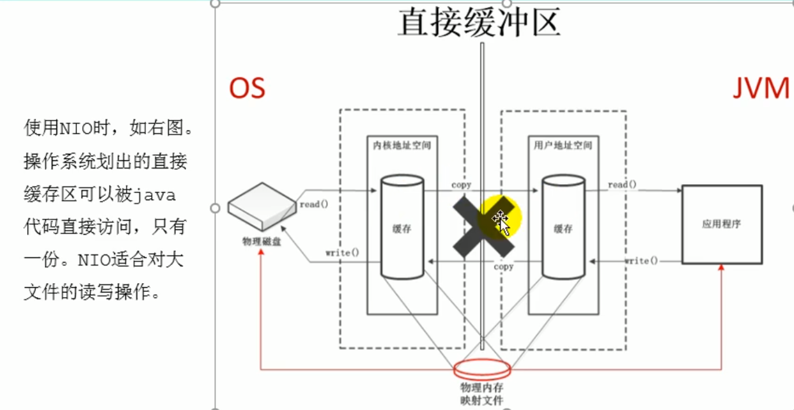

#### 存在的问题

* 也可能导致outofMemoryError异常

* 由于直接内存在Java堆外，因此它的大小不会直接受限于-xmx指定的最大堆大小，但是系统内存是有限的，Java堆和直接内存的总和依然受限于操作系统能给出的最大内存。
* 缺点
  * 分配回收成本较高
  * 不受JVM内存回收管理

* 直接内存大小可以通过MaxDirectMemorySize设置

* 如果不指定，默认与堆的最大值-xmx参数值一致

#### 直接内存的简单理解

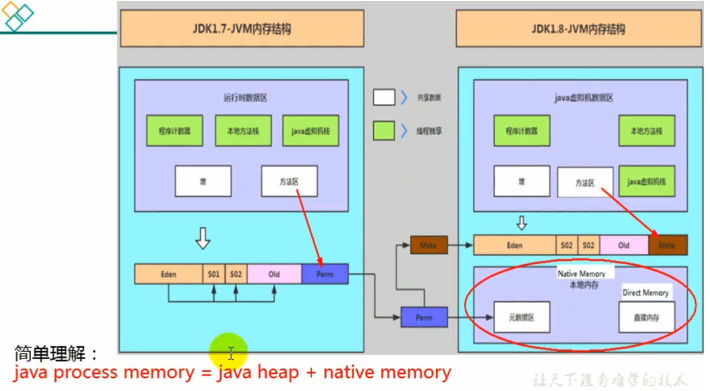

## 执行引擎

### 执行引擎概述

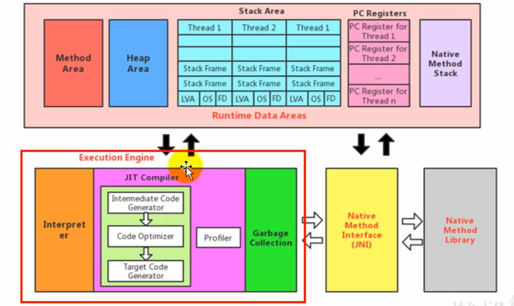

* 执行引擎是Java虚拟机核心的组成部分之一。
* “虚拟机”是一个相对于“物理机”的概念，这两种机器都有代码执行能力，其区别是物理机的执行引擎是直接建立在处理器、缓存、指令集和操作系统层面上的，而**虚拟机的执行引擎则是由软件自行实现的**，因此可以不受物理条件制约地定制指令集与执行引擎的结构体系，**能够执行那些不被硬件直接支持的指令集格式**。

JVM的主要任务是负责装载字节码到其内部，但字节码并不能够直接运行在操作系统之上，因为字节码指令并非等价于本地机器指令，它内部包含的仅仅只是一些能够被JVM所识别的字节码指令、符号表，以及其他辅助信息。

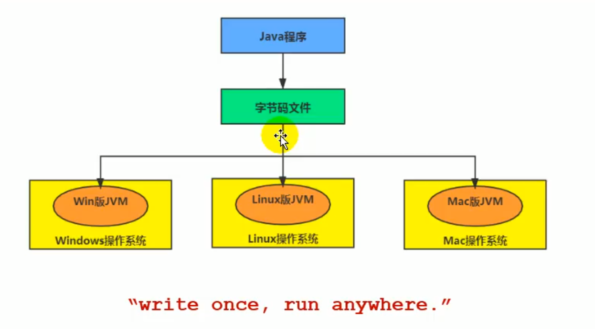

那么，如果想要让一个Java程序运行起来，执行引擎（Execution Engine）的任务就是**将字节码指令解释/编译（后端编译）为对应平台上的本地机器指令才可以**。简单来说，JVM中的执行引擎充当了将高级语言翻译为机器语言的译者。


### 执行引擎的工作流程

1. 执行引擎在执行的过程中究竟需要执行什么样的字节码指令完全依赖于PC寄存器。

2. 每当执行完一项指令操作后，PC寄存器就会更新下一条需要被执行的指令地址。

3. 当然方法在执行的过程中，执行引擎有可能会通过存储在局部变量表中的对象引用准确定位到存储在Java堆区中的对象实例信息，以及通过对象头中的元数据指针定位到目标对象的类型信息。

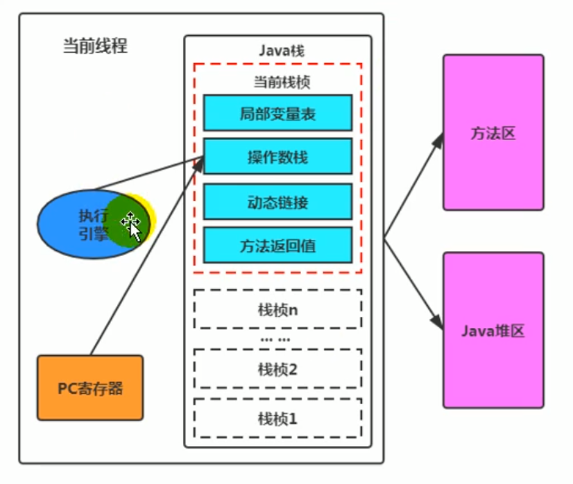

从外观上来看，所有的Java虚拟机的执行引擎输入，输出都是一致的：输入的是字节码二进制流，处理过程是字节码解析执行的等效过程，输出的是执行过程。

### Java代码编译和执行的过程

大部分的程序代码转换成物理机的目标代码或虚拟机能执行的指令集之前，都需要经过下图中的各个步骤

- 前面橙色部分是生成字节码文件的过程，和JVM无关
- 后面蓝色和绿色才是JVM需要考虑的过程

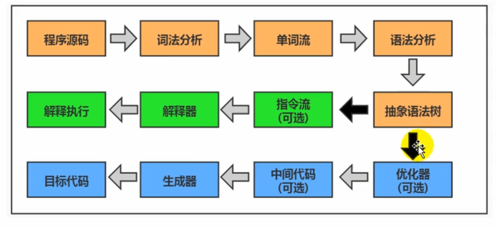

​	Java代码编译是由Java源码编译器来完成，流程图如下所示


Java字节码的执行是由JVM执行引擎来完成，流程图 如下所示

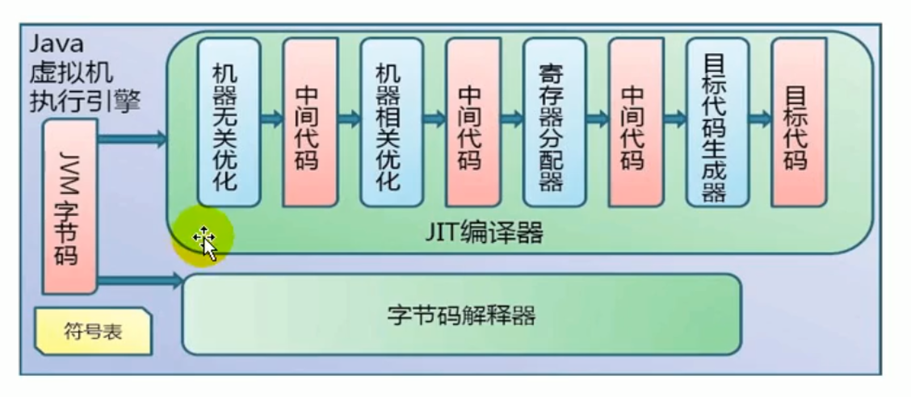

用一个总的图，来说说 解释器和编译器

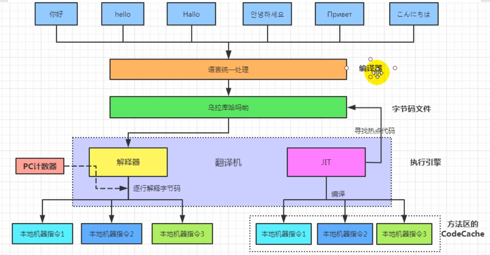

#### 什么是解释器？

当Java虚拟机启动时会根据预定义的规范**对字节码采用逐行解释的方式执行**，将每条字节码文件中的内容“翻译”为对应平台的本地机器指令执行。

#### 什么是JIT编译器?

JIT（Just In Time Compiler）编译器：就是虚拟机将源代码直接编译成和本地机器平台相关的机器语言。

#### 为什么Java是半编译半解释型语言?

​	JDK1.0时代，将Java语言定位为“解释执行”还是比较准确的。再后来，Java也发展出可以直接生成本地代码的编译器。

现在JVM在执行Java代码的时候，通常都会将解释执行与编译执行二者结合起来进行。

**翻译成本地代码后，就可以做一个缓存操作，存储在方法区中（JIT代码缓存）**

### 机器码、指令、汇编语言

#### 机器码

* 各种用二进制编码方式表示的指令，叫做**机器指令码**。开始，人们就用它采编写程序，这就是机器语言。

* 机器语言虽然能够被计算机理解和接受，但和人们的语言差别太大，不易被人们理解和记忆，并且用它编程容易出差错。

* 用它编写的程序一经输入计算机，CPU直接读取运行，因此和其他语言编的程序相比，执行速度最快。

* 机器指令与CPU紧密相关，所以不同种类的CPU所对应的机器指令也就不同。 

#### 指令

* 由于机器码是有0和1组成的二进制序列，可读性实在太差，于是人们发明了指令。

* 指令就是把机器码中特定的0和1序列，简化成对应的指令（一般为英文简写，如mov，inc等），可读性稍好

* 由于不同的硬件平台，执行同一个操作，对应的机器码可能不同，所以不同的硬件平台的同一种指令（比如mov），对应的机器码也可能不同

#### 指令集

* 不同的硬件平台，各自支持的指令，是有差别的。因此每个平台所支持的指令，称之为对应平台的指令集。
* 如常见的
  * x86指令集，对应的是x86架构的平台
  * ARM指令集，对应的是ARM架构的平台

#### 汇编语言

* 由于指令的可读性还是太差，于是人们又发明了汇编语言。

* 在汇编语言中，用**助记符**（Mnemonics）代替机器指令的操作码，用**地址符号（Symbol）或标号（Label）**代替**指令或操作数的地址**
* 在不同的硬件平台，汇编语言对应着不同的机器语言指令集，通过汇编过程转换成机器指令。
  * 由于计算机只认识指令码，所以用**汇编语言编写的程序还必须翻译成机器指令码**，计算机才能识别和执行

#### 高级语言

* 为了使计算机用户编程序更容易些，后来就出现了各种高级计算机语言。高级语言比机器语言、汇编语言**更接近人的语言**

* 当计算机执行高级语言编写的程序时，**仍然需要把程序解释和编译成机器的指令码**。完成这个过程的程序就叫做解释程序或编译程序

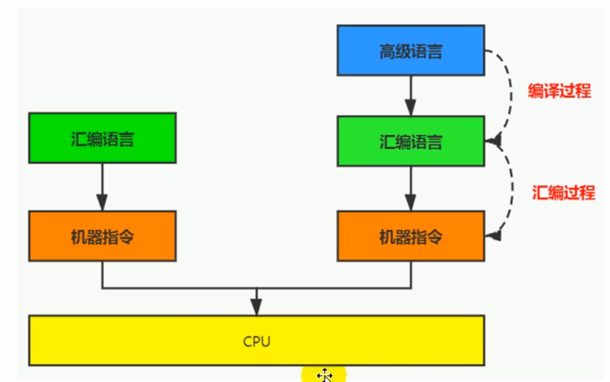

高级语言也不是直接翻译成 机器指令，而是翻译成汇编语言，如下面说的C和C++

#### C、C++源程序执行过程

编译过程又可以分成两个阶段：**编译**和**汇编**。

* 编译过程：是读取源程序（字符流），对之进行词法和语法的分析，将高级语言指令转换为功能等效的汇编代码

* 汇编过程：实际上指把汇编语言代码翻译成目标机器指令的过程。

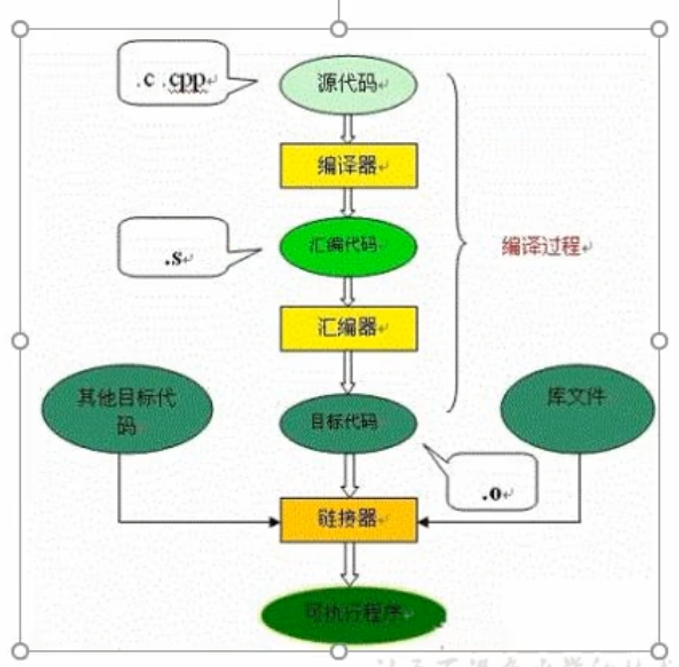

#### 字节码

* 字节码是一种**中间状态（中间码）的二进制代码**（文件），它比机器码更抽象，需要直译器转译后才能成为机器码

* 字节码主要为了实现特定软件运行和软件环境、**与硬件环境无关**。

* 字节码的实现方式是通过编译器和虚拟机器。编译器将源码编译成字节码，特定平台上的虚拟机器将字节码转译为可以直接执行的指令。
  * 字节码典型的应用为：Java bytecode

### 解释器

​	JVM设计者们的初衷仅仅只是单纯地**为了满足Java程序实现跨平台特性**，因此避免采用静态编译的方式直接生成本地机器指令，从而诞生了实现解释器在运行时采用逐行解释字节码执行程序的想法。

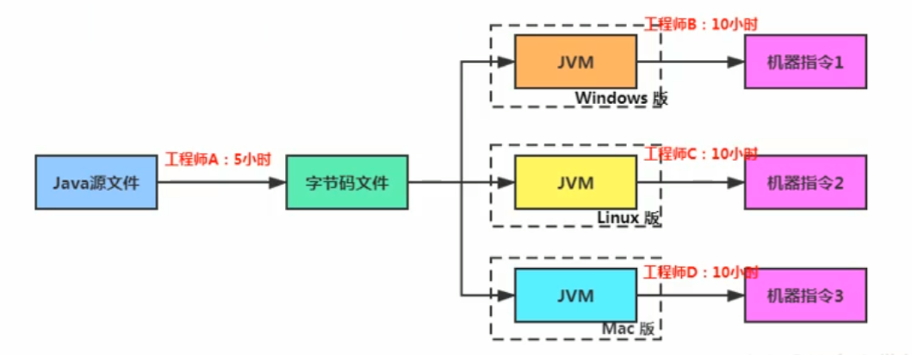

​	为什么Java源文件不直接翻译成JMV，而是翻译成字节码文件？可能是因为直接翻译的代码是比较大的

* 解释器真正意义上所承担的角色就是一个运行时“翻译者”，将字节码文件中的内容“翻译”为对应平台的本地机器指令执行。

* 当一条字节码指令被解释执行完成后，接着再根据PC寄存器中记录的下一条需要被执行的字节码指令执行解释操作。

#### 解释器分类

​	在Java的发展历史里，一共有两套解释执行器，即古老的**字节码解释器**、现在普遍使用的**模板解释器**

* 字节码解释器在执行时通过**纯软件代码**模拟字节码的执行，效率非常低下

* 而模板解释器将**每一条字节码和一个模板函数相关联**，模板函数中直接产生这条字节码执行时的机器码，从而很大程度上提高了解释器的性能
  * 在HotSpot VM中，解释器主要由Interpreter模块和Code模块构成
    * Interpreter模块：实现了解释器的核心功能
    * Code模块：用于管理HotSpot VM在运行时生成的本地机器指令

#### 现状

* 由于解释器在设计和实现上非常简单，因此除了Java语言之外，还有许多高级语言同样也是基于解释器执行的，比如Python、Perl、Ruby等。但是在今天，**基于解释器执行已经沦落为低效的代名词**，并且时常被一些C/C++程序员所调侃

* 为了解决这个问题，JVM平台支持一种叫作即时编译的技术。即时编译的目的是避免函数被解释执行，而是**将整个函数体编译成为机器码，每次函数执行时，只执行编译后的机器码即可**，这种方式可以使执行效率大幅度提升

* 不过无论如何，基于解释器的执行模式仍然为中间语言的发展做出了不可磨灭的贡献。

### JIT编译器

#### Java代码的执行分类

* 第一种是将源代码编译成字节码文件，然后在运行时通过解释器将字节码文件转为机器码执行

* 第二种是编译执行（直接编译成机器码）。现代虚拟机为了提高执行效率，会使用即时编译技术（JIT，Just In Time）将方法编译成机器码后再执行

> HotSpot VM是目前市面上高性能虚拟机的代表作之一。它**采用解释器与即时编译器并存的架构**。在Java虚拟机运行时，解释器和即时编译器能够相互协作，各自取长补短，尽力去选择最合适的方式来权衡编译本地代码的时间和直接解释执行代码的时间 

> 在今天，Java程序的运行性能早已脱胎换骨，已经达到了可以和C/C++ 程序一较高下的地步

#### 问题

​	有些开发人员会感觉到诧异，**既然HotSpot VM中已经内置JIT编译器了，那么为什么还需要再使用解释器来“拖累”程序的执行性能呢？**比如JRockit VM内部就不包含解释器，字节码全部都依靠即时编译器编译后执行。

- JRockit虚拟机是砍掉了解释器，也就是只采及时编译器。那是因为呢JRockit只部署在服务器上，一般已经有时间让他进行指令编译的过程了，对于响应来说要求不高，等及时编译器的编译完成后，就会提供更好的性能

首先明确：
当程序启动后，解释器可以马上发挥作用，省去编译的时间，立即执行（响应速度快）
编译器要想发挥作用，把代码编译成本地代码，需要一定的执行时间。但编译为本地代码后，执行效率高。

所以：
尽管JRockit VM中程序的执行性能会非常高效，但程序在启动时必然需要花费更长的时间来进行编译。对于服务端应用来说，启动时间并非是关注重点，但对于那些看中启动时间的应用场景而言，或许就需要采用解释器与即时编译器并存的架构来换取一个平衡点。

​	在此模式下，**当Java虚拟器启动时，解释器可以首先发挥作用，而不必等待即时编译器全部编译完成后再执行，这样可以省去许多不必要的编译时间。随着时间的推移，编译器发挥作用，把越来越多的代码编译成本地代码，获得更高的执行效率**。

同时，解释执行在编译器进行激进优化不成立的时候，作为编译器的“逃生门”（后备方案）

#### HotSpot JVM执行方式

​	当虚拟机启动的时候，**解释器可以首先发挥作用**，而不必等待即时编译器全部编译完成再执行，这样可以**省去许多不必要的编译时间**。并且随着程序运行时间的推移，即时编译器逐渐发挥作用，根据热点探测功能，**将有价值的字节码编译为本地机器指令**，以换取更高的程序执行效率。

#### 案例

​	注意解释执行与编译执行在线上环境微妙的辩证关系。**机器在热机状态可以承受的负载要大于冷机状态**。如果以热机状态时的流量进行切流，可能使处于冷机状态的服务器因无法承载流量而假死。

​	在生产环境发布过程中，以分批的方式进行发布，根据机器数量划分成多个批次，每个批次的机器数至多占到整个集群的1/8。曾经有这样的故障案例：某程序员在发布平台进行分批发布，在输入发布总批数时，误填写成分为两批发布。如果是热机状态，在正常情况下一半的机器可以勉强承载流量，但由于刚启动的JVM均是解释执行，还没有进行热点代码统计和JIT动态编译，导致机器启动之后，当前1/2发布成功的服务器马上全部宕机，此故障说明了JIT的存在。—阿里团队

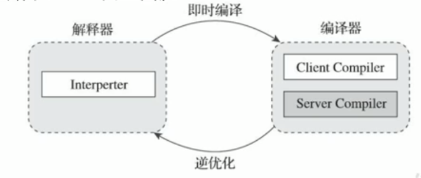

#### 概念解释

- Java 语言的“编译期”其实是一段“不确定”的操作过程，因为它可能是指一个**前端编译器**（其实叫“编译器的前端”更准确一些）把.java文件转变成.class文件的过程；也可能是指虚拟机的后端运行期编译器（JIT编译器，Just In Time Compiler）
- 也可能是指虚拟机的**后端运行期编译器（JIT 编译器）**把字节码转变成机器码的过程
- 还可能是指使用**静态提前编译器**（AOT编译器，Ahead of Time Compiler）直接把.java文件编译成本地机器代码的过程。

> 前端编译器：Sun的Javac、Eclipse JDT中的增量式编译器（ECJ）
>
> JIT编译器：HotSpot VM的C1、C2编译器
>
> AOT 编译器：GNU Compiler for the Java（GCJ）、Excelsior JET

#### 热点探测技术

* **一个被多次调用的方法，或者是一个方法体内部循环次数较多的循环体都可以被称之为“热点代码”**，因此都可以通过JIT编译器编译为本地机器指令。由于这种编译方式发生在方法的执行过程中，因此被称之为**栈上替换**，或简称为OSR（On Stack Replacement）编译。

* 一个方法究竟**要被调用多少次**，或者一个循环体究竟需要执行多少次循环才可以达到这个标准？必然需要一个明确的阈值，JIT编译器才会将这些“热点代码”编译为本地机器指令执行。这里主要依靠**热点探测功能**

* **目前HotSpot VM所采用的热点探测方式是基于计数器的热点探测**

* 采用基于计数器的热点探测，HotSpot VM将会为每一个方法都建立2个不同类型的计数器，分别为**方法调用计数器**（Invocation Counter）和**回边计数器**（Back Edge Counter）。
  * 方法调用计数器用于统计方法的调用次数
  * 回边计数器则用于统计循环体执行的循环次数

##### 方法调用计数器

* 这个计数器就用于统计方法被调用的次数，它的默认阀值在Client模式下是1500次，在Server模式下是10000次。超过这个阈值，就会触发JIT编译。

* 这个阀值可以通过虚拟机参数 **-XX:CompileThreshold** 来人为设定。

* 当一个方法被调用时，会先检查该方法是否存在被JIT编译过的版本，如果存在，则优先使用编译后的本地代码来执行。如果不存在已被编译过的版本，则将此方法的调用计数器值加1，然后判断**方法调用计数器与回边计数器值之和**是否超过方法调用计数器的阀值。如果已超过阈值，那么将会向即时编译器提交一个该方法的代码编译请求。

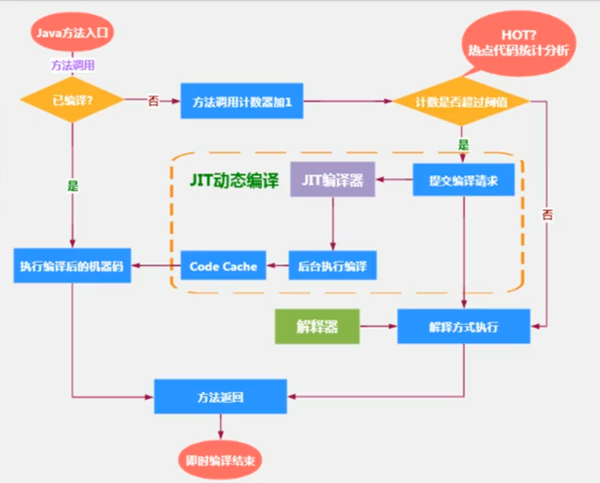

##### 回边计数器

它的作用是统计一个方法中**循环体代码执行的次数**，在字节码中遇到控制流向后跳转的指令称为“回边”（Back Edge）。显然，建立回边计数器统计的目的就是为了触发OSR编译。

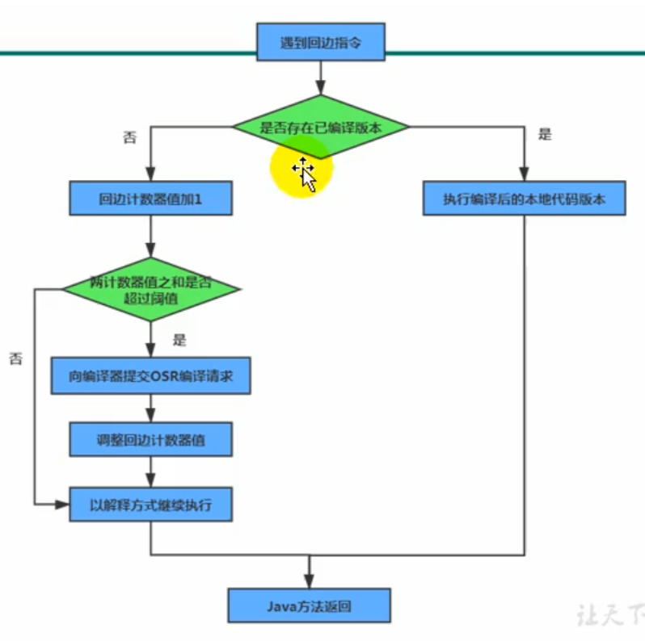

##### 热度衰减

* 如果不做任何设置，方法调用计数器统计的并不是方法被调用的绝对次数，而是一个相对的执行频率，即**一段时间之内方法被调用的次数**。当超过**一定的时间限度**，如果方法的调用次数仍然不足以让它提交给即时编译器编译，那这个方法的调用计数器就会被**减少一半**，这个过程称为方法调用计数器热度的**衰减（Counter Decay）**，而这段时间就称为此方法统计的**半衰周期（Counter Half Life Time）**

- 半衰周期是化学中的概念，比如出土的文物通过查看C60来获得文物的年龄

* 进行热度衰减的动作是在虚拟机进行垃圾收集时顺便进行的，可以使用虚拟机参数
  **-XX:-UseCounterDecay** 来关闭热度衰减，让方法计数器统计方法调用的绝对次数，这样，只要系统运行时间足够长，绝大部分方法都会被编译成本地代码。

* 另外，可以使用**-XX:CounterHalfLifeTime**参数设置半衰周期的时间，单位是秒。

#### HotSpotVM 可以设置程序执行方式

​	缺省情况下HotSpot VM是采用解释器与即时编译器并存的架构，当然开发人员可以根据具体的应用场景，通过命令显式地为Java虚拟机指定在运行时到底是**完全采用解释器执行**，还是**完全采用即时编译器执行**。如下所示：

- **-Xint**：完全采用解释器模式执行程序；
- **-Xcomp**：完全采用即时编译器模式执行程序。如果即时编译出现问题，解释器会介入执行
- **-Xmixed**：采用解释器+即时编译器的混合模式共同执行程序。

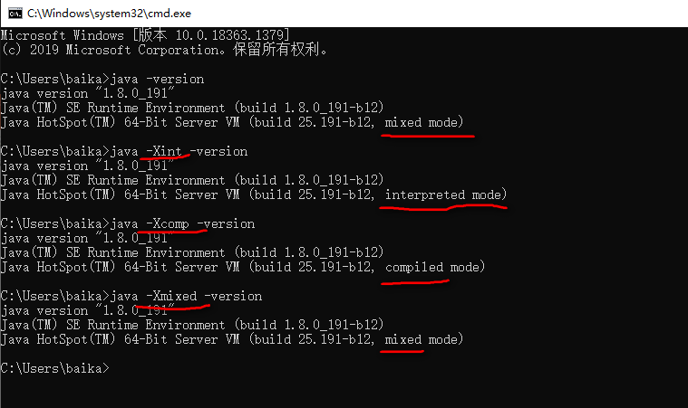

#### HotSpot VM中 JIT 分类

JIT的编译器还分为了两种，分别是C1和C2，在HotSpot VM中内嵌有两个JIT编译器，分别为Client Compiler和Server Compiler，但大多数情况下我们简称为C1编译器 和 C2编译器。开发人员可以通过如下命令显式指定Java虚拟机在运行时到底使用哪一种即时编译器，如下所示：

- **-client**：指定Java虚拟机运行在Client模式下，并使用C1编译器；
  - C1编译器会对字节码进行**简单和可靠的优化，耗时短**。以达到更快的编译速度。

- **-server**：指定Java虚拟机运行在server模式下，并使用C2编译器
  - C2进行**耗时较长的优化，以及激进优化**。但优化的代码执行效率更高。（使用C++）

#### C1 和 C2编译器不同的优化策略

* 在不同的编译器上有不同的优化策略，C1编译器上主要有**方法内联**，**去虚拟化**、**元余消除**
  * 方法内联：将引用的函数代码编译到引用点处，这样可以减少栈帧的生成，减少参数传递以及跳转过程
  * 去虚拟化：对唯一的实现樊进行内联
  * 冗余消除：在运行期间把一些不会执行的代码折叠掉

* C2的优化主要是在全局层面，逃逸分析是优化的基础。基于逃逸分析在C2上有如下几种优化
  * 标量替换：用标量值代替聚合对象的属性值
  * 栈上分配：对于未逃逸的对象分配对象在栈而不是堆
  * 同步消除：清除同步操作，通常指synchronized

#### 分层编译策略

​	**分层编译（Tiered Compilation）策略**：程序解释执行（不开启性能监控）可以触发C1编译，将字节码编译成机器码，可以进行简单优化，也可以加上性能监控，C2编译会根据性能监控信息进行激进优化。

不过在Java7版本之后，一旦开发人员在程序中显式指定命令“-server"时，默认将会开启分层编译策略，由C1编译器和C2编译器相互协作共同来执行编译任务。

#### 总结

- 一般来讲，JIT编译出来的机器码性能比解释器高
- C2编译器启动时长比C1慢，系统稳定执行以后，C2编译器执行速度远快于C1编译器

#### 写到最后

- 自JDK10起，HotSpot又加入了一个全新的及时编译器：Graal编译器
- 编译效果短短几年时间就追评了G2编译器，未来可期
- 目前，带着实验状态标签，需要使用开关参数去激活才能使用

````bash
-XX:+UnlockExperimentalvMOptions -XX:+UseJVMCICompiler
````

### AOT编译器

* JDK9引入了AOT编译器（静态提前编译器，Ahead of Time Compiler）

* Java 9引入了实验性AOT编译工具aotc。它借助了Graal编译器，将所输入的Java类文件转换为机器码，并存放至生成的动态共享库之中。

* 所谓AOT编译，是与即时编译相对立的一个概念。我们知道，即时编译（JIT）指的是在**程序的运行过程中**，将字节码转换为可在硬件上直接运行的机器码，并部署至托管环境中的过程。而AOT编译指的则是，在**程序运行之前**，便将字节码转换为机器码的过程。

```
.java -> .class -> (使用jaotc) -> .so
```

​	最大的好处：Java虚拟机加载已经预编译成二进制库，可以直接执行。不必等待及时编译器的预热，减少Java应用给人带来“第一次运行慢” 的不良体验

缺点：

- 破坏了 java  “ 一次编译，到处运行”，必须为每个不同的硬件，OS编译对应的发行包
- **降低了Java链接过程的动态性**，加载的代码在编译器就必须全部已知。
- 还需要继续优化中，最初只支持Linux X64 java base

## StringTable(字符串常量池)

### String的基本特性

- String：字符串，使用一对 ”” 引起来表示
  - String s1 = "tomkate" ;   // 字面量的定义方式
  - String s2 =  new String("tom"); 
- String声明为final的，不可被继承
- String实现了Serializable接口：表示字符串是支持序列化的。实现了Comparable接口：表示string可以比较大小
- String在JDK1.8及以前内部定义了final char[] value用于存储字符串数据。JDK1.9时改为byte[]

#### 为什么JDK9改变了结构

​	String类的当前实现将字符存储在char数组中，每个字符使用两个字节(16位)。从许多不同的应用程序收集的数据表明，字符串是堆使用的主要组成部分，而且，**大多数字符串对象只包含拉丁字符。这些字符只需要一个字节的存储空间，因此这些字符串对象的内部char数组中有一半的空间将不会使用**

​	我们建议改变字符串的内部表示clasš从utf - 16字符数组到字节数组+一个encoding-flag字段。新的String类将根据字符串的内容存储编码为ISO-8859-1/Latin-1(每个字符一个字节)或UTF-16(每个字符两个字节)的字符。编码标志将指示使用哪种编码。

结论：String再也不用char[] 来存储了，改成了byte [] 加上编码标记，节约了一些空间

```java
// 之前
private final char value[];
// 之后
private final byte[] value
```

同时基于String的数据结构，例如StringBuffer和StringBuilder也同样做了修改

#### String的不可变性

* String：代表不可变的字符序列。简称：不可变性。
  * 当对字符串重新赋值时，需要重写指定内存区域赋值，不能使用原有的value进行赋值。
  * 当对现有的字符串进行连接操作时，也需要重新指定内存区域赋值，不能使用原有的value进行赋值。
  * 当调用string的replace（）方法修改指定字符或字符串时，也需要重新指定内存区域赋值，不能使用原有的value进行赋值
* 通过字面量的方式（区别于new）给一个字符串赋值，此时的字符串值声明在字符串常量池中。

````java
/**
 * String 的基本使用：体现String的不可变性
 *
 * @author Tom
 * @version 1.0
 * @date 2021/2/16 19:09
 */
public class StringTest1 {
    public static void test1() {
        // 字面量定义的方式，“abc”存储在字符串常量池中
        String s1 = "abc";
        String s2 = "abc";
        //判断地址
        System.out.println(s1 == s2);
        s1 = "hello";
        System.out.println(s1 == s2);
        System.out.println(s1);
        System.out.println(s2);
        System.out.println("----------------");
    }

    public static void test2() {
        String s1 = "abc";
        String s2 = "abc";
        // 只要进行了修改，就会重新创建一个对象，这就是不可变性
        s2 += "def";
        System.out.println(s1);//abc
        System.out.println(s2);//abcdef
        System.out.println("----------------");
    }

    public static void test3() {
        String s1 = "abc";
        String s2 = s1.replace('a', 'm');
        System.out.println(s1);
        System.out.println(s2);
    }

    public static void main(String[] args) {
        test1();
        test2();
        test3();
    }
}
````

运行结果

````
true
false
hello
abc
----------------
abc
abcdef
----------------
abc
mbc
````

#### 面试题

````java
/**
 * @author Tom
 * @version 1.0
 * @date 2021/2/16 19:15
 */
public class StringExer {
    String str = new String("good");
    char[] ch = {'t', 'e', 's', 't'};

    public void change(String str, char ch[]) {
        str = "test ok";
        ch[0] = 'b';
    }

    public static void main(String[] args) {
        StringExer ex = new StringExer();
        ex.change(ex.str, ex.ch);
        System.out.println(ex.str);
        System.out.println(ex.ch);
    }
}
````

输出

````
good
best
````

#### 注意

* **字符串常量池是不会存储相同内容的字符串的**

* String的string Pool是一个固定大小的Hashtable，默认值大小长度是1009。如果放进string Pool的string非常多，就会造成Hash冲突严重，从而导致链表会很长，而链表长了后直接会造成的影响就是当调用string.intern时性能会大幅下降。

* 使用**-XX:StringTablesize**可设置stringTable的长度

* 在JDK6中stringTable是固定的，就是**1009**的长度，所以如果常量池中的字符串过多就会导致效率下降很快。stringTablesize设置没有要求

* 在JDK7中，stringTable的长度默认值是**60013**

* 在JDK8中，StringTable可以设置的最小值为**1009** 

### String的内存分配

* 在Java语言中有8种基本数据类型和一种比较特殊的类型String。这些类型为了使它们在运行过程中速度更快、更节省内存，都提供了一种常量池的概念。

* 常量池就类似一个Java系统级别提供的缓存。8种基本数据类型的常量池都是系统协调的，**String类型的常量池比较特殊。它的主要使用方法有两种**
* 直接使用双引号声明出来的String对象会直接存储在常量池中。
  * 比如：String info="tomkate"；
  * 如果不是用双引号声明的String对象，可以使用string提供的intern（）方法。

* Java 6及以前，字符串常量池存放在永久代

* Java 7中 oracle的工程师对字符串池的逻辑做了很大的改变，即将**字符串常量池的位置调整到Java堆内**
  * 所有的字符串都保存在堆（Heap）中，和其他普通对象一样，这样可以让你在进行调优应用时仅需要调整堆大小就可以了
  * 字符串常量池概念原本使用得比较多，但是这个改动使得我们有足够的理由让我们重新考虑在Java 7中使用string.intern（）。

* Java8元空间，字符串常量在堆

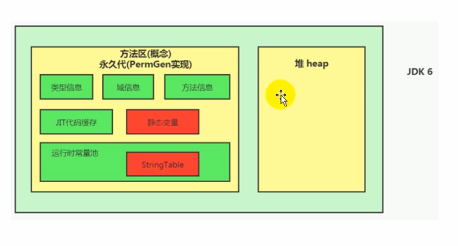

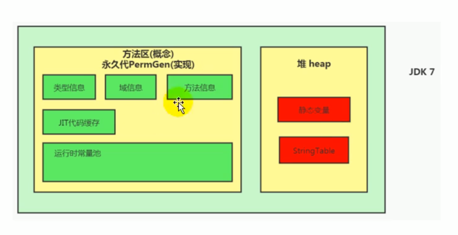

#### 为什么StringTable从永久代调整到堆中

​	在JDK 7中，interned字符串不再在Java堆的永久生成中分配，而是在Java堆的主要部分(称为年轻代和年老代)中分配，与应用程序创建的其他对象一起分配。此更改将导致驻留在主Java堆中的数据更多，驻留在永久生成中的数据更少，因此可能需要调整堆大小。由于这一变化，大多数应用程序在堆使用方面只会看到相对较小的差异，但加载许多类或大量使用字符串的较大应用程序会出现这种差异。intern()方法会看到更显著的差异。

- 永久代的默认比较小
- 永久代垃圾回收频率低

### String的基本操作

​	Java语言规范里要求完全相同的字符串字面量，应该包含同样的Unicode字符序列（包含同一份码点序列的常量），并且必须是指向同一个String类实例。

````java
/**
 * @author Tom
 * @version 1.0
 * @date 2021/2/16 19:48
 */
public class StringTest4 {
    public static void main(String[] args) {
        System.out.println();//2118
        System.out.println("1");//2219
        System.out.println("2");//2120
        System.out.println("3");
        System.out.println("4");
        System.out.println("5");
        System.out.println("6");
        System.out.println("7");
        System.out.println("8");
        System.out.println("9");
        System.out.println("10");//2128

        //如下的字符串"1"到"10" 不会再次增加
        System.out.println("1");//2129
        System.out.println("2");//2129
        System.out.println("3");
        System.out.println("4");
        System.out.println("5");
        System.out.println("6");
        System.out.println("7");
        System.out.println("8");
        System.out.println("9");
        System.out.println("10");//2129
    }
}
````

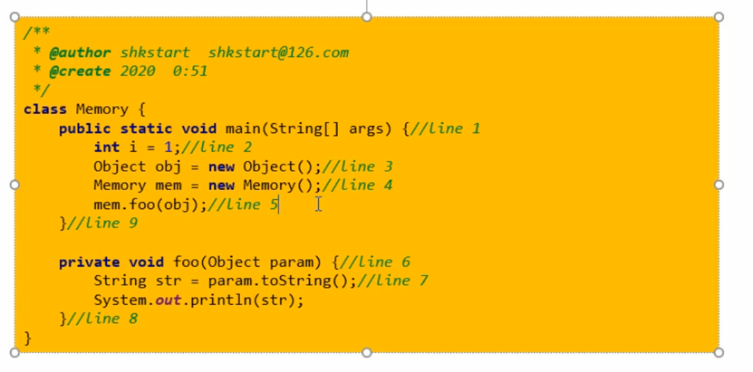

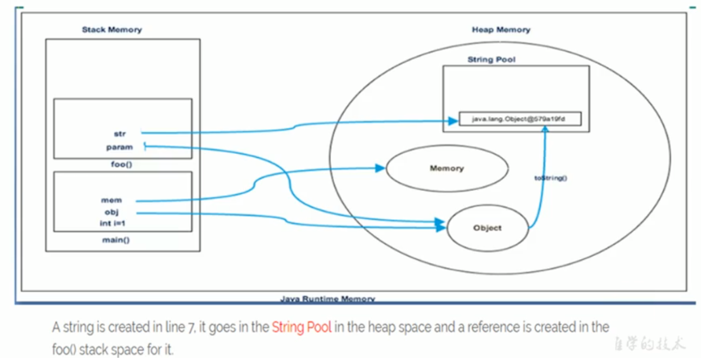

### 字符串拼接操作

- 常量与常量的拼接结果在常量池，原理是编译期优化
- 常量池中不会存在相同内容的变量
- 只要其中有一个是变量，结果就在堆中。变量拼接的原理是StringBuilder
- 如果拼接的结果调用intern()方法，则主动将常量池中还没有的字符串对象放入池中，并返回此对象地址

````java
/**
 * @author Tom
 * @version 1.0
 * @date 2021/2/16 19:59
 */
public class StringTest5 {
    public static void test1() {
        String s1 = "a" + "b" + "c";  //等同于"abc" 得到 abc的常量池
        String s2 = "abc"; // abc存放在常量池，直接将常量池的地址返回赋给s2
        /**
         * 最终java编译成.class，再执行.class
         */
        System.out.println(s1 == s2); // true，因为存放在字符串常量池
        System.out.println(s1.equals(s2)); // true
    }

    public static void test2() {
        String s1 = "javaEE";
        String s2 = "hadoop";
        String s3 = "javaEEhadoop";
        String s4 = "javaEE" + "hadoop"; //编译期优化

        //如果拼接符号前后出现了变量，则相当于在堆空间中new String(),具体内容为拼接的结果：javaEEhadoop
        String s5 = s1 + "hadoop";
        String s6 = "javaEE" + s2;
        String s7 = s1 + s2;

        System.out.println(s3 == s4); // true
        System.out.println(s3 == s5); // false 存在变量 结果放置于堆中
        System.out.println(s3 == s6); // false
        System.out.println(s3 == s7); // false
        System.out.println(s5 == s6); // false
        System.out.println(s5 == s7); // false
        System.out.println(s6 == s7); // false

        //intern():判断字符串常量池中是否存在javaEEhadoop，如果存在，则返回常量池中javaEEhadoop的地址，
        //如果字符串常量池中不存在javaEEhadoop，则在常量池中加载一份javaEEhadoop，并返回其对象的地址
        String s8 = s6.intern();
        System.out.println(s3 == s8); // true
    }
}
````

从上述的结果我们可以知道：

​	如果拼接符号的前后出现了变量，则相当于在堆空间中new String()，具体的内容为拼接的结果

​	而调用intern方法，则会判断字符串常量池中是否存在JavaEEhadoop值，如果存在则返回常量池中的值，否者就在常量池中创建

#### 拼接底层原理

拼接操作的底层其实使用了StringBuilder

````java
 public void test3() {
        String s1 = "a";
        String s2 = "b";
        String s3 = "ab";
        /**
         * 如下的s1+s2的执行细节（变量S是临时定义的）
         * StringBuilder s = new StringBuilder();
         * s.append("a");
         * s.append("b");
         * s.toString() ---> 约等于new String("ab")
         *
         * 补充JDK5.0之后使用的是StringBuilder
         * 在5.0之前使用的是StringBuffer
         */
        String s4 = s1 + s2;
        System.out.println(s3 == s4);//false
    }
````

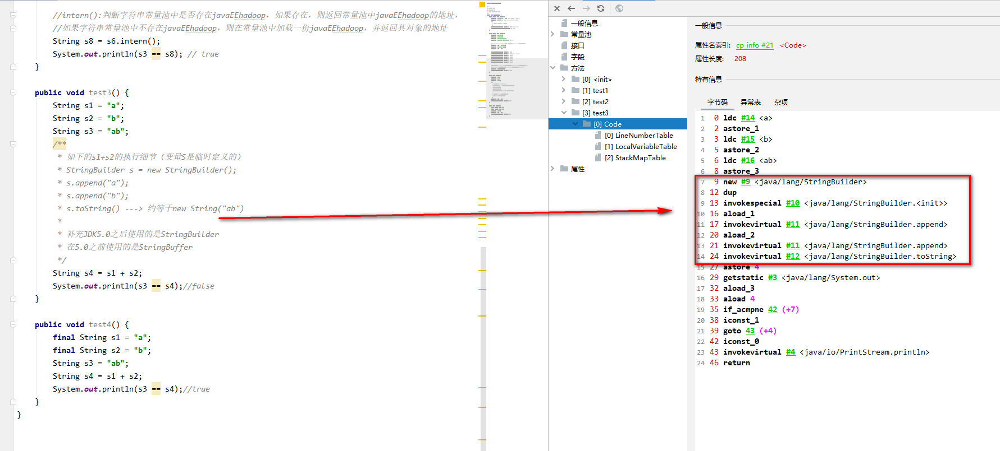

s1 + s2的执行细节

- StringBuilder s = new StringBuilder();
- s.append(s1);
- s.append(s2);
- s.toString();  -> 类似于new String("ab");

**在JDK5之后，使用的是StringBuilder，在JDK5之前使用的是StringBuffer**

| String                                                       | StringBuffer                                                 | StringBuilder    |
| ------------------------------------------------------------ | ------------------------------------------------------------ | ---------------- |
| String的值是不可变的，这就导致每次对String的操作都会生成新的String对象，不仅效率低下，而且浪费大量优先的内存空间 | StringBuffer是可变类，和线程安全的字符串操作类，任何对它指向的字符串的操作都不会产生新的对象。每个StringBuffer对象都有一定的缓冲区容量，当字符串大小没有超过容量时，不会分配新的容量，当字符串大小超过容量时，会自动增加容量 | 可变类，速度更快 |
| 不可变                                                       | 可变                                                         | 可变             |
|                                                              | 线程安全                                                     | 线程不安全       |
|                                                              | 多线程操作字符串                                             | 单线程操作字符串 |

````java
 /**
     * 字符串拼接操作不一定使用的是StringBuilder！
     * 如果拼接符号左右两侧都是字符串常量或者引用，则仍然使用编译器优化，即非StringBuilder的方式
     * 针对于final修饰类、方法、基本数据类型、引用数据类型的量的结构时，能使用上final的时候建议使用上。
     */
    public void test4() {
        final String s1 = "a";
        final String s2 = "b";
        String s3 = "ab";
        String s4 = s1 + s2;
        System.out.println(s3 == s4);//true
    }
````

运行结果

````
true
````

注意：我们左右两边如果是变量的话，就是需要new StringBuilder进行拼接，但是如果使用的是final修饰，则是从常量池中获取。所以说拼接符号左右两边都是字符串常量或常量引用 则仍然使用编译器优化。也就是说被final修饰的变量，将会变成常量，类和方法将不能被继承

#### 拼接操作和append性能对比

````java
    public void test6() {
        long start = System.currentTimeMillis();
//        method1(100000);//4014
        method2(100000);//7
        long end = System.currentTimeMillis();
        System.out.println("耗时：" + (end - start));
    }

    public void method1(int highLevel) {
        String src = "";
        for (int i = 0; i < highLevel; i++) {
            src = src + "a";//每次循环都会创建一个StringBuilder
        }
    }

    public void method2(int highLevel) {
        StringBuilder stringBuilder = new StringBuilder();
        for (int i = 0; i < highLevel; i++) {
            stringBuilder.append("a");
        }
    }
````

方法1耗费的时间：4014ms，方法2消耗时间：7ms

结论：

- 通过StringBuilder的append()方式添加字符串的效率，要远远高于String的字符串拼接方法

好处：

- StringBuilder的append的方式，自始至终只创建一个StringBuilder的对象
- 对于字符串拼接的方式，还需要创建很多StringBuilder对象和 调用toString时候创建的String对象
- 内存中由于创建了较多的StringBuilder和String对象，内存占用过大，如果进行GC那么将会耗费更多的时间

改进的空间

- 我们使用的是StringBuilder的空参构造器，默认的字符串容量是16，然后将原来的字符串拷贝到新的字符串中， 我们也可以默认初始化更大的长度，减少扩容的次数
- 因此在实际开发中，我们能够确定，前前后后需要添加的字符串不高于某个限定值，那么建议使用构造器创建一个阈值的长度

### intern（）的使用

* intern是一个native方法，调用的是底层C的方法

* 字符串池最初是空的，由String类私有地维护。在调用intern方法时，如果池中已经包含了由equals(object)方法确定的与该字符串对象相等的字符串，则返回池中的字符串。否则，该字符串对象将被添加到池中，并返回对该字符串对象的引用。

  如果不是用双引号声明的string对象，可以使用string提供的intern方法：intern方法会从字符串常量池中查询当前字符串是否存在，若不存在就会将当前字符串放入常量池中。

```
String myInfo = new string("tomkate").intern();
```

也就是说，如果在任意字符串上调用string.intern()方法，那么其返回结果所指向的那个类实例，必须和直接以常量形式出现的字符串实例完全相同。因此，下列表达式的值必定是true

```java
（"a"+"b"+"c"）.intern（）=="abc"
```

通俗点讲，Interned string就是确保字符串在内存里只有一份拷贝，这样可以节约内存空间，加快字符串操作任务的执行速度。注意，这个值会被存放在字符串内部池（String Intern Pool）

````
 * 如何保证变量s指向的是字符串常量池中的数据呢？
 * 有两种方式
 * 方式一：String s = "tomkate"; //字面量定义的方式
 * 方式二：调用intern()方法
 * String s = new String("tomkate").intern();
 * String s = new StringBuilder("tomkate").toString().intern()
````

#### 面试题

##### 1.new String("ab")会创建几个对象？

**两个，在堆中new出String对象， 另一个对象在StringPool中的“ab”对象**

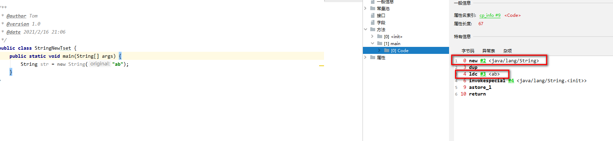

##### 2.new String("a")+new String("b")会创建几个对象?

````java
/**
 * @author Tom
 * @version 1.0
 * @date 2021/2/16 21:06
 */
public class StringNewTset {
    public static void main(String[] args) {
        /**
         * 对象1：new StringBuilder()
         * 对象2：new String("a")
         * 对象3：常量池中的"a"
         * 对象4：new String("b")
         * 对象5：常量池中的"b"
         *
         * 深入剖析：StringBuilder的toString()
         *      对象6： new String("ab")
         *      强调一下，toString()的调用，在字符串常量池中，没有生成"ab"
         */
        String str = new String("a") + new String("b");
    }
}
````

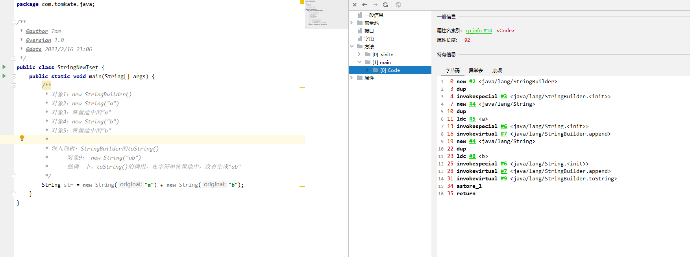

##### 3.intern()面试难题

````java
/**
 * 如何保证变量s指向的是字符串常量池中的数据呢？
 * 有两种方式
 * 方式一：String s = "tomkate"; //字面量定义的方式
 * 方式二：调用intern()方法
 * String s = new String("tomkate").intern();
 * String s = new StringBuilder("tomkate").toString().intern()
 *
 * @author Tom
 * @version 1.0
 * @date 2021/2/16 20:54
 */
public class StringIntern {
    public static void main(String[] args) {
        String s = new String("1");
        s.intern();
        String s2 = "1";
        System.out.println(s == s2);

        String s3 = new String("1") + new String("1");
        s3.intern();
        String s4 = "11";
        System.out.println(s3 == s4);
    }
}
````

###### **JDK6中**

```java
String s = new String("1");  // 在常量池中已经有了
s.intern(); // 将该对象放入到常量池。但是调用此方法没有太多的区别，因为已经存在了1
String s2 = "1";
System.out.println(s == s2); // 堆空间1地址 与 字符串常量池1 比较 false

//s3 地址为：new String("11")  
//new String("11")不存在字符串常量池中
String s3 = new String("1") + new String("1");
s3.intern();//在字符串常量池中生成"11"
String s4 = "11";//使用的是上一行代码在常量池中生成的代码
System.out.println(s3 == s4); // false
```

输出结果

```
false
false
```

为什么对象会不一样呢？

- 一个是new创建的对象，一个是常量池中的对象，显然不是同一个

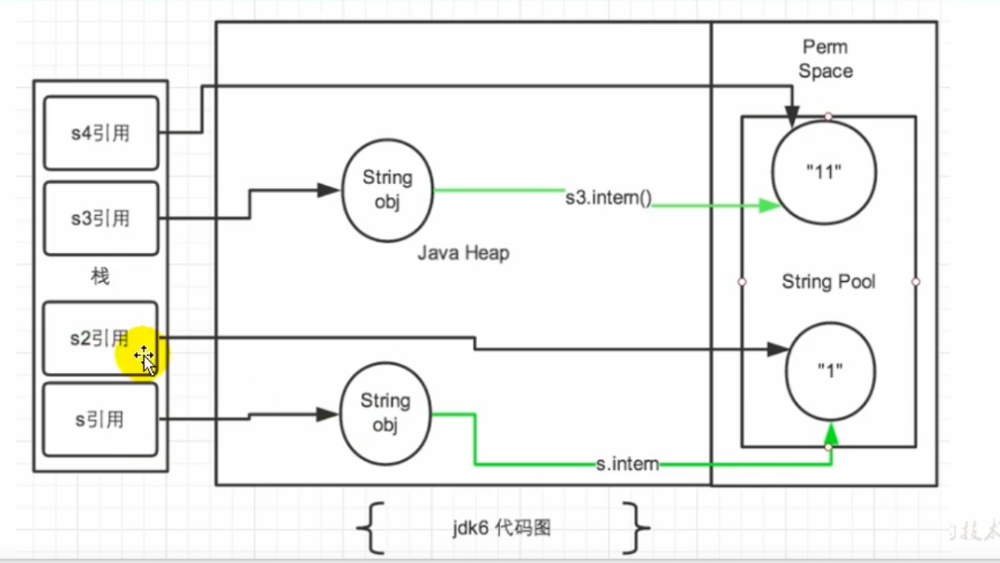

如果是下面这样的，那么就是true

```java
String s = new String("1");
s = s.intern();//在常量池内创建的地址返回给S
String s2 = "1";
System.out.println(s == s2); // true
```

###### JDK7中

````java
String s = new String("1");
s.intern();
String s2 = "1";
System.out.println(s == s2); // false

String s3 = new String("1") + new String("1");
s3.intern();//在字符串常量池中生成“11”
//如何理解
//在jdk6中就是创建了一个新的对象"11",也就有新的地址。
//在jdk7中 字符串常量池中没有创建"11"，记录的是堆空间中"11"的地址
//因为JDK7开始字符串常量池移动到堆空间中 为了节省空间，则不在字符串常量池中重新创建“11”
String s4 = "11";
System.out.println(s3 == s4); // true
````

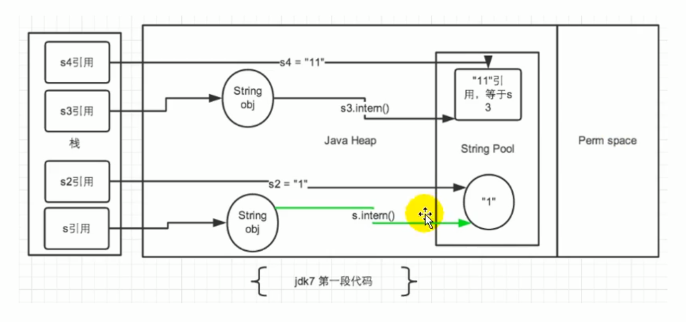

###### 扩展

````java
String s3 = new String("1") + new String("1");
//执行完上一行代码以后，字符串常量池中不存在"11"
String s4 = "11";  // 在常量池中生成的字符串
String s5 = s3.intern();  // 然后s3就会从常量池中找，发现有了，就什么事情都不做
System.out.println(s3 == s4);//false
System.out.println(s5 == s4);//true
````

我们将 s4的位置向上移动一行，发现变化就会很大，最后得到的是 false

#### 总结

总结String的intern（）的使用


* JDK1.6中，将这个字符串对象尝试放入串池。
  * 如果串池中有，则并不会放入。返回已有的串池中的对象的地址
  * 如果没有，会把此**对象复制一份**，放入串池，并返回串池中的对象地址

* JDK1.7起，将这个字符串对象尝试放入串池。
  * 如果串池中有，则并不会放入。返回已有的串池中的对象的地址
  * 如果没有，则会把**对象的引用地址**复制一份，放入串池，并返回串池中的引用地址

#### 练习

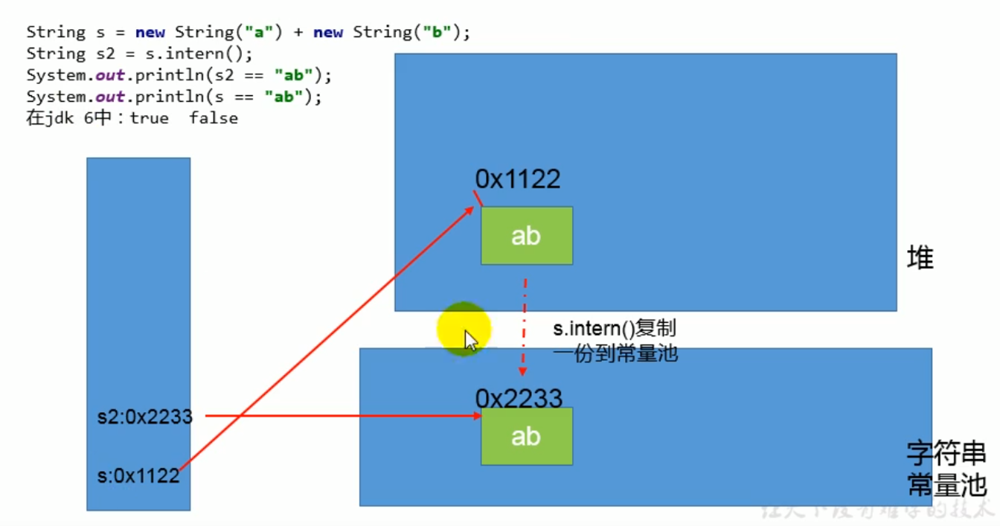

- 在JDK6中，在字符串常量池中创建一个字符串 “ab”
- 在JDK8中，在字符串常量池中没有创建 “ab”，而是将堆中的地址复制到 串池中。

所以上述结果，在JDK6中是：

```
true
false
```

在JDK8中是

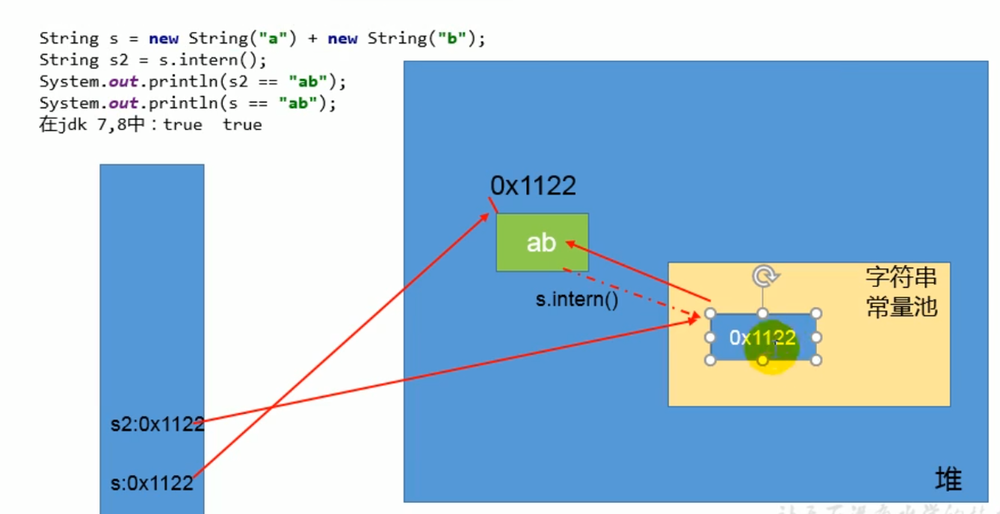

````java
true
true
````

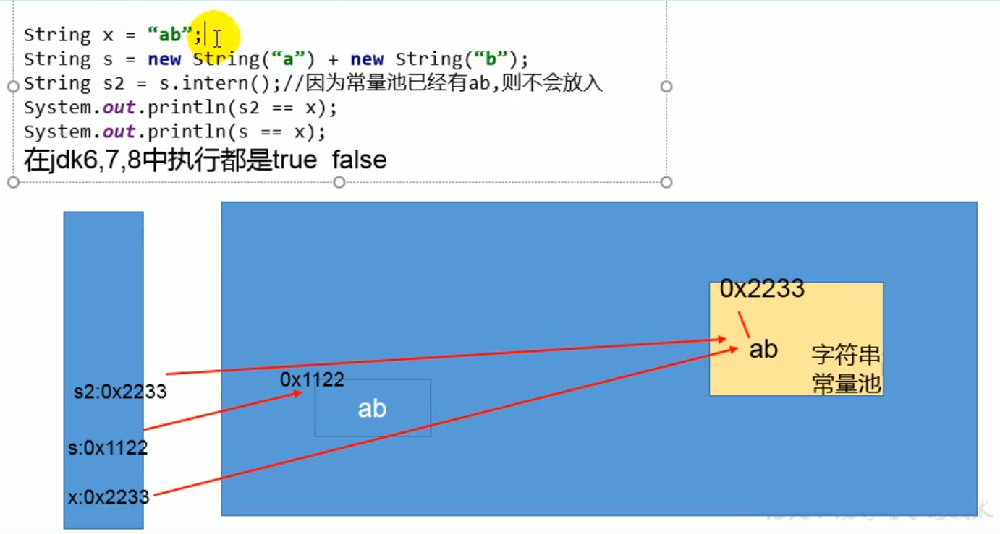

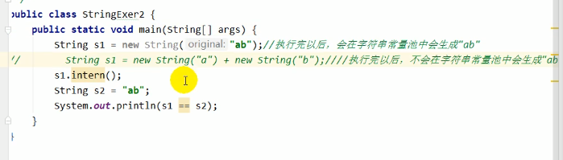

````
结果为：false	//S2为常量池中地址 s1为堆空间地址
````

#### intern的空间效率测试

````java
/**
 * 使用intern()测试执行效率
 * @author Tom
 * @version 1.0
 * @date 2021/2/16 22:34
 */
public class StringIntern2 {
    static final int MAX_COUNT = 1000 * 10000;
    static final String[] arr = new String[MAX_COUNT];

    public static void main(String[] args) {
        Integer[] data = new Integer[]{1, 2, 3, 4, 5, 6, 7, 8, 9, 10};
        long start = System.currentTimeMillis();
        for (int i = 0; i < MAX_COUNT; i++) {
//            arr[i] = new String(String.valueOf(data[i % data.length]));
            arr[i] = new String(String.valueOf(data[i % data.length])).intern();
        }
        long end = System.currentTimeMillis();
        System.out.println("花费的时间为：" + (end - start));

        try {
            Thread.sleep(1000000);
        } catch (Exception e) {
            e.getStackTrace();
        }
    }
}
````

**不使用intern（）**

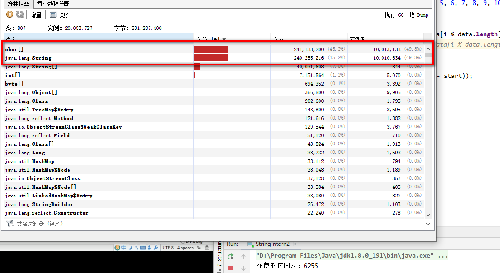

**使用intern()**

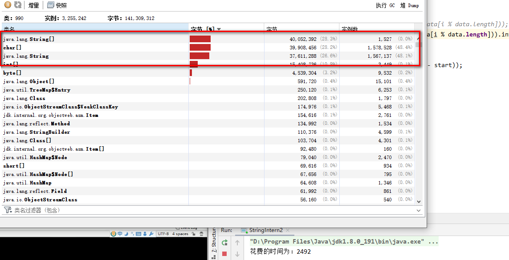

**结论**：对于程序中大量使用存在的字符串时，尤其存在很多已经重复的字符串时，使用intern()方法能够节省内存空间。

大的网站平台，需要内存中存储大量的字符串。比如社交网站，很多人都存储：北京市、海淀区等信息。这时候如果字符串都调用intern() 方法，就会很明显降低内存的大小。

#### StringTable的垃圾回收

````java
/**
 * Stirng的垃圾回收
 * -Xms15m -Xmx15m -XX:+PrintStringTableStatistics -XX:+PrintGCDetails
 *
 * @author Tom
 * @version 1.0
 * @date 2021/2/16 22:53
 */
public class StringGCTest {
    public static void main(String[] args) {
        for (int i = 0; i < 100; i++) {
            String.valueOf(i).intern();
        }
    }
}
````

零循环时log打印

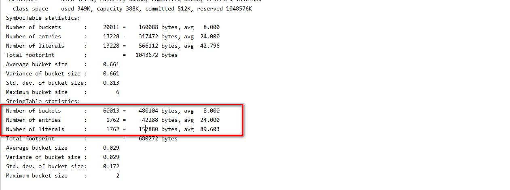

100次循环时 log打印

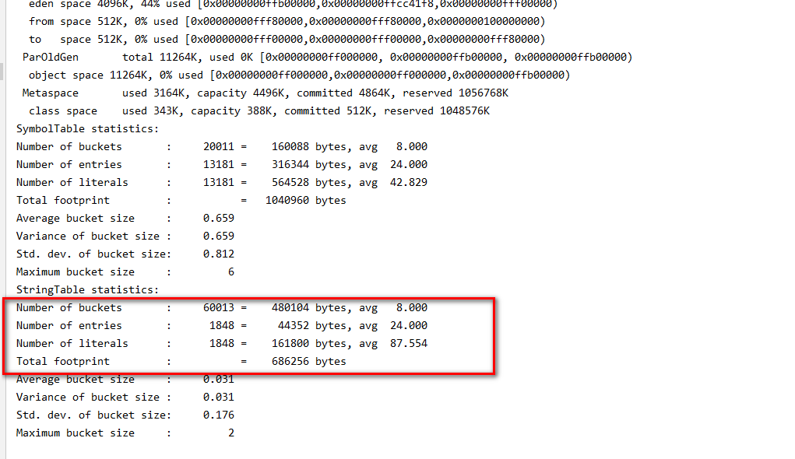

100000次循环时log打印，可发现触发了GC

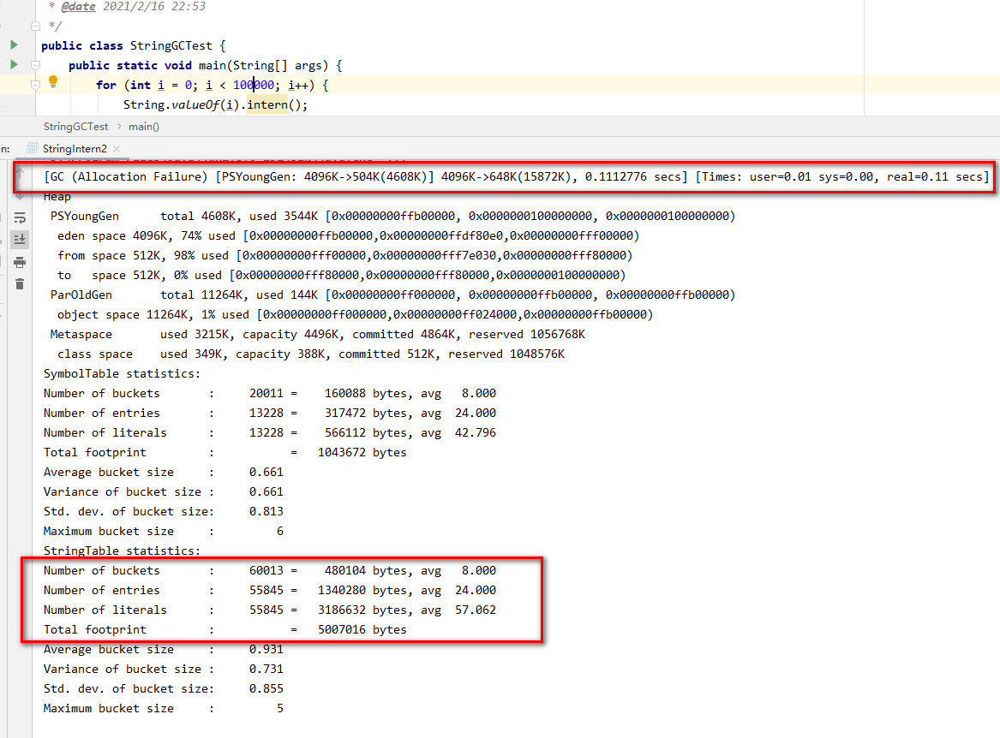

#### G1中的String去重操作

​	**注意这里说的重复，指的是在堆中的数据，而不是常量池中的，因为常量池中的本身就不会重复**

##### 描述

* 背景：对许多Java应用（有大的也有小的）做的测试得出以下结果：
  * 堆存活数据集合里面String对象占了25%
  * 堆存活数据集合里面重复的String对象有13.5%

  * String对象的平均长度是45

* 许多大规模的Java应用的瓶颈在于内存，测试表明，在这些类型的应用里面，**Java堆中存活的数据集合差不多25%是string对象**。更进一步，这里面差不多一半string对象是重复的，重复的意思是说：
  String1.equals（String2）= true。**堆上存在重复的String对象必然是一种内存的浪费**。这个项目将在G1垃圾收集器中实现自动持续对重复的String对象进行去重，这样就能避免浪费内存。

##### 实现

- 当垃圾收集器工作的时候，会访问堆上存活的对象。**对每一个访问的对象都会检查是否是候选的要去重的String对象**。
- 如果是，把这个对象的一个引用插入到队列中等待后续的处理。一个去重的线程在后台运行，处理这个队列。处理队列的一个元素意味着从队列删除这个元素，然后尝试去重它引用的String对象。
- 使用一个hashtable来记录所有的被String对象使用的不重复的char数组。当去重的时候，会查这个hashtable，来看堆上是否已经存在一个一模一样的char数组。
- 如果存在，String对象会被调整引用那个数组，释放对原来的数组的引用，最终会被垃圾收集器回收掉。
- 如果查找失败，char数组会被插入到hashtable，这样以后的时候就可以共享这个数组了。

##### 开启G1String去重（默认不开启）

* 命令行选项
  * UsestringDeduplication（bool）：开启string去重，**默认是不开启的，需要手动开启**
  * Printstringbeduplicationstatistics（bool）：打印详细的去重统计信息
  * stringpeduplicationAgeThreshold（uintx）：达到这个年龄的string对象被认为是去重的候选对象

## 垃圾回收概述

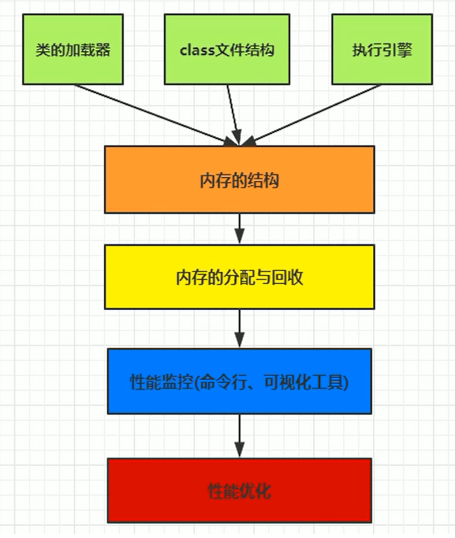

### 什么是垃圾

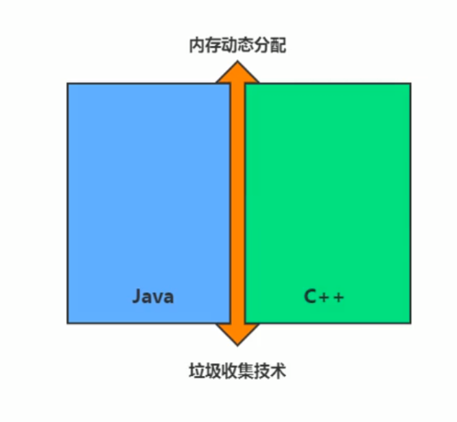

​	从上图我们可以很明确的知道，Java 和 C++语言的区别，就在于垃圾收集技术和内存动态分配上，C语言没有垃圾收集技术，需要我们手动的收集。

* 垃圾收集，不是Java语言的伴生产物。早在1960年，第一门开始使用内存动态分配和垃圾收集技术的Lisp语言诞生
* 关于垃圾收集有三个经典问题
  * 哪些内存需要回收？
  * 什么时候回收？
  * 如何回收？

* 垃圾收集机制是Java的招牌能力，**极大地提高了开发效率**。如今，垃圾收集几乎成为现代语言的标配，即使经过如此长时间的发展，Java的垃圾收集机制仍然在不断的演进中，不同大小的设备、不同特征的应用场景，对垃圾收集提出了新的挑战，这当然也是**面试的热点**

### 大厂面试题

#### 蚂蚁金服

- 你知道哪几种垃圾回收器，各自的优缺点，重点讲一下cms和G1？
- JVM GC算法有哪些，目前的JDK版本采用什么回收算法？
- G1回收器讲下回收过程GC是什么？为什么要有GC？
- GC的两种判定方法？CMS收集器与G1收集器的特点

#### 百度

- 说一下GC算法，分代回收说下
- 垃圾收集策略和算法

#### 天猫

- JVM GC原理，JVM怎么回收内存
- CMS特点，垃圾回收算法有哪些？各自的优缺点，他们共同的缺点是什么？

#### 滴滴

Java的垃圾回收器都有哪些，说下g1的应用场景，平时你是如何搭配使用垃圾回收器的

#### 京东

- 你知道哪几种垃圾收集器，各自的优缺点，重点讲下cms和G1，
- 包括原理，流程，优缺点。垃圾回收算法的实现原理

#### 阿里

- 讲一讲垃圾回收算法。
- 什么情况下触发垃圾回收？
- 如何选择合适的垃圾收集算法？
- JVM有哪三种垃圾回收器？

#### 字节跳动

- 常见的垃圾回收器算法有哪些，各有什么优劣？
- System.gc（）和Runtime.gc（）会做什么事情？
- Java GC机制？GC Roots有哪些？
- Java对象的回收方式，回收算法。
- CMS和G1了解么，CMS解决什么问题，说一下回收的过程。
- CMS回收停顿了几次，为什么要停顿两次?

### 什么是垃圾?

* 垃圾是指在**运行程序中没有任何指针指向的对象**，这个对象就是需要被回收的垃圾

* 如果不及时对内存中的垃圾进行清理，那么，这些垃圾对象所占的内存空间会一直保留到应用程序的结束，被保留的空间无法被其它对象使用，甚至可能导致**内存溢出**

### 磁盘碎片清理

机械硬盘需要进行磁盘整理，同时还有坏道

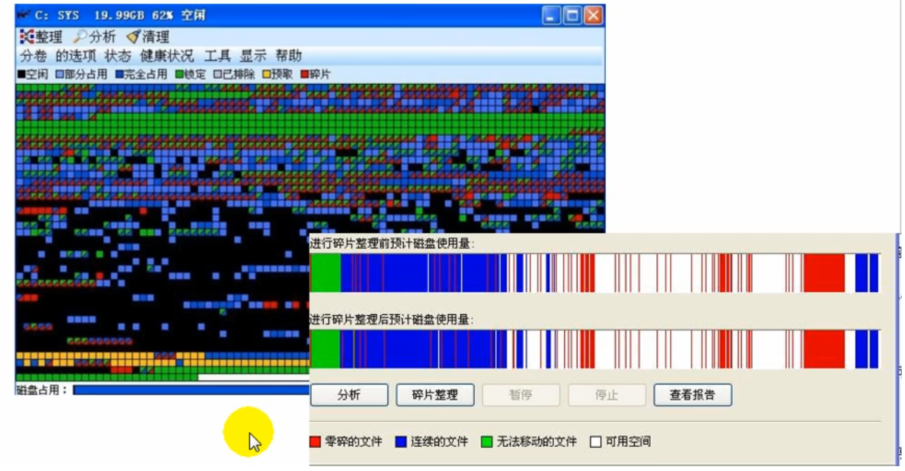

### 为什么需要GC?

* 对于高级语言来说，一个基本认知是如果不进行垃圾回收，**内存迟早都会被消耗完**，因为不断地分配内存空间而不进行回收，就好像不停地生产生活垃圾而从来不打扫一样

* 除了释放没用的对象，垃圾回收也可以清除内存里的记录碎片。碎片整理将所占用的堆内存移到堆的一端，以便**JVM将整理出的内存分配给新的对象**

* 随着应用程序所应付的业务越来越庞大、复杂，用户越来越多，**没有GC就不能保证应用程序的正常进行**。而经常造成STW的GC又跟不上实际的需求，所以才会不断地尝试对GC进行优化

### 早期的垃圾回收

* 在早期的C/C++时代，垃圾回收基本上是手工进行的。开发人员可以使用new关键字进行内存申请，并使用delete关键字进行内存释放。比如以下代码：

```c++
MibBridge *pBridge= new cmBaseGroupBridge（）；
//如果注册失败，使用Delete释放该对象所占内存区域
if（pBridge->Register（kDestroy）！=NO ERROR）
	delete pBridge；
```

* 这种方式可以灵活控制内存释放的时间，但是会给开发人员带来**频繁申请和释放内存的管理负担**。倘若有一处内存区间由于程序员编码的问题忘记被回收，那么就会产生**内存泄漏**，垃圾对象永远无法被清除，随着系统运行时间的不断增长，垃圾对象所耗内存可能持续上升，直到出现内存溢出并造成**应用程序崩溃**。 

有了垃圾回收机制后，上述代码极有可能变成这样

```c++
MibBridge *pBridge=new cmBaseGroupBridge(); 
pBridge->Register(kDestroy);
```

现在，除了Java以外，C#、Python、Ruby等语言都使用了自动垃圾回收的思想，也是未来发展趋势，可以说这种自动化的内存分配和来及回收方式已经成为了线代开发语言必备的标准。

### Java垃圾回收机制

#### 优点

* 自动内存管理，无需开发人员手动参与内存的分配与回收，这样**降低内存泄漏和内存溢出的风险**
  * 没有垃圾回收器，java也会和cpp一样，各种悬垂指针，野指针，泄露问题让你头疼不已。

* 自动内存管理机制，将程序员从繁重的内存管理中释放出来，可以**更专心地专注于业务开发**

* oracle官网关于垃圾回收的介绍
  * https://docs.oracle.com/javase/8/docs/technotes/guides/vm/gctuning/toc.html

#### 担忧

* 对于Java开发人员而言，自动内存管理就像是一个黑匣子，如果过度依赖于“自动”，那么这将会是一场灾难，最严重的就会**弱化Java开发人员在程序出现内存溢出时定位问题和解决问题的能力**

* 此时，了解JVM的自动内存分配和内存回收原理就显得非常重要，只有在真正了解JVM是如何管理内存后，我们才能够在遇见outofMemoryError时，快速地根据错误异常日志定位问题和解决问题

* 当需要排查各种内存溢出、内存泄漏问题时，当垃圾收集成为系统达到更高并发量的瓶颈时，我们就必须对这些“自动化”的技术**实施必要的监控和调节**

#### GC主要关注的区域

**GC主要关注于 方法区 和堆中的垃圾收集**

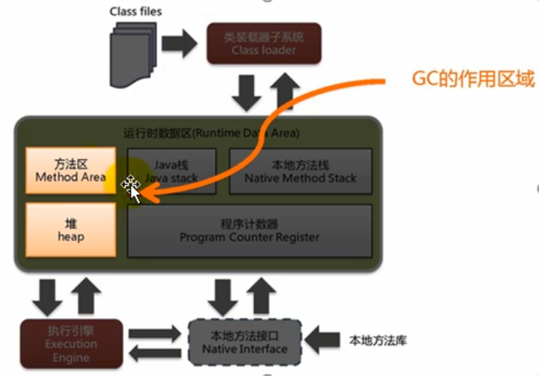

* 垃圾收集器可以对年轻代回收，也可以对老年代回收，甚至是全栈和方法区的回收
  * 其中，**Java堆是垃圾收集器的工作重点**

* 从次数上讲
  * **频繁收集Young区**
  * **较少收集Old区**
  * **基本不收集Perm区（元空间）**

## 垃圾回收相关算法

### **对象存活判断**

* 在堆里存放着几乎所有的Java对象实例，在GC执行垃圾回收之前，首先**需要区分出内存中哪些是存活对象，哪些是已经死亡的对象**。只有被标记为己经死亡的对象，GC才会在执行垃圾回收时，释放掉其所占用的内存空间，因此这个过程我们可以称为**垃圾标记阶段**

* 那么在JVM中究竟是如何标记一个死亡对象呢？简单来说，当一个对象已经不再被任何的存活对象继续引用时，就可以宣判为已经死亡。

* 判断对象存活一般有两种方式：**引用计数算法**和**可达性分析算法。**

### 标记阶段：引用计数算法

* 引用计数算法（Reference Counting）比较简单，对每个对象保存一个整型的**引用计数器属性。用于记录对象被引用的情况**

* 对于一个对象A，只要有任何一个对象引用了A，则A的引用计数器就加1；当引用失效时，引用计数器就减1。只要对象A的引用计数器的值为0，即表示对象A不可能再被使用，可进行回收。

* 优点：
  * **实现简单，垃圾对象便于辨识；判定效率高，回收没有延迟性。**

* 缺点：
  * 它需要单独的字段存储计数器，这样的做法增加了**存储空间的开销。**
  * 每次赋值都需要更新计数器，伴随着加法和减法操作，这增加了**时间开销。**
  * 引用计数器有一个严重的问题，即**无法处理循环引用**的情况。这是一条致命缺陷，导致在Java的垃圾回收器中没有使用这类算法。

#### 循环引用

当p的指针断开的时候，内部的引用形成一个循环，这就是循环引用，从而造成内存泄漏

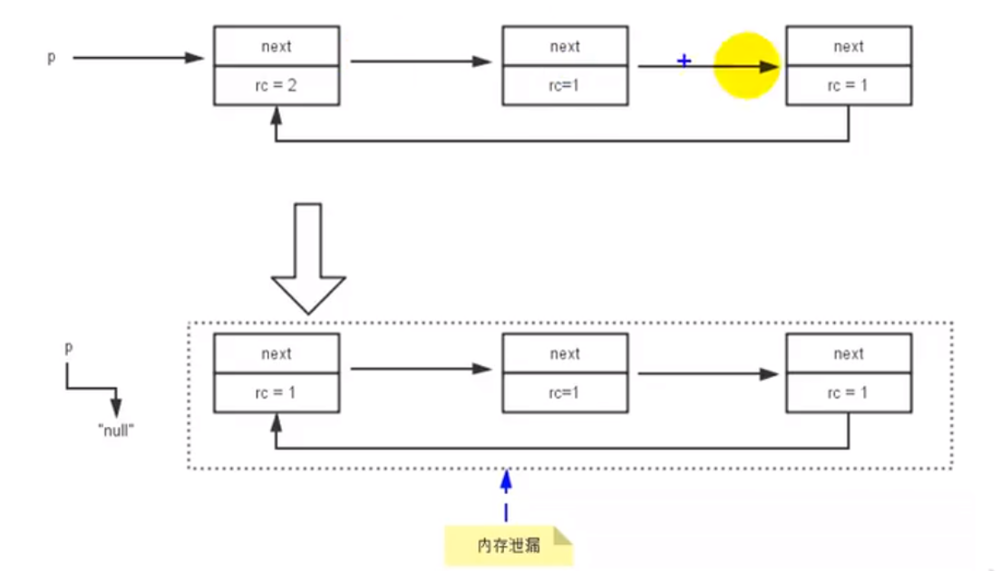

#### 举例

测试Java中是否采用的是引用计数算法

````java
/**
 * 引用计数算法测试
 * -XX:+PrintGCDetails
 * @author Tom
 * @version 1.0
 * @date 2021/2/17 21:14
 */
public class RefCountGC {
    // 这个成员属性的唯一作用就是占用一点内存
    private byte[] bigSize = new byte[5*1024*1024];
    // 引用
    Object reference = null;

    public static void main(String[] args) {
        RefCountGC obj1 = new RefCountGC();
        RefCountGC obj2 = new RefCountGC();
        obj1.reference = obj2;
        obj2.reference = obj1;
        obj1 = null;
        obj2 = null;
        // 显示的执行垃圾收集行为，判断obj1 和 obj2是否被回收？
        System.gc();
    }
}
````

运行结果

````
[GC (System.gc()) [PSYoungGen: 13199K->712K(57344K)] 13199K->720K(188416K), 0.1253951 secs] [Times: user=0.00 sys=0.00, real=0.13 secs] 
[Full GC (System.gc()) [PSYoungGen: 712K->0K(57344K)] [ParOldGen: 8K->599K(131072K)] 720K->599K(188416K), [Metaspace: 3200K->3200K(1056768K)], 0.0060930 secs] [Times: user=0.00 sys=0.00, real=0.01 secs] 
Heap
 PSYoungGen      total 57344K, used 1474K [0x0000000780600000, 0x0000000784600000, 0x00000007c0000000)
  eden space 49152K, 3% used [0x0000000780600000,0x0000000780770be0,0x0000000783600000)
  from space 8192K, 0% used [0x0000000783600000,0x0000000783600000,0x0000000783e00000)
  to   space 8192K, 0% used [0x0000000783e00000,0x0000000783e00000,0x0000000784600000)
 ParOldGen       total 131072K, used 599K [0x0000000701200000, 0x0000000709200000, 0x0000000780600000)
  object space 131072K, 0% used [0x0000000701200000,0x0000000701295e68,0x0000000709200000)
 Metaspace       used 3213K, capacity 4496K, committed 4864K, reserved 1056768K
  class space    used 349K, capacity 388K, committed 512K, reserved 1048576K
````

能够看到，上述进行了GC收集的行为，将上述的新生代中的两个对象都进行回收了

````
GC (System.gc()) [PSYoungGen: 13199K->712K(57344K)] 13199K->720K(188416K)
````

如果使用引用计数算法，那么这两个对象将会无法回收。而现在两个对象被回收了，说明Java使用的不是引用计数算法来进行标记的。

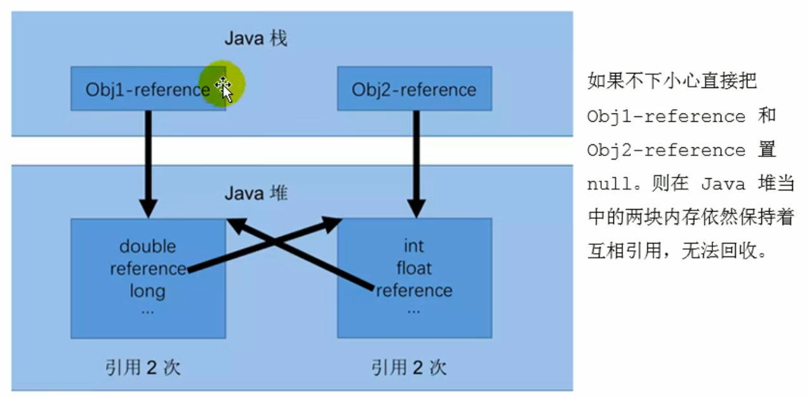

#### 小结

* 引用计数算法，是很多语言的资源回收选择，例如因人工智能而更加火热的Python，它更是同时支持引用计数和垃圾收集机制

* 具体哪种最优是要看场景的，业界有大规模实践中仅保留引用计数机制，以提高吞吐量的尝试

* Java并没有选择引用计数，是因为其存在一个基本的难题，也就是很难处理循环引用关系
* Python如何解决循环引用？
  * 手动解除：很好理解，就是在合适的时机，解除引用关系
  * 使用弱引用weakref，weakref是Python提供的标准库，旨在解决循环引用

### 标记阶段：可达性分析算法

#### 概念

**可达性分析算法：也可以称为 根搜索算法、追踪性垃圾收集**

* 相对于引用计数算法而言，可达性分析算法不仅同样具备实现简单和执行高效等特点，更重要的是该算法可以有效地**解决在引用计数算法中循环引用的问题，防止内存泄漏的发生。**

* 相较于引用计数算法，这里的可达性分析就是**Java、C#选择的**。这种类型的垃圾收集通常也叫作**追踪性垃圾收集**（Tracing Garbage Collection）

#### 思路

* 所谓"GC Roots”根集合就是一组必须活跃的引用

* 基本思路：
  * 可达性分析算法是以根对象集合（GCRoots）为起始点，按照从上至下的方式**搜索被根对象集合所连接的目标对象是否可达**
  * 使用可达性分析算法后，内存中的存活对象都会被根对象集合直接或间接连接着，搜索所走过的路径称为**引用链（Reference Chain）**
  * 如果目标对象没有任何引用链相连，则是不可达的，就意味着该对象己经死亡，可以标记为垃圾对象。
  * 在可达性分析算法中，只有能够被根对象集合直接或者间接连接的对象才是存活对象。

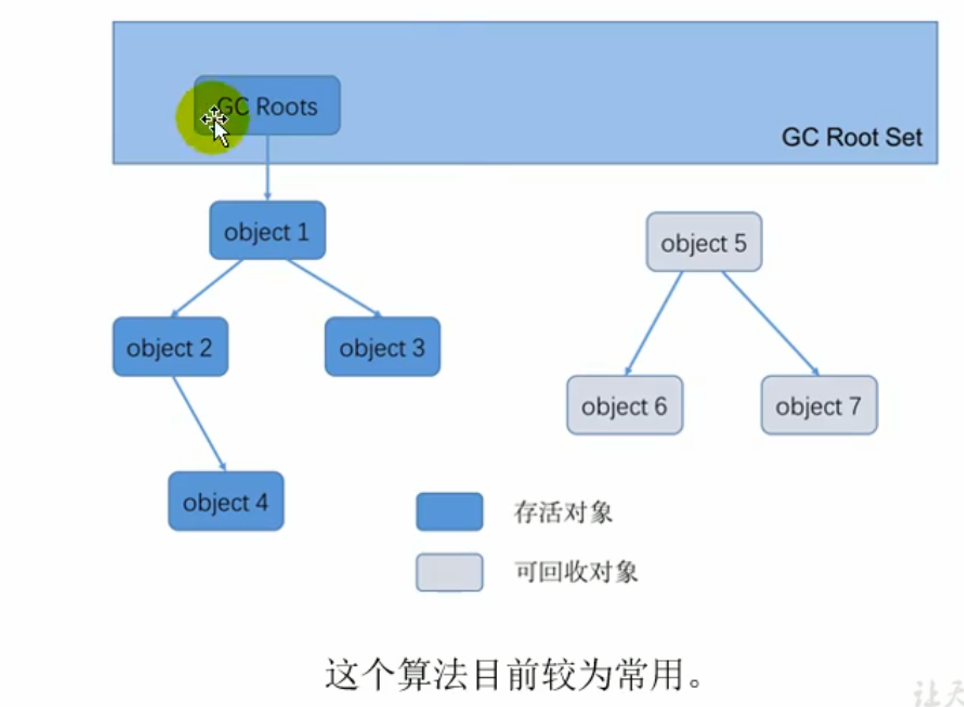

官场上的裙带关系，可达性分析在人类关系网中

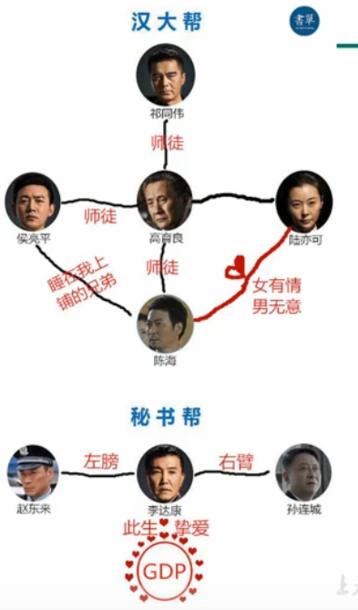

#### GC Roots可以是哪些？

**在JAVA语言中，GC Roots 包括以下几类元素**

- 虚拟机栈中引用的对象
  - 比如：各个线程被调用的方法中使用到的参数、局部变量等。
- 本地方法栈内JNI（通常说的本地方法）引用的对象方法区中类静态属性引用的对象
  - 比如：Java类的引用类型静态变量
- 方法区中常量引用的对象
  - 比如：字符串常量池（string Table）里的引用
- 所有被同步锁synchronized持有的对象
- Java虚拟机内部的引用。
  - 基本数据类型对应的Class对象，一些常驻的异常对象（如：NullPointerException、outofMemoryError），系统类加载器。
- 反映java虚拟机内部情况的JMXBean、JVMTI中注册的回调、本地代码缓存等。

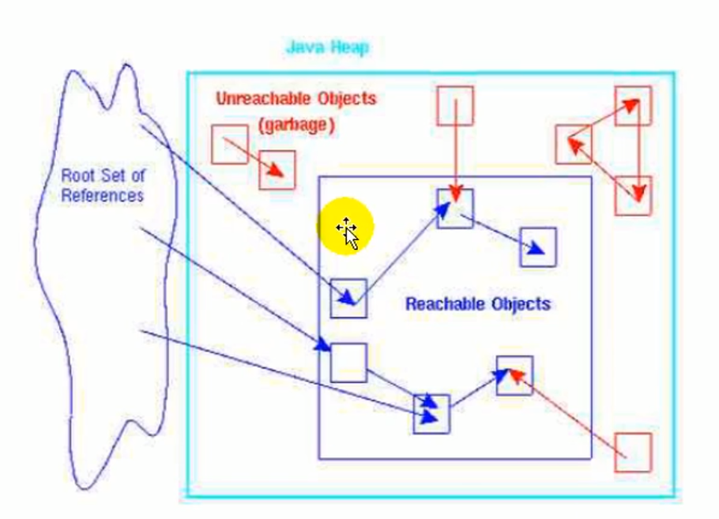

##### 总结

总结一句话就是，除了堆空间外的一些结构，比如 虚拟机栈、本地方法栈、方法区、字符串常量池 等地方对堆空间进行引用的，都可以作为GC Roots进行可达性分析

* 除了这些固定的GC Roots集合以外，根据用户所选用的垃圾收集器以及当前回收的内存区域不同，还可以有其他对象“临时性”地加入，共同构成完整GC Roots集合。比如：分代收集和局部回收（PartialGC）
  * 如果只针对Java堆中的某一块区域进行垃圾回收（比如：典型的只针对新生代），必须考虑到内存区域是虚拟机自己的实现细节，更不是孤立封闭的，这个区域的对象完全有可能被其他区域的对象所引用，这时候就需要一并将关联的区域对象也加入GCRoots集合中去考虑，才能保证可达性分析的准确性
* 技巧

由于Root采用栈方式存放变量和指针，所以如果一个指针，它保存了堆内存里面的对象，但是自己又不存放在堆内存里面，那它就是一个Root

##### 注意

* 如果要使用可达性分析算法来判断内存是否可回收，那么分析工作必须在一个能保障一致性的快照中进行。这点不满足的话分析结果的准确性就无法保证

* 这点也是导致GC进行时必须“Stop The World”的一个重要原因
  * 即使是号称（几乎）不会发生停顿的CMS收集器中，**枚举根节点时也是必须要停顿的**

### 对象的finalization机制

* Java语言提供了对象终止（finalization）机制来允许开发人员提供**对象被销毁之前的自定义处理逻辑。**

* 当垃圾回收器发现没有引用指向一个对象，即：垃圾回收此对象之前，总会先调用这个对象的finalize()方法。

* finalize() 方法允许在子类中被重写，**用于在对象被回收时进行资源释放**。通常在这个方法中进行一些资源释放和清理的工作，比如关闭文件、套接字和数据库连接等。

#### 注意

* 永远不要主动调用某个对象的finalize（）方法应该交给垃圾回收机制调用。理由包括下面三点：
  * 在finalize（）时可能会导致对象复活。
  * finalize（）方法的执行时间是没有保障的，它完全由GC线程决定，极端情况下，若不发生GC，则finalize（）方法将没有执行机会。
  * 因为优先级比较低，即使主动调用该方法，也不会因此就直接进行回收
  * 一个糟糕的finalize（）会严重影响GC的性能。

* 从功能上来说，finalize（）方法与c++中的析构函数比较相似，但是Java采用的是基于垃圾回收器的自动内存管理机制，所以finalize（）方法在本质上不同于C++中的析构函数。

* 由于finalize（）方法的存在，**虚拟机中的对象一般处于三种可能的状态**

#### 生存还是死亡？

* 如果从所有的根节点都无法访问到某个对象，说明对象己经不再使用了。一般来说，此对象需要被回收。但事实上，也并非是“非死不可”的，这时候它们暂时处于“缓刑”阶段。**一个无法触及的对象有可能在某一个条件下“复活”自己**，如果这样，那么对它的回收就是不合理的，为此，定义虚拟机中的对象可能的三种状态。如下：
  * **可触及的**：从根节点开始，可以到达这个对象。
  * **可复活的**：对象的所有引用都被释放，但是对象有可能在finalize（）中复活。
  * **不可触及的**：对象的finalize（）被调用，并且没有复活，那么就会进入不可触及状态。不可触及的对象不可能被复活，因为**finalize()只会被调用一次**。

* 以上3种状态中，是由于finalize（）方法的存在，进行的区分。只有在对象不可触及时才可以被回收。

#### 具体过程

* 判定一个对象objA是否可回收，至少要经历两次标记过程：
  1. 如果对象objA到GC Roots没有引用链，则进行第一次标记。
  2. 进行筛选，判断此对象是否有必要执行finalize（）方法
     * 如果对象objA没有重写finalize（）方法，或者finalize（）方法已经被虚拟机调用过，则虚拟机视为“没有必要执行”，objA被判定为不可触及的。
     * 如果对象objA重写了finalize（）方法，且还未执行过，那么objA会被插入到F-Queue队列中，由一个虚拟机自动创建的、低优先级的Finalizer线程触发其finalize（）方法执行。
     * **finalize（）方法是对象逃脱死亡的最后机会**，稍后GC会对F-Queue队列中的对象进行第二次标记。**如果objA在finalize（）方法中与引用链上的任何一个对象建立了联系**，那么在第二次标记时，objA会被移出“即将回收”集合。之后，对象会再次出现没有引用存在的情况。在这个情况下，finalize方法不会被再次调用，对象会直接变成不可触及的状态，也就是说，一个对象的finalize方法只会被调用一次。

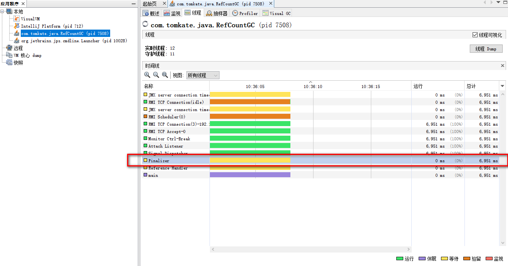

#### 代码演示

重写 finalize()方法，然后在方法的内部，重写将其存放到GC Roots中

````java
/**
 *
 * 测试Object类中finalize()方法,即对象finalization机制
 * 对象复活场景
 *
 * @author Tom
 * @version 1.0
 * @date 2021/2/18 10:47
 */
public class CanReliveObj {
    // 类变量，属于GC Roots的一部分
    public static CanReliveObj canReliveObj;

    //此方法只能被调用一次
    @Override
    protected void finalize() throws Throwable {
        super.finalize();
        System.out.println("调用当前类重写的finalize()方法");
        //当前带回收的对象在finalize（）方法中与引用链上的一个对象建立了联系
        canReliveObj = this;
    }

    public static void main(String[] args) throws InterruptedException {
        canReliveObj = new CanReliveObj();
        canReliveObj = null;
        System.gc();
        System.out.println("-----------------第一次gc操作------------");
        // 因为Finalizer线程的优先级比较低，暂停2秒，以等待它
        Thread.sleep(2000);
        if (canReliveObj == null) {
            System.out.println("obj is dead");
        } else {
            System.out.println("obj is still alive");
        }

        System.out.println("-----------------第二次gc操作------------");
        canReliveObj = null;
        System.gc();
        // 下面代码和上面代码是一样的，但是 canReliveObj却自救失败了
        Thread.sleep(2000);
        if (canReliveObj == null) {
            System.out.println("obj is dead");
        } else {
            System.out.println("obj is still alive");
        }

    }
}
````

最后运行结果

````
-----------------第一次gc操作------------
调用当前类重写的finalize()方法
obj is still alive
-----------------第二次gc操作------------
obj is dead
````

在进行第一次清除的时候，我们会执行finalize方法，然后 对象 进行了一次自救操作，但是因为finalize()方法只会被调用一次，因此第二次该对象将会被垃圾清除。

### MAT与JProfiler的GC Roots溯源

#### MAT是什么？

MAT是Memory Analyzer的简称，它是一款功能强大的Java堆内存分析器。用于查找内存泄漏以及查看内存消耗情况。

MAT是基于Eclipse开发的，是一款免费的性能分析工具。

大家可以在http://www.eclipse.org/mat/下载并使用MAT

#### 获取Dump文件

##### 1.命令行使用 jmap

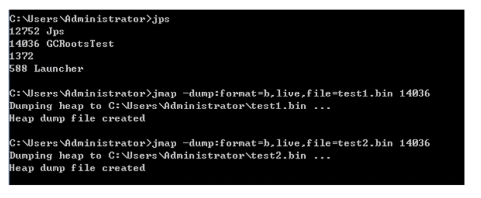

##### 2.使用JVIsualVM

* 捕获的heap dump文件是一个临时文件，关闭JVisualVM后自动删除，若要保留，需要将其另存为文件。
* 可通过以下方法捕获heap dump：
  * 在左侧“Application"（应用程序）子窗口中右击相应的应用程序，选择Heap Dump（堆Dump）。
  * 在Monitor（监视）子标签页中点击Heap Dump（堆Dump）按钮。
* 本地应用程序的Heap dumps作为应用程序标签页的一个子标签页打开。同时，heap dump在左侧的Application（应用程序）栏中对应一个含有时间戳的节点。右击这个节点选择save as（另存为）即可将heap dump保存到本地。

**获取dump，模拟数据代码**

````java
/**
 * @author Tom
 * @version 1.0
 * @date 2021/2/18 11:01
 */
public class GCRootsTest {
    public static void main(String[] args) {
        ArrayList<Object> numList = new ArrayList<>();
        Date birth = new Date();
        for (int i = 0; i < 100; i++) {
            numList.add(String.valueOf(i));
            try {
                Thread.sleep(10);
            } catch (InterruptedException e) {
                e.printStackTrace();
            }
        }

        System.out.println("数据添加完毕，请操作：");
        new Scanner(System.in).next();
        numList = null;
        birth = null;

        System.out.println("numList、birth已置空，请操作：");
        new Scanner(System.in).next();

        System.out.println("结束");
    }
}
````

#### 使用MAT打开Dump文件

打开后，我们就可以看到有哪些可以作为GC Roots的对象

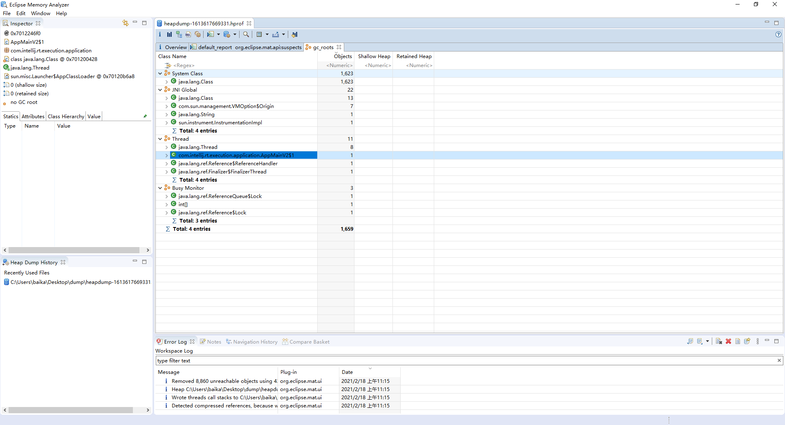

里面我们能够看到有一些常用的Java类，然后Thread线程。

#### JProfiler的GC Roots溯源

我们在实际的开发中，一般不会查找全部的GC Roots，可能只是查找某个对象的整个链路，或者称为GC Roots溯源，这个时候，我们就可以使用JProfiler

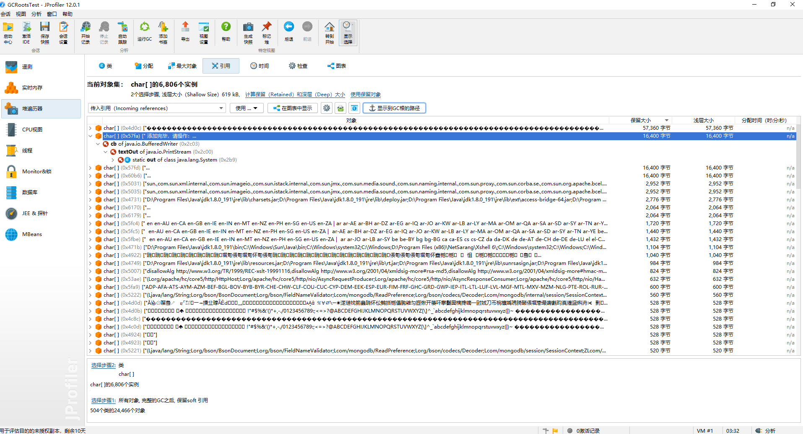

#### 如何判断什么原因造成OOM

程序出现OOM的时候，我们就需要进行排查，我们首先使用下面的例子进行说明

````java
/**
 * 内存溢出排查
 * -Xms8m -Xmx8m -XX:HeapDumpOnOutOfMemoryError
 *
 * @author Tom
 * @version 1.0
 * @date 2021/2/18 11:42
 */
public class HeapOOM {
    // 创建1M的文件
    byte[] buffer = new byte[1 * 1024 * 1024];

    public static void main(String[] args) {
        ArrayList<HeapOOM> list = new ArrayList<>();
        int count = 0;
        try {
            while (true) {
                list.add(new HeapOOM());
                count++;
            }
        } catch (Exception e) {
            e.getStackTrace();
            System.out.println("count:" + count);
        }
    }
}
````

